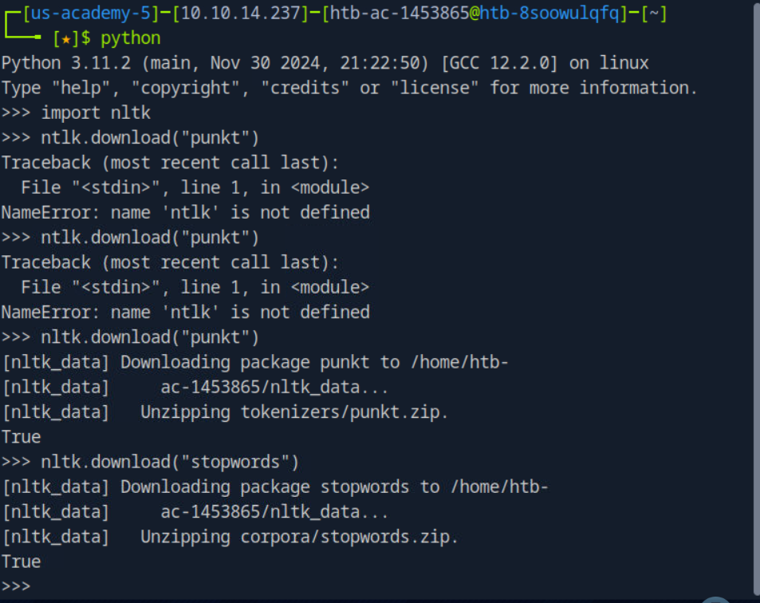
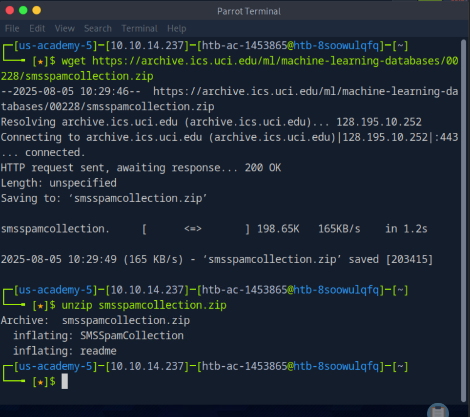
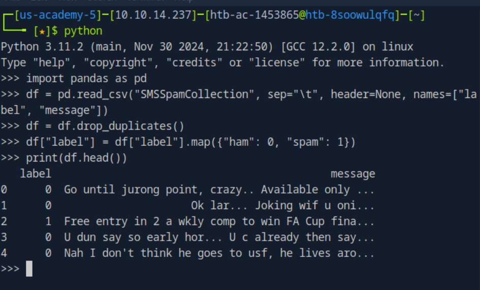

Dưới đây là các bước chi tiết để thực hiện quy trình xây dựng và đánh giá mô hình phân loại thư rác (spam detection) trên hệ thống Unix.

---

### **Bước 1: Cài Đặt Môi Trường và Thư Viện Cần Thiết**

Trước tiên, bạn cần cài đặt các thư viện cần thiết bằng pip. Mở terminal và thực hiện các lệnh sau:

1. Cài đặt `nltk`, `pandas`, `sklearn`, và `joblib`:

   ```bash
   pip install nltk pandas scikit-learn joblib
   ```

2. Cài đặt các tài nguyên cần thiết của `nltk` (tokenizer và stopwords):

   ```python
   import nltk
   nltk.download("punkt")
   nltk.download("stopwords")
   ```

---

### **Bước 2: Tải và Xử Lý Dữ Liệu**

Tiếp theo, bạn cần tải bộ dữ liệu SMS Spam Collection từ UCI và đọc dữ liệu vào Python:

1. Tải bộ dữ liệu từ UCI:

   ```bash
   wget https://archive.ics.uci.edu/ml/machine-learning-databases/00228/smsspamcollection.zip
   ```

2. Giải nén file ZIP:

   ```bash
   unzip smsspamcollection.zip
   ```

3. Đọc dữ liệu vào DataFrame:

   ```python
   import pandas as pd

   df = pd.read_csv("SMSSpamCollection", sep="\t", header=None, names=["label", "message"])
   df = df.drop_duplicates()
   df["label"] = df["label"].map({"ham": 0, "spam": 1})
   ```
Sau khi thực hiện xong, bạn sẽ có dữ liệu SMS Spam Collection trong DataFrame với hai cột: "label" (0 cho ham, 1 cho spam) và "message" (nội dung tin nhắn).


---

### **Bước 3: Tiền Xử Lý Dữ Liệu Văn Bản**

Quá trình tiền xử lý văn bản bao gồm việc chuyển tất cả văn bản thành chữ thường, loại bỏ ký tự không phải chữ, và loại bỏ từ dừng (stopwords). Cùng với đó, ta sẽ sử dụng `PorterStemmer` để thực hiện stemming:

1. Tiến hành tiền xử lý:

   ```python
   import re
   from nltk.tokenize import word_tokenize
   from nltk.corpus import stopwords
   from nltk.stem import PorterStemmer

   # Khởi tạo các đối tượng cần thiết
   stop_words = set(stopwords.words("english"))
   stemmer = PorterStemmer()

   def preprocess_message(message):
       message = message.lower()
       message = re.sub(r"[^a-z\s$!]", "", message)  # Giữ lại các ký tự đặc biệt như $, !
       tokens = word_tokenize(message)
       tokens = [word for word in tokens if word not in stop_words]  # Loại bỏ stopwords
       tokens = [stemmer.stem(word) for word in tokens]  # Áp dụng stemming
       return " ".join(tokens)

   # Áp dụng tiền xử lý cho dữ liệu
   df["cleaned_message"] = df["message"].apply(preprocess_message)
   ```

---

### **Bước 4: Trích Xuất Đặc Trưng và Huấn Luyện Mô Hình**

Ta sẽ sử dụng `CountVectorizer` để chuyển văn bản thành các đặc trưng số học, và `MultinomialNB` (Naive Bayes) làm mô hình phân loại.

1. Cài đặt các thư viện cần thiết:

   ```bash
   pip install scikit-learn
   ```

2. Trích xuất đặc trưng và huấn luyện mô hình:

   ```python
   from sklearn.feature_extraction.text import CountVectorizer
   from sklearn.naive_bayes import MultinomialNB
   from sklearn.model_selection import GridSearchCV
   from sklearn.pipeline import Pipeline

   # Xây dựng pipeline với CountVectorizer và MultinomialNB
   pipeline = Pipeline([
       ("vectorizer", CountVectorizer()),
       ("classifier", MultinomialNB())
   ])

   # Thiết lập tham số tìm kiếm lưới (Grid Search) cho alpha
   param_grid = {
       "classifier__alpha": [0.01, 0.1, 0.15, 0.2, 0.25, 0.5, 0.75, 1.0]
   }

   # Tìm kiếm lưới với Cross-validation
   grid_search = GridSearchCV(pipeline, param_grid, cv=5, scoring="f1", n_jobs=-1)
   grid_search.fit(df["cleaned_message"], df["label"])

   # Lưu mô hình tốt nhất
   best_model = grid_search.best_estimator_
   ```

---

### **Bước 5: Lưu Mô Hình**

Sau khi huấn luyện mô hình, ta sẽ lưu mô hình vào file `.joblib` để có thể tải lên máy chủ đánh giá.

1. Lưu mô hình bằng `joblib`:

   ```python
   import joblib

   model_filename = "spam_detection_model.joblib"
   joblib.dump(best_model, model_filename)
   ```

---

### **Bước 6: Đánh Giá Mô Hình trên Playground VM**

Khi mô hình đã được lưu, bạn sẽ gửi mô hình lên máy chủ đánh giá thông qua HTTP POST request. Nếu bạn đang làm việc trên hệ thống của riêng mình, hãy chắc chắn rằng bạn đã kết nối với VPN của HTB và đang sử dụng VM.

1. Gửi mô hình lên máy chủ đánh giá:

   Trước tiên, bạn cần đảm bảo rằng bạn có địa chỉ IP của VM đang chạy. Sau đó, gửi mô hình bằng cách sử dụng đoạn mã sau:

   ```python
   import requests
   import json

   # Địa chỉ URL của API máy chủ đánh giá
   url = f"http://{vm_ip}:8000/api/upload"

   # Đường dẫn tới mô hình đã lưu
   model_filename = "spam_detection_model.joblib"

   # Mở file mô hình và gửi request POST
   with open(model_filename, "rb") as model_file:
       files = {"model": model_file}
       response = requests.post(url, files=files)

   # In kết quả trả về từ máy chủ
   print(json.dumps(response.json(), indent=4))
   ```

Kết quả trả về từ máy chủ sẽ có dạng như sau:

```json
{
    "status": "success",
    "flag": "HTB{sp4m_*******_*******}"
}
```

Flag này xác nhận rằng mô hình của bạn đã đáp ứng các tiêu chí đánh giá.

---

### **Tóm Tắt**

1. Cài đặt môi trường và thư viện.
2. Tải và xử lý dữ liệu.
3. Tiền xử lý dữ liệu văn bản.
4. Trích xuất đặc trưng và huấn luyện mô hình.
5. Lưu mô hình vào file.
6. Đánh giá mô hình trên Playground VM.

Hy vọng các bước trên sẽ giúp bạn hoàn thành bài toán phân loại thư rác trên Unix thành công.
