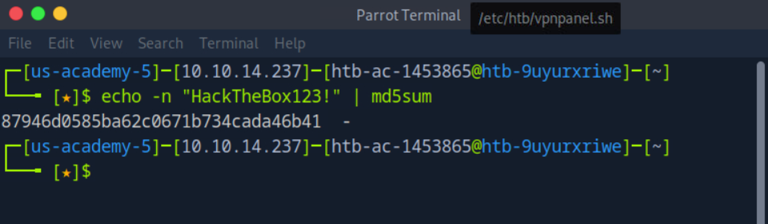
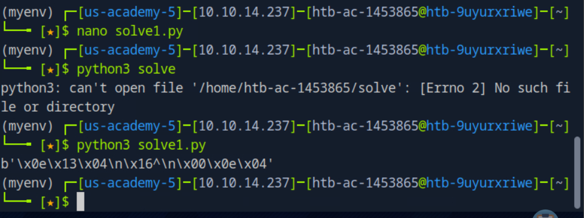
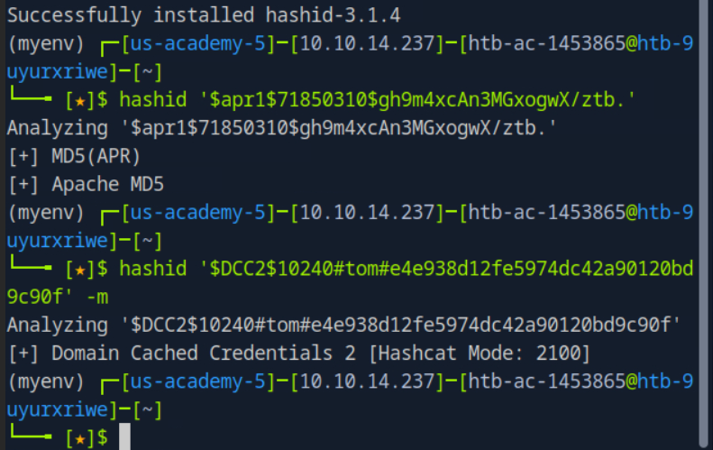
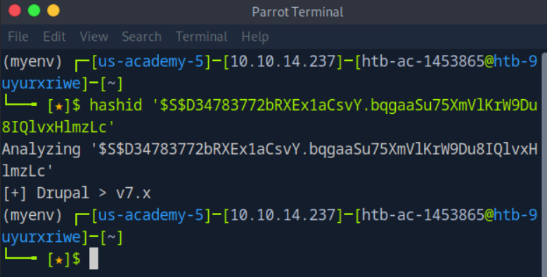

# Hashing 

- Process of coverting text to string, unique to particular text
- one-way process, no way of reconstructing the original plaintext from a hash
- md5,sha256 algo used to verify file integrity 
- pbkdf2 are used to hash password before storage. 
- Some hash functions can be keyed . ex:HMAC ,which acts a checksum to verify a particular messaeg was tampered with during tranmission.

Unix Systems: SHA-512, Blowfish, Bcrypt, Argon2

SHA-512 convert a long string of characters into a hash value. Fast but many rainbow table attacks where attacker uses a pre-computed table to reconstruct the original passwords

Blowfish, sysmetric block cipher algo encrypts a passwd with a key. more secure than sha-512 but also a lot slower

BCrypt uses a slow hash function to make it harder for potential attackers to guest passwords or perfrom rainbow table attacks.

Argon2 , modern and secure. It use multiple rounds of hash functions and a large amount of memory to make it harder to gues passwords. It is considered one of the most secure algorithms because it has a high time and resource requirement.

1. Generate an MD5 hash of the password 'HackTheBox123!'.
echo -n "HackTheBox123!" | md5sum

2.Create the XOR ciphertext of the password 'opens3same' using the key 'academy'. (Answer format: \x00\x00\x00\....)

python3 -m venv myenv
myenv\Scripts\activate
pip install pwntools

```python
from pwn import xor

password = 'opens3same'
key = 'academy'

# Tạo ciphertext bằng XOR
ciphertext = xor(password.encode(), key.encode())

# In ra ciphertext theo định dạng yêu cầu
print(ciphertext)

```


# Identifying Hashes
Mosh hashing algorithms produce hashes of a constant length. The length of a particular hash can be used to map it to algorithm it was hashed with. for example, 32 characters in length can be md5 or ntlm hash

Sometimes, hashes are stored in certain formats. For example, hash:salt or $id$salt$hash

2fc5a684737ce1bf7b3b239df432416e0dd07357:2014 
    sha1 + salt of 2014

$6$vb1tLY1qiY$M.1ZCqKtJBxBtZm1gRi8Bbkn39KU0YJW1cuMFzTRANcNKFKR4RmAQVk4rqQQCkaJT6wXqjUkFcA/qNxLyqW.U/
    - First Part $6$ : SHA512 algorithm - Algorithm Identifers
    - Second Part (Salt) vb1tLY1qiY
    - Third Part (The Hash): M.1ZCqKtJBxBtZm1gRi8Bbkn39KU0YJW1cuMFzTRANcNKFKR4RmAQVk4rqQQCkaJT6wXqjUkFcA/qNxLyqW.U/ **actual hash**
**Algorithm Identifier**
- $1$ : MD5
- $2a$ : Blowfish
- $2y$: Blowfish (8 bit character handling)
- $5$: SHA256
- $6$ SHA512

# Hashid tool 

pip install hashid


Context is crucial . Knowing where hash come from or what software it was used with can greatly narrow down the possibilites

Contexual Information of Pentest
- AD Attacks: it could be NTLM or Kerberos hash
- SQL Injection: Web application related hashes (MD5,SHA1,bcrypt)
- Exploitation of Vulnerabilites: Hash obtained through specific exploits, such as web apps, could be Wordpress, Joomla, other CMS-related hases

Hash cat is powerful password cracking tool, each hash type has specific mode number associated with it
Hashcat modes help map the correct cracking method to given hash, understand context of hash allows u to choose the correct mode

1.Identify the following hash: $S$D34783772bRXEx1aCsvY.bqgaaSu75XmVlKrW9Du8IQlvxHlmzLc

Drupal > v7.x

# Hashcat
password cracking tool 
support 320 hash algo (modes) , use GPU acceleration

Hash types (-m option): hashcat requires specifying the hash type to know crack it:
Example
-m 0 : MD5
-m 1000: NTLM-m 3200: bcrypt

+ What is the hash mode of the hash type Cisco-ASA MD5?
 2410

 # Dictionary Attack
 + Crack the following hash using the rockyou.txt wordlist: 0c352d5b2f45217c57bef9f8452ce376

hashcat -m 0 -a 0 hash.txt /usr/share/wordlists/rockyou.txt
=> 0c352d5b2f45217c57bef9f8452ce376:cricket1  