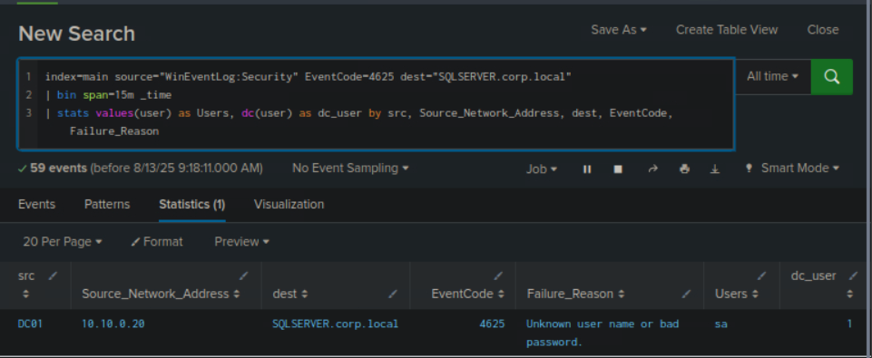

# Detecting-Windows-Attacks-with-Splunk

## Detecting Common User/Domain Recon
### Notes
Domain Recon
- AD domain recon is crucial in a cryberattack lifecycle
  - Attackers want as much info as possible: architecture, network topology, security measures, and potential vulnerabilities.
    - Focus on: domain controllers, user accounts, groups, trust relationships, organizational units (OUs), group policies, and other vital objects.
- With enough info, attackers can pinpoint high-value targets, escalate privileges, and move laterally within the network

User/Domain Recon Using Native Windows Executables
- Attacker executes the net group command to obtain a list of Domain Admins
  - net group "Domain Admins" /domain
    - If succesful, will display accounts with admin privileges
- Other tools used:
  - whoami /all
    - Displays current user and all security info about the user, including: group memberships, privileges, authentication ID, SID
  - wmic computersystem get domain
    - Uses WMIC (Windows Management Instrumentation Command-line) to display the domain to which the current computer is joined
    - Helps attackers to pivot from a non-domain-joined to a domain-joined environment.
  - net user /domain
    - Lists all domain user accounts by querying the domain controller
    - Used to identify potential targets
  - arp -a
    - Displays the ARP cache, which maps IP addresses to MAC addresses
    - Identifies other active devices on the local subnet
  - nltest /domain_trusts
    - Lists domain trust relationships
    - Useful for mapping multi-domain or multi-forest environments. Shows possible lateral movement paths across domain boundaries

User/Domain Recon Using BloodHound/SharpHound
- BloodHound: open-source domain recon tool created to analyze and visualize the AD environment
  - Used to find attack paths and potential security risks within an organization's AD infrastructure
  - Leverages graph theory and relationship mapping to know trust relationships, permissions, and group memberships within the AD domain
- Sharphound: a C# data collector for BloodHound
  - Runs: .\Sharphound3.exe -c all
    - To collect all sorts of data

BloodHound Detection Opportunities
- BloodHound collector executes numerous LDAP queries directed at the Domain Controller to learn more about the domain
  - Hard to monitor LDAP queries. Windows Event log doesn't record them by default.
    - Best bet is to check for Event 1644 - LDAP performance monitoring log, but some events may not be recorded
  - Better to use: Windows ETW provider Microsoft-Windows-LDAP-Client
    - SilkETW & SilkService: versatile C# wrappers for ETW, simplifies intricacies of ETW, provides accessible interface for research and introspection
- List of LDAP filters used for recon tools: https://techcommunity.microsoft.com/t5/microsoft-defender-for-endpoint/hunting-for-reconnaissance-activities-using-ldap-search-filters/ba-p/824726

Detecting User/Domain Recon With Splunk
- index=main source="XmlWinEventLog:Microsoft-Windows-Sysmon/Operational" EventID=1 earliest=1690447949 latest=1690450687 | search process_name IN (arp.exe,chcp.com,ipconfig.exe,net.exe,net1.exe,nltest.exe,ping.exe,systeminfo.exe,whoami.exe) OR (process_name IN (cmd.exe,powershell.exe) AND process IN (*arp*,*chcp*,*ipconfig*,*net*,*net1*,*nltest*,*ping*,*systeminfo*,*whoami*)) | stats values(process) as process, min(_time) as _time by parent_process, parent_process_id, dest, user | where mvcount(process) > 3
- Breakdown:
  - Index & Source Filter:
    - Targets events in the main index.
    - Source: XmlWinEventLog:Microsoft-Windows-Sysmon/Operational (Sysmon logs in XML format).
  - Event ID Filter:
    - Filters for Event ID 1, which corresponds to process creation events in Sysmon.
  - Time Range Filter:
    - Only includes events between Unix timestamps 1690447949 and 1690450687.
  - Process Name Filter:
    - Focuses on specific system/network tools (e.g., arp.exe, ipconfig.exe).
    - Includes events where:
      - process_name is cmd.exe or powershell.exe
      - And process field contains specific substrings (indicating commands run inside a shell).
  - Statistical Aggregation:
    - Groups events by parent_process, parent_process_id, dest, and user.
    - Collects:
      - values(process) → list of unique processes.
      - min(_time) → timestamp of the first event in each group.
  - Result Filtering:
    - Keeps only results where the number of processes (count(process)) is greater than 3.
    - Highlights suspicious parent processes spawning multiple child processes.

Detecting Recon By Targeting BloodHound
- index=main earliest=1690195896 latest=1690285475 source="WinEventLog:SilkService-Log" | spath input=Message | rename XmlEventData.* as * | table _time, ComputerName, ProcessName, ProcessId, DistinguishedName, SearchFilter | sort 0 _time | search SearchFilter="*(samAccountType=805306368)*" | stats min(_time) as _time, max(_time) as maxTime, count, values(SearchFilter) as SearchFilter by ComputerName, ProcessName, ProcessId | where count > 10 | convert ctime(maxTime)
- Breakdown
  - Filtering by Index and Source:
    - Searches the main index.
    - Filters for logs with source: WinEventLog:SilkService-Log (from SilkETW).
  - Time Range Filter:
    - Filters events between Unix timestamps 1690195896 and 1690285475.
  - Path Extraction:
    - Uses spath to extract fields from the Message field (likely structured as JSON or XML).
  - Field Renaming:
    - Uses rename to strip XmlEventData. prefix from field names for simplicity.
  - Tabulating Results:
    - Uses table to display selected columns: _time, ComputerName, ProcessName, ProcessId, DistinguishedName, SearchFilter
  - Sorting:
    - Uses sort 0 _time to sort all results by _time (ascending).
    - 0 means no limit on the number of results sorted.
  - Search Filter:
    - Filters events where SearchFilter contains: *(samAccountType=805306368)*
      - (likely targeting LDAP queries for user accounts).
  - Statistics:
    - Groups events by: ComputerName, ProcessName, ProcessId
    - Each group, calculates:
      - min(_time) as _time → First occurrence.
      - max(_time) as maxTime → Last occurrence.
      - count → Number of events in the group.
      - values(SearchFilter) → Unique search filters used.
  - Filtering by Event Count:
    - Uses where to filter groups with count > 10.
    - Focuses on processes that ran >10 LDAP searches with the target filter.
  - Time Conversion
    - Uses convert to change maxTime from Unix timestamp to human-readable ctime format.
### Walkthrough
Q1. Modify and employ the Splunk search provided at the end of this section on all ingested data (All time) to find all process names that made LDAP queries where the filter includes the string *(samAccountType=805306368)*. Enter the missing process name from the following list as your answer. N/A, Rubeus, SharpHound, mmc, powershell, _
- Open Splunk in Firefox and go to 'Search' tab
- Run the Splunk query in the (Detecting Recon By Targeting BloodHound) section and set time range to 'All Time'
- Modify the query
  - Remove the time range: earliest=1690195896 latest=1690285475
    - This is to go through all LDAP query events, not just in a specific time range
  - Change the count from 'where count > 10' to 'where count > 1'
    - This ensures that it will list all processes that made LDAP queries at least once.
  ```spl
  index=main source="WinEventLog:SilkService-Log"
| spath input=Message 
| rename XmlEventData.* as * 
| table _time, ComputerName, ProcessName, ProcessId, DistinguishedName, SearchFilter
| sort 0 _time
| search SearchFilter="*(samAccountType=805306368)*"
| stats min(_time) as _time, max(_time) as maxTime, count, values(SearchFilter) as SearchFilter by ComputerName, ProcessName, ProcessId
| where count > 1
| convert ctime(maxTime)
```
- Answer is: rundll32


## Password Spraying
### Notes
Password Spraying
- Spreads out the attack across multiple accounts using a limited set of commonly used or easily guessable passwords
  - Want to evade account lockout policies
    - Applied to defend against brute-force attacks on individual accounts
- Lowers the chance of triggering account lockouts
  - Each user account receives only a few password attempts
  - Attack is less noticeable.

Password Spraying Detection Opportunities
- Done in Windows
- Look for multiple failed logons: Event ID 4625 - Failed Logon
  - From multiple accounts but comes from same source IP.
  - Within short time frame
- Other useful event logs:
  - 4768 and ErrorCode 0x6 - Kerberos Invalid Users
  - 4768 and ErrorCode 0x12 - Kerberos Disabled Users
  - 4776 and ErrorCode 0xC000006A - NTLM Invalid Users
  - 4776 and ErrorCode 0xC0000064 - NTLM Wrong Password
  - 4648 - Authenticate Using Explicit Credentials
  - 4771 - Kerberos Pre-Authentication Failed

Detecting Password Spraying With Splunk
- index=main earliest=1690280680 latest=1690289489 source="WinEventLog:Security" EventCode=4625 | bin span=15m _time | stats values(user) as Users, dc(user) as dc_user by src, Source_Network_Address, dest, EventCode, Failure_Reason
- Breakdown
  - Filtering by Index, Source, and EventCode:
    - Filters events from index=main
    - Source is WinEventLog:Security
    - EventCode is 4625 (represents failed Windows logon attempts)
  - Time Range Filter:
    - Limits events to those between Unix timestamps 1690280680 and 1690289489
  - Time Binning:
    - Uses the bin command to group events into 15-minute intervals (_time)
    - Helps identify trends or patterns over time
  - Statistical Aggregation (stats command):
    - Groups events by: src (source host), Source_Network_Address, dest (destination), EventCode, Failure_Reason
    - Calculates:
      - values(user) as Users: Lists all unique users involved in each group
      - dc(user) as dc_user: Counts the number of distinct users per group

### Walkthrough
Q1. Employ the Splunk search provided at the end of this section on all ingested data (All time) and enter the targeted user on SQLSERVER.corp.local as your answer.
- Open Firefox, go to Splunk, go to 'Search' tab and run the Splunk query
  - http://IPADDRESS:8000
- Modify the query:
  - Remove the time range: earliest=1690280680 latest=1690289489
    - It will remove the time range and query for all failed login events
  - Add the destination to the specified domain after the EventCode
    - dest="SQLSERVER.corp.local"
```spl
index=main source="WinEventLog:Security" EventCode=4625 dest="SQLSERVER.corp.local"
| bin span=15m _time
| stats values(user) as Users, dc(user) as dc_user by src, Source_Network_Address, dest, EventCode, Failure_Reason
```
- Answer is: sa

## Detecting Responder-Like Attacks
### Notes
LLMNR/NBT-NS/mDNS Poisoning
- Vocab
  - LLMNR (Link-Local Multicast Name Resolution)
  - NBT-NS (NetBIOS Name Service)
- Network-level attacks that exploit inefficiencies in these name resolution protocols.
- LLMNR and NBT-NS are used to resolve hostnames to IP addresses on local networks when the fully qualified domain name (FQDN) resolution fails
  - No built-in security features. Very susceptible to spoofing and poisoning attacks
    - Attackers use Responder tool to execute the attack
      - https://github.com/lgandx/Responder

Attack Steps
- Victim device sends a name resolution query for a mistyped hostname
- DNS fails to resolve the mistyped hostname
- Victim device sends a name resolution query for the mistyped hostname using LLMNR/NBT-NS
- Attacker's host responds to the query and pretends to know the identity of the requested host
  - LLMNR (UDP 5355)
  - NBT-NS (UDP 137)
- Victim device is redirected to adversary-controlled system

Responder Detection Opportunities
- Detection is diffult for this attack
- Deploy network monitoring solutions to detect unusual LLMNR and NBT-NS traffic patterns, such as an elevated volume of name resolution requests from a single source.
- Employ a honeypot approach - name resolution for non-existent hosts should fail. If an attacker is present and spoofing LLMNR/NBT-NS/mDNS responses, name resolution will succeed.
  - https://www.praetorian.com/blog/a-simple-and-effective-way-to-detect-broadcast-name-resolution-poisoning-bnrp/

Detecting Responder-like Attacks With Splunk
- Options:
  - index=main earliest=1690290078 latest=1690291207 SourceName=LLMNRDetection | table _time, ComputerName, SourceName, Message
    - This one focuses on the LLMNRDetection as an event provider
  - index=main earliest=1690290078 latest=1690291207 EventCode=22 | table _time, Computer, user, Image, QueryName, QueryResults
    - Can use Sysmon Event ID 22 to track DNS queries on non-existent/mistyped file shares
  - index=main earliest=1690290814 latest=1690291207 EventCode IN (4648) | table _time, EventCode, source, name, user, Target_Server_Name, Message | sort 0 _time
    - Can also use Event 4648, used to detect explicit logons to rogue file shares which attackers might use to gather legitimate user credentials

### Walkthrough
Q1. Modify and employ the provided Sysmon Event 22-based Splunk search on all ingested data (All time) to identify all share names whose location was spoofed by 10.10.0.221. Enter the missing share name from the following list as your answer. myshare, myfileshar3, _
- Open Firefox, go to Splunk, go to 'Search' tab and run the Splunk query
  - http://IPADDRESS:8000
- Run the EventCode=22 version of the query
- Scroll and observe the myshare and myfileshar3 events
  - Both share the QueryResults having the value '::1;::ffff:10.10.0.221;' which is the attacker machine spoofing these share names
- Modify the query:
  - Remove the time range: earliest=1690280680 latest=1690289489
    - It will remove the time range and query for all failed login events
  - Add the QueryResults that indicate the spoofing
    - QueryResults="::1;::ffff:10.10.0.221;"
- Run the query and it will show the 3 share names that have been spoofed by 10.10.0.221
- Answer is: f1nancefileshare

## Detecting Kerberoasting/AS-REProasting
### Notes
Kerberoasting
- A technique targeting service accounts in AD environments to extract and crack their password hashes
- It exploits Kerberos service tickets encryption and usage of weak or easily crackable passwords for service accounts

Attack Steps
- Identify Target Service Accounts:
  - Attacker searches for service accounts in AD
  - Enumerates accounts with Service Principal Names (SPNs) set
  - Why:
    - SPNs are linked to services like SQL Server, Exchange, or custom apps.
    - Service accounts often have elevated privileges.
  - Attackers may use tools like Rubeus to automate SPN enumeration
- Request TGS Ticket:
  - Attacker requests TGS (Ticket Granting Service) tickets for service accounts, from Key Distribution Center (KDC).
  - TGS tickets contain encrypted password hashes of the targeted service accounts.
    - This will be brute-forced offline
  - Rubeus is used to automate the TGS ticket requests.
- Offline Brute-Force Attack:
  - Attacker runs offline brute-force techniques, using password cracking tools like Hashcat or John the Ripper, to attempt to crack the encrypted password hashes.

Benign Service Access Process & Related Events
- Rehash of Kerberos operations and tickets
- Related Events:
  - Event ID 4768 (Kerberos TGT Request):
    - Triggered when a client requests a TGT from the KDC
    - Logged on the domain controller in the Security log.
  - Event ID 4769 (Kerberos Service Ticket Request):
    - Occurs when the client uses the TGT to request a TGS ticket for a service (e.g., MSSQL server’s SPN).
    - Also logged on the domain controller.
  - Event ID 4624 (Logon):
    - Logged on the target server (e.g., MSSQL server) after the client uses the TGS to authenticate and successfully log in.
    - Indicates successful connection using the service account tied to the SPN.

Kerberoasting Detection Opportunities
- Done during recon phase for privileged service accounts, look for LDAP activity
- Legitimate vs Kerberoasting: TGS tickets are requested, but legitimate user will connect to the server and present the TGS ticket
  - Attacker takes the TGS ticket to break encryption and steal credentials.

Detecting Kerberoasting With Splunk
- Benign TGS Request
  - index=main earliest=1690388417 latest=1690388630 EventCode=4648 OR (EventCode=4769 AND service_name=iis_svc) | dedup RecordNumber | rex field=user "(?<username>[^@]+)" | table _time, ComputerName, EventCode, name, username, Account_Name, Account_Domain, src_ip, service_name, Ticket_Options, Ticket_Encryption_Type, Target_Server_Name, Additional_Information
  - Breakdown
    - index=main earliest=1690388417 latest=1690388630
      - Limits the search to the main index.
      - Filters events that occurred between the given epoch timestamps (specific time range).
    - EventCode=4648 OR (EventCode=4769 AND service_name=iis_svc)
      - Includes events with: EventCode=4648, or EventCode=4769 only if the service_name is iis_svc.
    - | dedup RecordNumber
      - Removes duplicate events using the RecordNumber field to ensure unique records.
    - | rex field=user "(?<username>[^@]+)"
      - Uses regular expression to extract the username from the user field (removes domain part after @).
      - Stores the result in a new field called username.
    - | table _time, ComputerName, EventCode, name, username, Account_Name, Account_Domain, src_ip, service_name, Ticket_Options, Ticket_Encryption_Type, Target_Server_Name, Additional_Information
      - Formats the output as a table displaying only the listed fields for readability and analysis.
- Detecting Kerberoasting - SPN Querying
  - index=main earliest=1690448444 latest=1690454437 source="WinEventLog:SilkService-Log" | spath input=Message | rename XmlEventData.* as * | table _time, ComputerName, ProcessName, DistinguishedName, SearchFilter | search SearchFilter="*(&(samAccountType=805306368)(servicePrincipalName=*)*"
- Detecting Kerberoasting - TGS Requests
  - index=main earliest=1690450374 latest=1690450483 EventCode=4648 OR (EventCode=4769 AND service_name=iis_svc) | dedup RecordNumber | rex field=user "(?<username>[^@]+)" | bin span=2m _time | search username!=*$ | stats values(EventCode) as Events, values(service_name) as service_name, values(Additional_Information) as Additional_Information, values(Target_Server_Name) as Target_Server_Name by _time, username | where !match(Events,"4648")
- Detecting Kerberoasting Using Transactions - TGS Requests
  - index=main earliest=1690450374 latest=1690450483 EventCode=4648 OR (EventCode=4769 AND service_name=iis_svc) | dedup RecordNumber | rex field=user "(?<username>[^@]+)" | search username!=*$ | transaction username keepevicted=true maxspan=5s endswith=(EventCode=4648) startswith=(EventCode=4769) | where closed_txn=0 AND EventCode = 4769 | table _time, EventCode, service_name, username

AS-REPRoasting
- A technique used in Active Directory environments to target user accounts without pre-authentication enabled
- Pre-Auth in Kerberos is a security feature, users must prove their identity before TGT is issued

Attack Steps:
- Identify Target User Accounts: Attacker identifies user accounts without pre-authentication enabled.
- Request AS-REQ Service Tickets: The attacker initiates an AS-REQ service ticket request for each identified target user account.
- Offline Brute-Force Attack: The attacker captures the encrypted TGTs and employs offline brute-force techniques to attempt to crack the password hashes.

Kerberos Pre-Auth
- When a user tries to access a network resource or service, the client sends an authentication request AS-REQ to the KDC
- If pre-auth is enabled, this request also contains an encrypted timestamp (pA-ENC-TIMESTAMP)
  - KDC attempts to decrypt this timestamp using the user password hash and, if successful, issues a TGT to the user.
- If pre-auth is disabled, there is no timestamp validation by the KDC, allowing users to request a TGT ticket without knowing the user password.

AS-REPRoasting Detection Opportunities
- Monitor LDAP activity during reocn phase for service accounts
- Kerberos authentication Event ID 4768 (TGT Request) contains a PreAuthType attribute in the additional information part of the event indicating whether pre-authentication is enabled for an account

Detecting AS-REPRoasting With Splunk
- Detecting AS-REPRoasting - Querying Accounts With Pre-Auth Disabled
  - index=main earliest=1690392745 latest=1690393283 source="WinEventLog:SilkService-Log" | spath input=Message | rename XmlEventData.* as * | table _time, ComputerName, ProcessName, DistinguishedName, SearchFilter | search SearchFilter="*(samAccountType=805306368)(userAccountControl:1.2.840.113556.1.4.803:=4194304)*"
- Detecting AS-REPRoasting - TGT Requests For Accounts With Pre-Auth Disabled
  - index=main earliest=1690392745 latest=1690393283 source="WinEventLog:Security" EventCode=4768 Pre_Authentication_Type=0 | rex field=src_ip "(\:\:ffff\:)?(?<src_ip>[0-9\.]+)" | table _time, src_ip, user, Pre_Authentication_Type, Ticket_Options, Ticket_Encryption_Type

### Walkthrough
Q1. Modify and employ the Splunk search provided at the "Detecting Kerberoasting - SPN Querying" part of this section on all ingested data (All time). Enter the name of the user who initiated the process that executed an LDAP query containing the "*(&(samAccountType=805306368)(servicePrincipalName=*)*" string at 2023-07-26 16:42:44 as your answer. Answer format: CORP\_
- Open Firefox, go to Splunk, go to 'Search' tab and run the Splunk query
  - http://IPADDRESS:8000
- Run the specified query
- Modify the query:
  - Remove the time range: earliest=1690280680 latest=1690289489
    - It will remove the time range and query for all LDAP events
    - This will also show relevant events on the same time and date
  - 
- Answer is: CORP\LANDON_HINES

## Detecting Pass the Hash
### Notes
Pass-the-Hash
- A technique utilized by attackers to authenticate to a networked system using the NTLM hash of a user's password instead of the plaintext password
- Takes advantage on how Windows stores password hashes in memory.
  - If attacker has Admin privileges, they can capture the hash and reuse for lateral movement

Attack Steps
- Attacker uses tools such as Mimikatz to extract the NTLM hash of a user currently logged in the compromised system. Local admin privileges are required on the system to extract the user's hash.
- Attacker can then authenticate as the targeted user on other systems or network resources without needing to know the actual password
- Attacker can use the authenticated session, moving laterally within the network, gaining unauthorized access to other systems and resources

Windows Access Tokens & Alternate Credentials
- Access Token: a data structure that defines the security context of a process or thread
  - Contains info about the associated user account's identity and privileges
  - References a LogonSession generated at user logon
    - LogonSession contains Username, Domain, and AuthenticationID (NTHash/LMHash), which are used when a process attempts to access remote resources
- When user logs on, the system verifies the user's password by comparing it with information stored in a security database
  - Once auth is confirmed, access token is generated
  - Any process executed by this user also has a copy of the access token.
    - https://learn.microsoft.com/en-us/windows/win32/secauthz/access-tokens
- Alt Credentials: provides a way to supply different login credentials for specific actions or processes without altering the user's primary login session
  - It allows a user/process to execute certain commands or access resources as a different user without logging out or switching user accounts
  - The command 'runas' allows this.
    - This also generates a new access token, verified by 'whoami' command
    - Also contains '/netonly' flag, which indicates that user information for it are remote access only
  - The 'whoami' command returns the original credentials, but the created processes through 'runas' will have privileges of the 'mask' user account

Pass-the-Hash Detection Opportunities
- 'runas' comand execution
  - When runas command is executed without the /netonly flag - Event ID 4624 (Logon) with LogonType 2 (interactive).
  - When runas command is executed with the /netonly flag - Event ID 4624 (Logon) with LogonType 9 (NewCredentials).
    - False Positives could occur
    - True Positives has Mimikatz access the LSASS process memory to change LogonSession credential materials
      - Relate the events to 'User Logon with NewCredentials' events with 'Sysmon Process Access Event Code 10'.

Detecting Pass-the-Hash With Splunk
- index=main earliest=1690450689 latest=1690451116 (source="XmlWinEventLog:Microsoft-Windows-Sysmon/Operational" EventCode=10 TargetImage="C:\\Windows\\system32\\lsass.exe" SourceImage!="C:\\ProgramData\\Microsoft\\Windows Defender\\platform\\*\\MsMpEng.exe") OR (source="WinEventLog:Security" EventCode=4624 Logon_Type=9 Logon_Process=seclogo) | sort _time, RecordNumber | transaction host maxspan=1m endswith=(EventCode=4624) startswith=(EventCode=10) | stats count by _time, Computer, SourceImage, SourceProcessId, Network_Account_Domain, Network_Account_Name, Logon_Type, Logon_Process | fields - count
- Breakdown:
  - index=main earliest=1690450689 latest=1690451116:
    - Limits the search to the main index.
    - Time range specified by epoch timestamps (earliest=1690450689 latest=1690451116).
  - (source="XmlWinEventLog:Microsoft-Windows-Sysmon/Operational" EventCode=10 TargetImage="C:\\Windows\\system32\\lsass.exe" SourceImage!="C:\\ProgramData\\Microsoft\\Windows Defender\\platform\\*\\MsMpEng.exe"):
    - Source: XmlWinEventLog:Microsoft-Windows-Sysmon/Operational
    - TargetImage: lsass.exe (indicates process access to LSASS).
    - Excludes: Defender process (MsMpEng.exe) as a SourceImage.
  - OR (source="WinEventLog:Security" EventCode=4624 Logon_Type=9 Logon_Process=seclogo):
    - Source: WinEventLog:Security
    - Logon_Type = 9 (NewCredentials)
    - Logon_Process = seclogo (typical for remote logons via runas or remote tools).
  - | sort _time, RecordNumber:
    - Sorts by _time and RecordNumber for chronological analysis.
  - | transaction host maxspan=1m endswith=(EventCode=4624) startswith=(EventCode=10):
    - transaction command groups events on the same host within 1 minute.
    - Starts with Sysmon EventCode=10 and ends with Security EventCode=4624.
    - Links potential LSASS access to a remote logon event.
  - | stats count by _time, Computer, SourceImage, SourceProcessId, Network_Account_Domain, Network_Account_Name, Logon_Type, Logon_Process:
    - stats count by several fields to show event combinations and activity context.
  - | fields - count:
    - Removes the count field from the results.

### Walkthrough
Q1. A Pass-the-Hash attack took place during the following timeframe earliest=1690543380 latest=1690545180. Enter the involved ComputerName as your answer.
- Open Firefox, go to Splunk, go to 'Search' tab and run the Splunk query
  - http://IPADDRESS:8000
- Modify the time range of the query as specified by the question
- Answer is: BLUE.corp.local

## Detecting Pass-the-Ticket
### Notes
Pass-the-Ticket (PtT)
- A lateral movement technique on a network by abusing Kerberos TGT and TGS tickets
- It leverages Kerberos tickets to authenticate to other systems and access network resources without needing to know the users' passwords

Attack Steps
- Attacker gains admin access to a system, either through an initial compromise or privilege escalation
- Uses tools such as Mimikatz or Rubeus to extract valid TGT or TGS tickets from the compromised system's memory
- Submits the extracted ticket for the current logon session
- Attacker can now authenticate to other systems and network resources without needing plaintext passwords

Related Windows Security Events
- Event ID 4648 (Explicit Credential Logon Attempt): This event is logged when explicit credentials (e.g., username and password) are provided during logon.
- Event ID 4624 (Logon): This event indicates that a user has successfully logged on to the system.
- Event ID 4672 (Special Logon): This event is logged when a user's logon includes special privileges, such as running applications as an administrator.
- Event ID 4768 (Kerberos TGT Request): This event is logged when a client requests a Ticket Granting Ticket (TGT) during the Kerberos authentication process.
- Event ID 4769 (Kerberos Service Ticket Request): When a client requests a Service Ticket (TGS Ticket) to access a remote service during the Kerberos authentication process, Event ID 4769 is generated.

Pass-the-Ticket Detection Opportunities
- Difficult, attackers are leveraging valid Kerberos tickets instead of traditional credential hashes
  - The gievaway is that Kerberos Authentication process will be partial
  - Attacker imports a used TGT to a logon session and requests for a TGS, but imported TGT never had an initial request for it from the attacker, so no associated Event ID 4768
- Look for Event ID 4769 (Kerberos Service Ticket Request) or Event ID 4770 (Kerberos Service Ticket was renewed) without a prior Event ID 4768 (Kerberos TGT Request) from the same system within a specific time window.
- Look for mismatches between Service and Host IDs (in Event ID 4769) and the actual Source and Destination IPs (in Event ID 3)
  - False positives are possible, but unusual names should be investigated
- When a TGS ticket is imported, review Event ID 4771 (Kerberos Pre-Authentication Failed) for mismatches between Pre-Authentication type and Failure Code
- Apply these with behavior-based detection to minimize False Positives

Detecting Pass-the-Ticket With Splunk
- index=main earliest=1690392405 latest=1690451745 source="WinEventLog:Security" user!=*$ EventCode IN (4768,4769,4770) | rex field=user "(?<username>[^@]+)" | rex field=src_ip "(\:\:ffff\:)?(?<src_ip_4>[0-9\.]+)" | transaction username, src_ip_4 maxspan=10h keepevicted=true startswith=(EventCode=4768) | where closed_txn=0 | search NOT user="*$@*" | table _time, ComputerName, username, src_ip_4, service_name, category
- Breakdown
  - index=m0ain earliest=1690392405 latest=1690451745 source="WinEventLog:Security" user!=*$ EventCode IN (4768,4769,4770):
    - Searches the main index within the specified time range.
    - Limits to events from WinEventLog:Security.
    - Filters:
      - EventCode must be one of 4768, 4769, or 4770 (Kerberos authentication-related).
      - Excludes machine accounts by filtering out users ending in $ (user!=*$).
  - | rex field=user "(?<username>[^@]+)":
    - Extracts username from the user field (everything before @).
  - | rex field=src_ip "(\:\:ffff\:)?(?<src_ip_4>[0-9\.]+)":
    - Extracts IPv4 address (src_ip_4) from src_ip, even if stored in IPv6-mapped format.
  - | transaction username, src_ip_4 maxspan=10h keepevicted=true startswith=(EventCode=4768):
    - Groups events by username and src_ip_4.
    - Each transaction starts with EventCode=4768 (Kerberos TGT request).
    - Maximum transaction span is 10 hours.
    - keepevicted=true: includes incomplete transactions.
  - | where closed_txn=0:
    - Keeps only open transactions (no ending event), possibly indicating incomplete or anomalous authentication sequences.
  - | search NOT user="*$@*":
    - Removes users matching the pattern *$@* (likely malformed or irrelevant usernames).
  - | table _time, ComputerName, username, src_ip_4, service_name, category:
    - Displays selected fields in a table: _time, ComputerName, username, src_ip_4, service_name, and category.

### Walkthrough
Q1. Execute the Splunk search provided at the end of this section to find all usernames that may be have executed a Pass-the-Ticket attack. Enter the missing username from the following list as your answer. Administrator, _
- Open Firefox, go to Splunk, go to 'Search' tab and run the Splunk query
  - http://IPADDRESS:8000
- Run the query
- Answer is: YOUNG_WILKINSON

## Detecting Overpass-the-Hash
### Notes
Detecting Overpass-the-Hash
- Allows authentication to occur via Kerberos rather than NTLM. Both NTLM hashes or AES keys can serve as a basis for requesting a Kerberos TGT

Attack Steps
- Attacker uses tools such as Mimikatz to extract the NTLM hash of a user who is currently logged in to the compromised system.
  - Must have at least local administrator privileges on the system to be able to extract the hash of the user
- Use a tool such as Rubeus to craft a raw AS-REQ request for a specified user to request a TGT ticket
  - Doesn't require elevated privileges on the host to request the TGT, stealthier than Mimikatz Pass the Hash attack
- Analogous to the Pass-the-Ticket technique, the attacker submits the requested ticket for the current logon session

Overpass-the-Hash Detection Opportunities
- For Mimikatz, it has same artifacts as Pass the Hash attack, can be detected using the same strategies.
- For Rubeus, the previous strategy only works if the requested TGT is used on another host
  - Rubeus sends an AS-REQ request directly to the Domain Controller (DC), generating Event ID 4768 (Kerberos TGT Request)
  - Communication with the DC (TCP/UDP port 88) from an unusual process can serve as an indicator of a potential Overpass-the-Hash attack

Detecting Overpass-the-Hash With Splunk (Targeting Rubeus)
- index=main earliest=1690443407 latest=1690443544 source="XmlWinEventLog:Microsoft-Windows-Sysmon/Operational" (EventCode=3 dest_port=88 Image!=*lsass.exe) OR EventCode=1 | eventstats values(process) as process by process_id | where EventCode=3 | stats count by _time, Computer, dest_ip, dest_port, Image, process | fields - count

### Walkthrough
Q1. Employ the Splunk search provided at the end of this section on all ingested data (All time) to find all involved images (Image field). Enter the missing image name from the following list as your answer. Rubeus.exe, _.exe
- Open Firefox, go to Splunk, go to 'Search' tab and run the Splunk query
  - http://IPADDRESS:8000
- Modify the specified query and remove the time range to query for all events
- Answer is: rundll32.exe

## Detecting Golden Tickets/Silver Tickets
### Notes
Golden Ticket
- Attacker forges a TGT to gain unauthorized access to a Windows Active Directory domain as a domain administrator
  - TGT has arbitrary credentials, but is used to pretend as a domain admin
- Stealthy and persistent
  - Forged ticket has a long validity period

Attack Steps
- Attacker extracts the NTLM hash of the KRBTGT account using a DCSync attack (alternatively, they can use NTDS.dit and LSASS process dumps on the Domain Controller).
- With the KRBTGT hash, attacker forges a TGT for an arbitrary user account, assigning it domain administrator privileges
- Attacker injects the forged TGT in the same manner as a Pass-the-Ticket attack

Golden Ticket Detection Opportunities
- Hard to detect, TGT can be forged offline by an attacker, no trace of Mimikatz execution
- Monitor common methods of extracting the KRBTGT hash:
  - DCSync attack
  - NTDS.dit file access
  - LSASS memory read on the domain controller (Sysmon Event ID 10)

Detecting Golden Tickets With Splunk (Yet Another Ticket To Be Passed Approach)
- index=main earliest=1690451977 latest=1690452262 source="WinEventLog:Security" user!=*$ EventCode IN (4768,4769,4770) | rex field=user "(?<username>[^@]+)" | rex field=src_ip "(\:\:ffff\:)?(?<src_ip_4>[0-9\.]+)" | transaction username, src_ip_4 maxspan=10h keepevicted=true startswith=(EventCode=4768) | where closed_txn=0 | search NOT user="*$@*" | table _time, ComputerName, username, src_ip_4, service_name, category

Silver Ticket
- Attacker has the password hash of a target service account (e.g., SharePoint, MSSQL) may forge Kerberos TGS. This is Silver Ticket
- Can impersonate any user, but only allows attacker to access a specific resource (e.g., MSSQL) and the system hosting the resource

Attack Steps
- Attacker extracts the NTLM hash of the targeted service account (or the computer account for CIFS access) using tools like Mimikatz or other credential dumping techniques
- Generate a Silver Ticket using the extracted NTLM hash
  - Use tools like Mimikatz to create a forged TGS ticket for the specified service.
- The attacker injects the forged TGT in the same manner as a Pass-the-Ticket attack.

Silver Ticket Detection Opportunities
- Hard to detect, no simple indicators of attack
  - Both Golden and Silver Ticket attacks, any user can be used, including non-existent ones
    - Event ID 4720 (A user account was created) can help identify newly created users.
- No validation for user permissions
  - Event ID 4672 (Special Logon) can be employed to detect anomalously assigned privileges

Detecting Silver Tickets With Splunk
- Detecting Silver Tickets With Splunk Through User Correlation
  - index=main latest=1690545656 EventCode=4624 | stats min(_time) as firstTime, values(ComputerName) as ComputerName, values(EventCode) as EventCode by user | eval last24h = 1690451977 | where firstTime > last24h ```| eval last24h=relative_time(now(),"-24h@h")``` | convert ctime(firstTime) | convert ctime(last24h) | lookup users.csv user as user OUTPUT EventCode as Events | where isnull(Events)
  - Breakdown:
    - index=main latest=1690545656 EventCode=4624:
      - Searches in the main index.
      - Limits to events with EventCode=4624 (successful logons).
      - Only includes events before timestamp 1690545656.
    - | stats min(_time) as firstTime, values(ComputerName) as ComputerName, values(EventCode) as EventCode by user:
      - Finds the earliest logon time (firstTime) per user.
      - Collects associated ComputerName and EventCode values.
    - eval last24h = 1690451977:
      - Sets a static time threshold for filtering recent logins.
    - where firstTime > last24h:
      - Keeps only users whose first login occurred after the time threshold.
      - Converts firstTime and last24h from epoch to readable timestamps.
    - eval last24h=relative_time(now(),"-24h@h"):
      - (Commented out) — would dynamically set last24h to 24 hours ago.
    - | convert ctime(firstTime):
      - Converts the firstTime field from epoch time to a human-readable format.
    - | convert ctime(last24h):
      - Converts the last24h field from epoch time to a human-readable format.
    - lookup users.csv user as user OUTPUT EventCode as Events:
      - Compares users found in the log against those listed in users.csv.
    - where isnull(Events):
      - Keeps only users not found in the lookup file — i.e., potentially new or unauthorized accounts.
- Detecting Silver Tickets With Splunk By Targeting Special Privileges Assigned To New Logon
  - index=main latest=1690545656 EventCode=4672 | stats min(_time) as firstTime, values(ComputerName) as ComputerName by Account_Name | eval last24h = 1690451977 ```| eval last24h=relative_time(now(),"-24h@h") ``` | where firstTime > last24h | table firstTime, ComputerName, Account_Name | convert ctime(firstTime)

### Walkthrough
Q1. For which "service" did the user named Barbi generate a silver ticket?
- Open Firefox, go to Splunk, go to 'Search' tab and run the Splunk query
  - http://IPADDRESS:8000
- Run the Splunk query to create a list of users, using Event ID 4720
  - index=main latest=1690448444 EventCode=4720 | stats min(_time) as _time, values(EventCode) as EventCode by user | outputlookup users.csv
    - This will generate the 'users.csv' file which will be used as lookup for the next query
- Run this query to compare the compare the list of users to the logged in users within the specified timeframe
  - index=main latest=1690545656 EventCode=4624 | stats min(_time) as firstTime, values(ComputerName) as ComputerName, values(EventCode) as EventCode by user | eval last24h = 1690451977 | where firstTime > last24h | convert ctime(firstTime) | convert ctime(last24h) | lookup users.csv user as user OUTPUT EventCode as Events | where isnull(Events)
- Select the single entry for 'Barbi' and modify the query
  - Change the 'EventCode=4624' to 'EventCode!=4624' to lookup other events related to this account
- Focus on the entry with Event ID 4648 - A logon was attempted using explicit credentials.
  - This shows that JERRI_BALLARD was using Barbi's TGS to access CIFS service in the SQLServer
- Answer is: CIFS

## Detecting Unconstrained Delegation/Constrained Delegation Attacks
### Notes
Unconstrained Delegation
- A privilege that can be granted to User or Computer Accounts in an AD environment, allowing a service to authenticate to another resource on behalf of any user

Attack Steps
- Attacker identifies systems on which Unconstrained Delegation is enabled for service accounts.
- Attacker gains access to a system with Unconstrained Delegation enabled.
- Attacker extracts TGT tickets from the memory of the compromised system using tools such as Mimikatz.

Kerberos Authentication With Unconstrained Delegation
- In Kerberos Authentication, when a user requests a TGS ticket for a remote service, the Domain Controller will embed the user's TGT into the service ticket
  - When connecting to the remote service, the user will present not only the TGS ticket but also their own TGT
- When the service needs to authenticate to another service on behalf of the user, it will present the user's TGT ticket, which the service received with the TGS ticket.

Unconstrained Delegation Attack Detection Opportunities
- PowerShell commands and LDAP search filters used for Unconstrained Delegation discovery can be detected by monitoring PowerShell script block logging (Event ID 4104) and LDAP request logging
- Main goal of an Unconstrained Delegation attack is to retrieve and reuse TGT tickets, so Pass-the-Ticket detection can be used as well.

Detecting Unconstrained Delegation Attacks With Splunk
- index=main earliest=1690544538 latest=1690544540 source="WinEventLog:Microsoft-Windows-PowerShell/Operational" EventCode=4104 Message="*TrustedForDelegation*" OR Message="*userAccountControl:1.2.840.113556.1.4.803:=524288*" | table _time, ComputerName, EventCode, Message

Constrained Delegation
- A feature in AD that allows services to delegate user credentials only to specified resources, reducing the risk associated with Unconstrained Delegation
- Any user or computer accounts that have service principal names (SPNs) set in their msDS-AllowedToDelegateTo property can impersonate any user in the domain to those specific SPNs.

Attack Steps
- Attacker identifies systems where Constrained Delegation is enabled and determines the resources to which they are allowed to delegate
- Attacker gains access to the TGT of the principal (user or computer). The TGT can be extracted from memory (Rubeus dump) or requested with the principal's hash
- Attacker uses the S4U technique to impersonate a high-privileged account to the targeted service (requesting a TGS ticket)
- Attacker injects the requested ticket and accesses targeted services as the impersonated user.

Kerberos Protocol Extensions - Service For User
- Service for User to Self (S4U2self) and Service for User to Proxy (S4U2proxy) allow a service to request a ticket from the KDC on behalf of a user
  - S4U2self allows a service to obtain a TGS for itself on behalf of a user
    - Designed to enable a user to request a TGS ticket when another method of authentication was used instead of Kerberos
    - This TGS ticket can be requested on behalf of any use
  - S4U2proxy allows the service to obtain a TGS on behalf of a user for a second service
    - Designed to take a forwardable ticket and use it to request a TGS ticket to any SPN specified in the msds-allowedtodelegateto options for the user specified in the S4U2self part
- With S4U2self and S4U2proxy, an attacker can impersonate any user to service principal names (SPNs) set in msDS-AllowedToDelegateTo properties

Constrained Delegation Attack Detection Opportunities
- Possible to detect PowerShell commands and LDAP requests aimed at discovering vulnerable Constrained Delegation users and computers
- To request a TGT ticket for a principal, as well as a TGS ticket using the S4U technique, Rubeus makes connections to the Domain Controller
  - Can be detected as an unusual process network connection to TCP/UDP port 88 (Kerberos).

Detecting Constrained Delegation Attacks With Splunk
- index=main earliest=1690544553 latest=1690562556 source="WinEventLog:Microsoft-Windows-PowerShell/Operational" EventCode=4104 Message="*msDS-AllowedToDelegateTo*" | table _time, ComputerName, EventCode, Message

Detecting Constrained Delegation Attacks - Leveraging Sysmon Logs
- index=main earliest=1690562367 latest=1690562556 source="XmlWinEventLog:Microsoft-Windows-Sysmon/Operational" | eventstats values(process) as process by process_id | where EventCode=3 AND dest_port=88 | table _time, Computer, dest_ip, dest_port, Image, process

### Walkthrough
Q1. Employ the Splunk search provided at the "Detecting Unconstrained Delegation Attacks With Splunk" part of this section on all ingested data (All time). Enter the name of the other computer on which there are traces of reconnaissance related to Unconstrained Delegation as your answer. Answer format: _.corp.local
- Open Firefox, go to Splunk, go to 'Search' tab and run the Splunk query
  - http://IPADDRESS:8000
- Run the specified query and modify it to remove the time range to scan all events
- Answer is: DC01.corp.local

## Detecting DCSync/DCShadow
### Notes
DCSync
- A technique used by attackers to extract password hashes from Active Directory Domain Controllers (DCs).
- It exploits the "Replication Directory Changes" permission, which allows reading all object attributes — including password hashes.
- The following accounts can perform DCSync by default: Admins, Domain Admins, Enterprise Admins, Computer accounts of Domain Controllers
- DCSync can retrieve:
  - Current and historical password hashes
  - Especially sensitive accounts like:
    - KRBTGT (used for Kerberos ticket encryption)
    - Administrator accounts
- Attacker wants to gain persistent access and perform pass-the-hash or Golden Ticket attacks

Attack Steps
- Attacker secures admin access to a domain-joined system or escalates privileges to acquire the requisite rights to request replication data.
- Use tools such as Mimikatz, attacker requests domain replication data by using the DRSGetNCChanges interface, and mimic a legitimate domain controller.
- Attacker may then craft Golden Tickets, Silver Tickets, or opt to employ Pass-the-Hash/Overpass-the-Hash attacks.

DCSync Detection Opportunities
- DS-Replication-Get-Changes operations can be recorded with Event ID 4662.
  - Additional Audit Policy Configuration is needed, not enabled by default (Computer Configuration/Windows Settings/Security Settings/Advanced Audit Policy Configuration/DS Access)
- Find events with the property {1131f6aa-9c07-11d1-f79f-00c04fc2dcd2}, corresponding to DS-Replication-Get-Changes, as Event 4662 solely consists of GUIDs.

Detecting DCSync With Splunk
- index=main earliest=1690544278 latest=1690544280 EventCode=4662 Message="*Replicating Directory Changes*" | rex field=Message "(?P<property>Replicating Directory Changes.*)" | table _time, user, object_file_name, Object_Server, property

DCShadow
- An advanced technique used to stealthily modify AD objects without triggering typical security logs.
- It exploits the Directory Replicator permission (i.e., Replicating Directory Changes), which is normally assigned to Domain Controllers for replication purposes.
- Attackers use DCShadow to:
  - Create or alter AD objects (e.g., accounts, groups, permissions)
  - Bypass standard detection and logging
  - Establish persistence within the network
- To register a rogue Domain Controller (used in the attack), the attacker must:
  - Create new server and nTDSDSA objects in the Configuration partition of AD
  - This action requires Administrator privileges:
    - Either Domain Admin, Local Admin on the DC, or access to the KRBTGT hash
-Purpose for attackers:
  - Inject backdoors or elevate privileges
  - Operate under the radar of traditional monitoring tools

Attack Steps
- Attacker gains administrative access to a domain-joined system or escalates privileges to acquire the necessary rights to request replication data.
- Attacker registers a rogue domain controller within the domain, leveraging the Directory Replicator permission, and executes changes to AD objects, such as modifying user groups to Domain Administrator groups
- The compromised domain controller initiates replication with the legitimate domain controllers, disseminating the changes throughout the domain

DCShadow Detection Opportunities
- To emulate a Domain Controller, DCShadow must implement specific modifications in Active Directory:
  - Add a new nTDSDSA object
  - Append a global catalog ServicePrincipalName to the computer object
- Event ID 4742 (Computer account was changed) logs changes related to computer objects, including ServicePrincipalName.

Detecting DCShadow With Splunk
- index=main earliest=1690623888 latest=1690623890 EventCode=4742 | rex field=Message "(?P<gcspn>XX\/[a-zA-Z0-9\.\-\/]+)" | table _time, ComputerName, Security_ID, Account_Name, user, gcspn | search gcspn=*

### Walkthrough
Q1. Modify the last Splunk search in this section by replacing the two hidden characters (XX) to align the results with those shown in the screenshot. Enter the correct characters as your answer.


## Detecting RDP Brute Force Attacks
### Notes
RDP Brute Force Attack
- A common vector for attackers to gain initial foothold in a network
- Attackers try to login into a Remote Desktop session by guessing and trying different passwords until they find the correct one.
- Many users often have weak or default passwords that are easy to guess

Detecting RDP Brute Force Attacks With Splunk & Zeek Logs
- index="rdp_bruteforce" sourcetype="bro:rdp:json" | bin _time span=5m | stats count values(cookie) by _time, id.orig_h, id.resp_h | where count>30

### Walkthrough
Q1. Construct a Splunk query targeting the "ssh_bruteforce" index and the "bro:ssh:json" sourcetype. The resulting output should display the time bucket, source IP, destination IP, client, and server, together with the cumulative count of authentication attempts where the total number of attempts surpasses 30 within a 5-minute time window. Enter the IP of the client that performed the SSH brute attack as your answer.
- Open Firefox, go to Splunk, go to 'Search' tab and run the Splunk query
  - https://IPADDRESS:8000
- Run the specified query
- Answer is: 192.168.152.140

## Detecting Beaconing Malware
### Notes
Malware Beaconing
- Another common technique
- Refers to the periodic communication initiated by malware-infected systems with their respective command and control (C2) servers
- Beacons, typically small data packets, are sent at regular intervals
  - Intervals can be fixed, jittered (varied slightly from a fixed pattern), or follow a more complex schedule based on the malware's specific objectives
  - Can use various protocols such as HTTP/HTTPS, DNS, and even ICMP
- This section focuses on Cobalt Strike

Detecting Beaconing Malware With Splunk & Zeek Logs
- index="cobaltstrike_beacon" sourcetype="bro:http:json" | sort 0 _time | streamstats current=f last(_time) as prevtime by src, dest, dest_port | eval timedelta = _time - prevtime | eventstats avg(timedelta) as avg, count as total by src, dest, dest_port | eval upper=avg*1.1 | eval lower=avg*0.9 | where timedelta > lower AND timedelta < upper | stats count, values(avg) as TimeInterval by src, dest, dest_port, total | eval prcnt = (count/total)*100 | where prcnt > 90 AND total > 10
- Breakdown
  - index="cobaltstrike_beacon" sourcetype="bro:http:json"
    - Selects Zeek HTTP log events from the cobaltstrike_beacon index.
  - | sort 0 _time
    - Sorts events chronologically.
  - | streamstats current=f last(_time) as prevtime by src, dest, dest_port
    - Assigns the previous event's timestamp (prevtime) for each src, dest, and dest_port combination.
  - | eval timedelta = _time - prevtime
    - Computes the time between current and previous events.
  - | eventstats avg(timedelta) as avg, count as total by src, dest, dest_port
    - Calculates the average time difference (avg) and total number of events (total) per group.
  - | eval upper=avg*1.1 and | eval lower=avg*0.9
    - Create a ±10% range around the average interval.
  - | where timedelta > lower AND timedelta < upper
    - Keeps events with intervals close to the average.
  - | stats count, values(avg) as TimeInterval by src, dest, dest_port, total
    - Counts events within the time window and shows the average interval.
  - | eval prcnt = (count/total)*100
    - Computes what percentage of events fell into the expected time range.
  - | where prcnt > 90 AND total > 10
    - Keeps only those source-destination-port groups with over 90% regular timing and more than 10 events — indicating likely beaconing activity.

### Walkthrough
Q1. Use the "cobaltstrike_beacon" index and the "bro:http:json" sourcetype. What is the most straightforward Splunk command to pinpoint beaconing from the 10.0.10.20 source to the 192.168.151.181 destination? Answer format: One word
- Answer is: timechart
  - 'timechart' is used to:
    - Analyze how events change over time
    - Visualize patterns and trends
      - Good for Beaconing which usually transmits 'beacons' consistently over time
    - Detect regular or abnormal behavior, like beaconing, traffic bursts, or downtime
  - Used for:
    - Counting events over time (e.g., HTTP requests per minute)
      - Can count events within 'buckets' or time intervals
    - Calculating averages, sums, or other metrics over time
    - Detecting periodic patterns, which is key for beaconing
      - Can bucket events into specified time intervals, using 'span=1m', in this case every 1 min

## Detecting Nmap Port Scanning
### Notes
Nmap Port Scanning
- A key technique in the toolkit of attackers and penetration testers alike.
- Probes networked systems for open ports - these are 'gates' through which data passes in and out of a system
  - Open ports are like doors in a building, can be used as possible attack vector

How?
- Nmap port scanning initiates a series of connection requests
  - Attempts to establish a TCP handshake with each port in the target's address space
    - If successful, it means the port is open
- When connection to open port is established, the service listening on that port might send back a "banner" - a little bit of data that tells us what service is running, and maybe even what version it's running
- NMap doesn't send any real data, payload is 0

Detecting Nmap Port Scanning With Splunk & Zeek Logs
- index="cobaltstrike_beacon" sourcetype="bro:conn:json" orig_bytes=0 dest_ip IN (192.168.0.0/16, 172.16.0.0/12, 10.0.0.0/8) | bin span=5m _time | stats dc(dest_port) as num_dest_port by _time, src_ip, dest_ip | where num_dest_port >= 3
- Breakdown:
  - index="cobaltstrike_beacon"
    - Limits the search to events in the cobaltstrike_beacon index.
  - orig_bytes=0
    - Filters for events where no original bytes were sent — possibly indicating scanning or failed connection attempts.
  - dest_ip IN (192.168.0.0/16, 172.16.0.0/12, 10.0.0.0/8)
    - Focuses only on events targeting private/internal IP ranges.
  - | bin span=5m _time
    - Groups events into 5-minute time buckets to analyze activity over short intervals.
  - | stats dc(dest_port) as num_dest_port by _time, src_ip, dest_ip
    - Calculates the number of distinct destination ports contacted by each source IP to each destination IP per 5-minute interval.
  - | where num_dest_port >= 3
    - Filters to show only events where 3 or more distinct ports were accessed — a possible sign of port scanning activity.

### Walkthrough
Q1. Use the "cobaltstrike_beacon" index and the "bro:conn:json" sourcetype. Did the attacker scan port 505? Answer format: Yes, No
- Open Firefox, go to Splunk, go to 'Search' tab and run the Splunk query
  - https://IPADDRESS:8000
- Run this query and it should confirm the NMap traffic to port 505
  - index="cobaltstrike_beacon" sourcetype="bro:conn:json" orig_bytes=0 dest_port=505 | bin span=5m _time | stats count by src_ip, dest_ip, dest_port
    - Modify the query to look for NMap traffic to port 505
- Answer is: Yes

## Detecting Kerberos Brute Force Attacks
### Notes
Kerberos-Based User Enumeration
- Sends an AS-REQ (Authentication Service Request) message to the KDC, which is responsible for handling Kerberos authentication
  - Message includes the username attacker is trying to validate
  - The response reveals valuable information about the existence of the specified user account
- If:
  - Username is valid, it will prompt the server to return a TGT or raise an error like KRB5KDC_ERR_PREAUTH_REQUIRED, meaning preauthentication is required
  - Username is invalid, will be met with a Kerberos error code KRB5KDC_ERR_C_PRINCIPAL_UNKNOWN in the AS-REP (Authentication Service Response) message

Detecting Kerberos Brute Force Attacks With Splunk & Zeek Logs
- index="kerberos_bruteforce" sourcetype="bro:kerberos:json" error_msg!=KDC_ERR_PREAUTH_REQUIRED success="false" request_type=AS | bin _time span=5m | stats count dc(client) as "Unique users" values(error_msg) as "Error messages" by _time, id.orig_h, id.resp_h | where count>30

### Walkthrough
Q1. Use the "kerberos_bruteforce" index and the "bro:kerberos:json" sourcetype. Was the "accrescent/windomain.local" account part of the Kerberos user enumeration attack? Answer format: Yes, No
- Open Firefox, go to Splunk, go to 'Search' tab and run the Splunk query
  - https://IPADDRESS:8000
- Run this query, as there's only 1 event
  - index="kerberos_bruteforce" sourcetype="bro:kerberos:json" error_msg="KDC_ERR_C_PRINCIPAL_UNKNOWN" client="accrescent/windomain.local"
    - Confirms that "accrescent/windomain.local" is part of the attack
    - Error message confirms that KDC doesn't recognize the account - the account doesn't exist
- Answer is: Yes

## Detecting Kerberoasting
### Notes
Kerberoasting
- If attacker has at least 1 set of legitimate credentials, then they could retrieve the SPN tickets and attempt to break them offline
- RC4 is utilized for ticket encryption behind the scenes.
  - https://www.ired.team/offensive-security-experiments/active-directory-kerberos-abuse/t1208-kerberoasting

Detecting Kerberoasting With Splunk & Zeek Logs
- index="sharphound" sourcetype="bro:kerberos:json" request_type=TGS cipher="rc4-hmac" forwardable="true" renewable="true" | table _time, id.orig_h, id.resp_h, request_type, cipher, forwardable, renewable, client, service

### Walkthrough
Q1. What port does the attacker use for communication during the Kerberoasting attack?
- Open Firefox, go to Splunk, go to 'Search' tab and run the Splunk query
  - https://IPADDRESS:8000
- Run this modified query
  - index="sharphound" sourcetype="bro:kerberos:json" request_type=TGS cipher="rc4-hmac" forwardable="true" renewable="true" | stats count by client, service, id.orig_h, id.orig_p, id.resp_h, id.resp_p
    - This will show that the attacker cycles through multiple ports, but the service always reponds to the same port on attacker
- Answer is: 88

## Detecting Golden Tickets
### Notes
Golden Tickets
- Zeek can't reliably identify Golden Tickets, but Splunk can
- Attacker bypasses the usual Kerberos authentication process, involving the AS-REQ and AS-REP messages
- Kerberos Authentication Process:
  - Client sends an AS-REQ (Authentication Service Request) message to the KDC
    - Specifically the Authentication Service (AS) and reqeusts for a TGT
  - KDC responds with an AS-REP (Authentication Service Response) message, and includes the TGT if the client's credentials are valid
  - Client uses the TGT to request service tickets (TGS) for specific services on the network
- Golden Ticket Attack:
  - Attacker generates a forged TGT, bypassing the authentication from KDC, and can request for TGS
- Pass the Ticket ATtack:
  - Attacker steals a valid TGT or TGS ticket from a legitimate user and uses that ticket to access network resources. KDS authentication bypassed.

Detecting Golden Tickets With Splunk & Zeek Logs
- index="golden_ticket_attack" sourcetype="bro:kerberos:json" | where client!="-" | bin _time span=1m | stats values(client), values(request_type) as request_types, dc(request_type) as unique_request_types by _time, id.orig_h, id.resp_h | where request_types=="TGS" AND unique_request_types==1
- Breakdown
  - index="golden_ticket_attack" sourcetype="bro:kerberos:json"
    - Searches for Kerberos-related events in the specified index and format.
  - | where client!="-"
    - Filters out events where the client field is missing or undefined to reduce noise.
  - | bin _time span=1m
    - Groups events into 1-minute intervals for time-based analysis.
  - | stats values(client), values(request_type) as request_types, dc(request_type) as unique_request_types by _time, id.orig_h, id.resp_h
    - Groups data by time, source IP (id.orig_h), and destination IP (id.resp_h)
    - Lists all unique clients and request types in that time window
    - Counts distinct request types per grouping
  - | where request_types=="TGS" AND unique_request_types==1
    - Filters to show only events where TGS is the only request type, which may indicate forged ticket usage (a sign of Golden Ticket attacks).

### Walkthrough
Q1. What port does the attacker use for communication during the Golden Ticket attack?
- Open Firefox, go to Splunk, go to 'Search' tab and run the Splunk query
  - https://IPADDRESS:8000
- Run this modified query
  - index="golden_ticket_attack" sourcetype="bro:kerberos:json" id.resp_h=192.168.38.102 | where client!="-" | where request_type="TGS"
    - THis query shows that attacker is using port 88
- Answer is: 88

## Detecting Cobalt Strike's PSExec
### Notes
Cobalt Strike's PSExec
- An implementation of the PsExec tool, a part of Microsoft's Sysinternals Suite.
- A lightweight telnet-replacement that lets you execute processes on other systems
  - Executes payloads on remote systems, as part of the post-exploitation process
- Cobalt Strike's psexec works over port 445 (SMB), and it requires local administrator privileges on the target system
  - Used after initial access and privilege escalation has been done

How?
- Service Creation
  - A new Windows service is created on the target machine.
  - The service name is usually randomized to evade detection.
- File Transfer
  - The malicious payload is copied to the target (commonly via the ADMIN$ share using SMB).
- Service Execution
  - The attacker starts the service, which executes the payload (e.g., shellcode or executable).
- Service Removal
  - After execution, the service is stopped and deleted to reduce forensic evidence.
- Communication
  - If the payload is a beacon/backdoor, it connects back to the Cobalt Strike server for command-and-control (C2).

Detecting Cobalt Strike's PSExec With Splunk & Zeek Logs
- index="cobalt_strike_psexec" sourcetype="bro:smb_files:json" action="SMB::FILE_OPEN" name IN ("*.exe", "*.dll", "*.bat") path IN ("*\\c$", "*\\ADMIN$") size>0

### Walkthrough
Q1. Use the "change_service_config" index and the "bro:dce_rpc:json" sourcetype to create a Splunk search that will detect SharpNoPSExec (https://gist.github.com/defensivedepth/ae3f882efa47e20990bc562a8b052984). Enter the IP included in the "id.orig_h" field as your answer.
- Open Firefox, go to Splunk, go to 'Search' tab and run the Splunk query
  - https://IPADDRESS:8000
- Run this query based on the parameters
  - index="change_service_config" sourcetype="bro:dce_rpc:json" endpoint=svcctl | search operation="ChangeServiceConfigW" OR operation="StartServiceA" | table _time, src_ip, dest_ip, operation, named_pipe
    - The 'endpoint' is as specified on the reference link
    - The operation, as shown on the link, could be either 'ChangeServiceConfigW' or 'StartServiceA'
- Answer is: 192.168.38.104

## Detecting Zerologon
### Notes
Zerologon
- A.K.A. CVE-2020-1472, a critical flaw in the implementation of Netlogon Remote Protocol, specifically the cryptographic algorithm of the protocol
- Attacker can impersonate any computer, including the domain controller, and execute remote procedure calls on their behalf
- Protocol Flaw: Zerologon exploits a cryptographic flaw in MS-NRPC (Netlogon Remote Protocol) used for machine authentication in Windows domains.
- AES-CFB8 IV Misuse: The protocol uses AES-CFB8 encryption with a flawed implementation — the initialization vector (IV) is set to all zeros instead of being random.
- Session Key Exploit: An attacker can send authentication attempts with a zeroed session key, which the domain controller may incorrectly accept due to the IV flaw.
- Bypassing Authentication: The attacker can successfully authenticate without knowing the machine account’s password.
- Privilege Escalation: Once authenticated, the attacker uses the NetrServerPasswordSet2 function to change the domain controller’s machine password — potentially to a blank value.
- Full Domain Control: This gives the attacker complete control over the domain controller and the entire Active Directory domain.
- Speed & Simplicity: The attack is fast, requires no special credentials, and can be executed with just a few Netlogon messages in seconds.

Detecting Zerologon With Splunk & Zeek Logs
- index="zerologon" endpoint="netlogon" sourcetype="bro:dce_rpc:json" | bin _time span=1m | where operation == "NetrServerReqChallenge" OR operation == "NetrServerAuthenticate3" OR operation == "NetrServerPasswordSet2" | stats count values(operation) as operation_values dc(operation) as unique_operations by _time, id.orig_h, id.resp_h | where unique_operations >= 2 AND count>100

### Walkthrough
Q1. In a Zerologon attack, the primary port of communication for the attacker is port 88. Answer format: True, False.
- Open Firefox, go to Splunk, go to 'Search' tab and run the Splunk query
  - https://IPADDRESS:8000
- Run the modified query which includes queries for ports
  - index="zerologon" endpoint="netlogon" sourcetype="bro:dce_rpc:json" | bin _time span=1m | where operation == "NetrServerReqChallenge" OR operation == "NetrServerAuthenticate3" OR operation == "NetrServerPasswordSet2" | stats count values(operation) as operation_values dc(operation) as unique_operations by _time, id.orig_h, id.resp_h, id.orig_p, id.resp_p
    - There are a lot more entries. Attacker will cycle through ports to make it harder to detect. Ports are also uncommon and high value such as 56208 and 56210
- Answer is: False


## Detecting Exfiltration (HTTP)
### Notes
Exfiltration (HTTP)
- Attackers exfiltrate sensitive data by hiding it in the body of HTTP POST requests, malicious activity hidden in normal web traffic
- Method:
  - Data is hidden in the POST body of HTTP requests.
  - Sent from the compromised system to an attacker-controlled C2 server.
  - Mimics normal behavior like form submissions or file uploads.
- Evasion Techniques:
  - Attackers use normal-looking URLs and headers.
  - This disguises the traffic to evade detection by traditional monitoring tools.
- C2 Servers:
  - Receives POST requests.
  - Extracts, decodes, or decrypts the embedded stolen data.
- Detection:
  - Monitor outgoing HTTP POST traffic, especially to unusual IPs or ports.
  - Look for anomalies in data volume and frequency of POST requests.
  - Aggregate and analyze traffic to detect patterns suggesting exfiltration.
- IoCs:
  - Unusual data transfer sizes in POST bodies.
  - Frequent outbound POSTs to unfamiliar destinations.

Detecting HTTP Exfiltration With Splunk & Zeek Logs
- index="cobaltstrike_exfiltration_http" sourcetype="bro:http:json" method=POST | stats sum(request_body_len) as TotalBytes by src, dest, dest_port | eval TotalBytes = TotalBytes/1024/1024

### Walkthrough
Q1. Use the "cobaltstrike_exfiltration_https" index and the "bro:conn:json" sourcetype. Create a Splunk search to identify exfiltration through HTTPS. Enter the identified destination IP as your answer.
- Open Firefox, go to Splunk, go to 'Search' tab and run the Splunk query
  - https://IPADDRESS:8000
- Run the modified query
  - index="cobaltstrike_exfiltration_http" sourcetype="bro:http:json" method=POST | stats sum(request_body_len) as TotalBytes by src, dest, dest_port
- Answer is: 192.168.151.181

## Detecting Exfiltration (DNS)
### Notes
Exfiltration (DNS)
- A covert method used by attackers to extract data from a network by encoding it into DNS queries
- DNS traffic is usually allowed and overlooked by security systems

How?
- Initial Compromise:
  - The attacker gains access to the network via malware, phishing, or exploits.
- Data Identification & Preparation:
  - Sensitive data is encoded/encrypted and split into small chunks.
- Exfiltration via DNS Queries
  - The attacker embeds data in the subdomain fields of DNS requests.
  - Requests are sent to a malicious or compromised domain controlled by the attacker.
  - The attacker's DNS server collects and reassembles the data.
- Data Retrieval & Analysis
  - On the attacker’s side, the data is decoded/decrypted and analyzed.

Detection
- Monitor for unusually long subdomain strings in DNS queries.
- Look for frequent outbound DNS requests to rare or unknown domains.
- Use DNS traffic analysis tools to detect suspicious patterns or tunneling behavior.

Detecting DNS Exfiltration With Splunk & Zeek Logs
- index=dns_exf sourcetype="bro:dns:json" | eval len_query=len(query) | search len_query>=40 AND query!="*.ip6.arpa*" AND query!="*amazonaws.com*" AND query!="*._googlecast.*" AND query!="_ldap.*" | bin _time span=24h | stats count(query) as req_by_day by _time, id.orig_h, id.resp_h | where req_by_day>60 | table _time, id.orig_h, id.resp_h, req_by_day

### Walkthrough
Q1. Use the "dns_exf" index and the "bro:dns:json" sourcetype. Enter the attacker-controlled domain as your answer. Answer format: _._
- Open Firefox, go to Splunk, go to 'Search' tab and run the Splunk query
  - https://IPADDRESS:8000
- Run the modified query which shows the 'query' field for the attacker domain
  - index=dns_exf sourcetype="bro:dns:json" | eval len_query=len(query) | search len_query>=40 AND query!="*.ip6.arpa*" AND query!="*amazonaws.com*" AND query!="*._googlecast.*" AND query!="_ldap.*" | bin _time span=24h | stats count(query) as req_by_day by _time, id.orig_h, id.resp_h, query
    - There will be countless of entries, due to the randomly generated numbers for multiple subdomains, but the attakcer domain should be the same throughout the query field
- Answer is: letsgohunt.online

## Detecting Ransomware
### Notes
Ransomware
- Ransomware often uses file overwrite or file renaming techniques via the SMB protocol to encrypt and lock victim files. Both methods have unique behavioral indicators that can be detected through network and file activity monitoring.

File Overwrite Approach
- How?
  - Ransomware accesses files over SMB (Server Message Block).
  - Encrypts them in memory and overwrites the original files directly.
- Why?
  - Faster and stealthier – leaves fewer traces and file remnants.
- Detection
  - Look for unusual or excessive file overwrite operations.
  - Monitor SMB traffic for high volumes of write operations without corresponding file renames.

File Renaming Approach
- How?
  - Ransomware reads files via SMB, encrypts them, and saves them with a new name.
  - Often appends a unique extension indicating the ransomware strain (e.g., .locky, .conti).
- Why?
  - Clear signal that files are encrypted and held hostage.
  - Makes it easier to intimidate victims and signal the presence of ransomware.
- Detection
  - Monitor for a sudden spike in file renames.
  - Flag cases where many files are renamed with the same unusual extension.

Detecting Ransomware With Splunk & Zeek Logs (Excessive Overwriting)
- index="ransomware_open_rename_sodinokibi" sourcetype="bro:smb_files:json" | where action IN ("SMB::FILE_OPEN", "SMB::FILE_RENAME") | bin _time span=5m | stats count by _time, source, action | where count>30 | stats sum(count) as count values(action) dc(action) as uniq_actions by _time, source | where uniq_actions==2 AND count>100

Detecting Ransomware With Splunk & Zeek Logs (Excessive Renaming With The Same Extension)
- index="ransomware_new_file_extension_ctbl_ocker" sourcetype="bro:smb_files:json" action="SMB::FILE_RENAME" | bin _time span=5m | rex field="name" "\.(?<new_file_name_extension>[^\.]*$)" | rex field="prev_name" "\.(?<old_file_name_extension>[^\.]*$)" | stats count by _time, id.orig_h, id.resp_p, name, source, old_file_name_extension, new_file_name_extension, | where new_file_name_extension!=old_file_name_extension | stats count by _time, id.orig_h, id.resp_p, source, new_file_name_extension | where count>20 | sort -count
- Breakdown

### Walkthrough
Q1. Modify the action-related part of the Splunk search of this section that detects excessive file overwrites so that it detects ransomware that delete the original files instead of overwriting them. Run this search against the "ransomware_excessive_delete_aleta" index and the "bro:smb_files:json" sourcetype. Enter the value of the "count" field as your answer.
- Open Firefox, go to Splunk, go to 'Search' tab and run the Splunk query
  - https://IPADDRESS:8000
- Modify the Excessive Overwriting query and run it
  - index="ransomware_excessive_delete_aleta" sourcetype="bro:smb_files:json" | where action IN ("SMB::FILE_OPEN", "SMB::FILE_DELETE") | bin _time span=5m | stats count by _time, source, action | where count>30 | stats sum(count) as count values(action) dc(action) as uniq_actions by _time, source
    - Rather than FILE_OPEN & FILE_RENAME it's now FILE_OPEN AND FILE_DELETE
- Answer is: 4588

## Skill Assessment
### Walkthrough
Q1. Use the "empire" index and the "bro:http:json" sourcetype. Identify beaconing activity by modifying the Splunk search of the "Detecting Beaconing Malware" section and enter the value of the "TimeInterval" field as your answer.
- Open Firefox, go to Splunk, go to 'Search' tab and run the Splunk query
  - https://IPADDRESS:8000
- Modify the specified query and run it
  - index="empire" sourcetype="bro:http:json" | sort 0 _time | streamstats current=f last(_time) as prevtime by src, dest, dest_port | eval timedelta = _time - prevtime | eventstats avg(timedelta) as avg, count as total by src, dest, dest_port | stats count, values(avg) as TimeInterval by src, dest, dest_port, total | eval prcnt = (count/total)*100 | where prcnt > 90 AND total > 10
    - Change the index to "empire" and remove the timedelta comparisons
- Answer is: 4.680851063829787

Q2. Use the "printnightmare" index and the "bro:dce_rpc:json" sourcetype to create a Splunk search that will detect possible exploitation of the PrintNightmare vulnerability. Enter the IP included in the "id.orig_h" field as your answer.
- Open Firefox, go to Splunk, go to 'Search' tab and run the Splunk query
  - https://IPADDRESS:8000
- Run this query
  - index="printnightmare" sourcetype="bro:dce_rpc:json" | stats count by id.orig_h, id.resp_h
- Answer is: 192.168.1.149
  - Attacker IP that caused the PrintNightmare attack

Q3. Use the "bloodhound_all_no_kerberos_sign" index and the "bro:dce_rpc:json" sourcetype to create a Splunk search that will detect possible BloodHound activity (https://www.lares.com/blog/active-directory-ad-attacks-enumeration-at-the-network-layer/). Enter the IP included in the "id.orig_h" field as your answer.
- Open Firefox, go to Splunk, go to 'Search' tab and run the Splunk query
  - https://IPADDRESS:8000
- Run this query
  - index="bloodhound_all_no_kerberos_sign" sourcetype="bro:dce_rpc:json" | search operation="NetrSessionEnum" OR operation="NetrWkstaUserEnum" | stats count by operation, id.orig_h, id.resp_h
    - The operation is narrowed down to either operation="NetrSessionEnum" and operation="NetrWkstaUserEnum".
      - These are network RPC calls, telemetry left behind by Sharphound activity.
      - The data captured by Bloodhound will be fed to Bloodhound
    - SharpHound is enumerating the workstations on the domain as well as gathering session information for those workstations
- Answer is: 192.168.109.105
