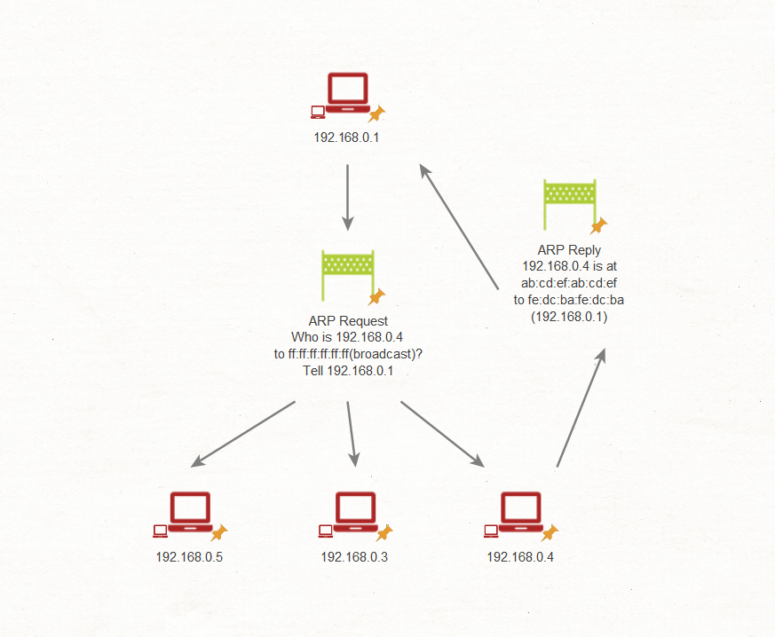
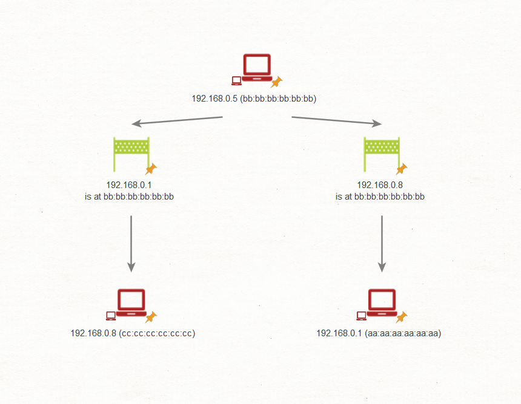
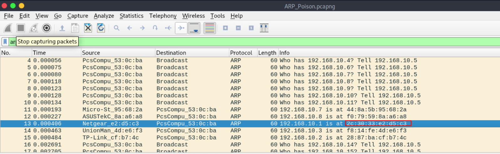

### **Tấn Công ARP Spoofing & Phát Hiện Bất Thường**

#### **Tấn Công ARP - MiTM và DoS**

Nhiều cuộc tấn công dựa trên ARP được phát tán dưới dạng broadcast, điều này giúp chúng dễ dàng phát hiện hơn.

#### **Cách Thức Hoạt Động Của Giao Thức Phân Giải Địa Chỉ (ARP)**



1. **Máy chủ A** cần gửi dữ liệu đến **Máy chủ B**. Máy chủ A cần xác định địa chỉ vật lý (MAC) của máy chủ B.
2. Máy chủ A tham khảo bộ nhớ đệm ARP của mình để kiểm tra xem nó đã biết địa chỉ vật lý chưa.
3. Nếu địa chỉ không có trong bộ nhớ đệm ARP, Máy chủ A sẽ phát tán yêu cầu ARP đến tất cả các máy chủ trong mạng con: "Ai sở hữu IP x.x.x.x?"
4. **Máy chủ B** phản hồi với thông báo: "Chào, Máy chủ A. IP của tôi là x.x.x.x, và nó được ánh xạ với địa chỉ MAC aa\:aa\:aa\:aa\:aa\:aa."
5. Sau khi nhận được phản hồi này, Máy chủ A sẽ cập nhật bộ nhớ đệm ARP của mình với ánh xạ IP-to-MAC mới.
6. Một máy chủ có thể cài đặt giao diện mới, hoặc địa chỉ IP trước đó được cấp phát cho máy chủ có thể hết hạn.

#### **ARP Poisoning & Spoofing**



**Bước 1**: Xem xét một mạng có 3 máy tính: máy tính của nạn nhân, router và kẻ tấn công.

**Bước 2**: Kẻ tấn công bắt đầu chiến lược **ARP cache poisoning** bằng cách gửi các thông điệp ARP giả mạo đến cả máy tính nạn nhân và router.

**Bước 3**: Thông điệp gửi đến nạn nhân thông báo rằng địa chỉ IP của gateway (router) tương ứng với địa chỉ vật lý của máy tính kẻ tấn công.

**Bước 4**: Ngược lại, thông điệp gửi đến router tuyên bố rằng địa chỉ IP của máy tính nạn nhân ánh xạ với địa chỉ vật lý của máy tính kẻ tấn công.

**Bước 5**: Sau khi các yêu cầu được thực hiện thành công, kẻ tấn công có thể làm ô nhiễm bộ nhớ đệm ARP của cả máy nạn nhân và router, khiến tất cả dữ liệu bị chuyển hướng đến máy tính của kẻ tấn công.

**Bước 6**: Nếu kẻ tấn công cấu hình chuyển tiếp lưu lượng, chúng có thể nâng cao tình huống từ một tấn công **DoS** thành một tấn công **Man-in-the-Middle (MiTM)**.

**Bước 7**: Bằng cách kiểm tra các lớp khác của mô hình mạng, chúng ta có thể phát hiện các tấn công bổ sung. Kẻ tấn công có thể thực hiện **DNS spoofing** để chuyển hướng các yêu cầu web đến các trang giả mạo hoặc thực hiện **SSL stripping** để chặn các dữ liệu nhạy cảm trong quá trình truyền tải.

### **Cách Để Ngăn Chặn Tấn Công ARP Spoofing**

1. Sử dụng **Các mục ARP tĩnh**.
2. Áp dụng **Bảo mật Cổng Switch và Router**.

---

### **Phát Hiện ARP Spoofing**

Để phát hiện ARP spoofing, mở tệp **ARP\_Poison.pcapng** trong **Wireshark** và áp dụng bộ lọc sau:

```
arp.opcode == 1 && eth.src == 08:00:27:53:0c:ba
```

Bộ lọc này sẽ hiển thị tổng số yêu cầu ARP từ địa chỉ MAC đã chỉ định.

Để xem các cuộc trò chuyện:

* Chuyển đến **Conversation > Statistics** để phân tích lưu lượng.

---
### Tấn công ARP và DoS
ARP posioning và ARP spoofing thường là cơ sở của các cuộc tấn công từ chối dịch vụ và MITM. 
Dấu hiệu quét ARP:
- Các yêu cầu ARP broadcast gửi tới các địa chỉ IP liên tiếp(.1,.2,.3...)
- Các yêu cầu ARP broadcast gửi tới các địa chỉ IP ko tồn tại
- Có một lượng lớn ARP xuất phát từ một máy chủ độc hại hoặc bị xâm 
### find the first MAC address that was linked with the IP 192.168.10.1
