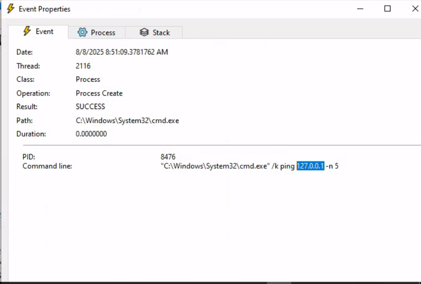

**Phân tích động (Dynamic Analysis)**

Trong lĩnh vực phân tích phần mềm độc hại (malware), phân tích động (hay còn gọi là phân tích hành vi) là một phương pháp rất quan trọng. Ở phương pháp này, chúng ta quan sát và phân tích hành vi của phần mềm độc hại khi nó đang hoạt động, khác với phân tích tĩnh, khi chúng ta chỉ **kiểm tra các đặc tính** và **nội dung** của phần mềm mà **không chạy nó**. Mục tiêu chính của phân tích động là **ghi lại và hiểu rõ tác động thực tế của phần mềm độc hại lên hệ thống mà nó xâm nhập**, giúp ta có cái nhìn toàn diện hơn về phần mềm độc hại này.

Khi thực hiện phân tích động, chúng ta sẽ đưa phần mềm độc hại vào một **môi trường an toàn, được giám sát và thường được cô lập để tránh sự lây lan hoặc hư hại ngoài ý muốn**. Môi trường này thường là một máy ảo (VM), khiến phần mềm độc hại không nhận ra rằng nó đang hoạt động trong một môi trường kiểm soát. Chúng ta có toàn quyền kiểm soát các hoạt động của nó và ghi lại chi tiết các hành vi của nó.

Quy trình phân tích động có thể được chia thành các bước sau:

1. **Thiết lập môi trường:** Trước tiên, chúng ta tạo ra một môi trường an toàn và kiểm soát, thường là một máy ảo, tách biệt hoàn toàn với hệ thống mạng chính để tránh nguy cơ lây nhiễm hoặc lan rộng. Máy ảo này sẽ được cấu hình giống với một hệ thống thật, với các phần mềm, ứng dụng và cấu hình mạng mà người dùng thực tế có thể sử dụng.

2. **Chụp lại trạng thái ban đầu:** Sau khi thiết lập môi trường, chúng ta sẽ chụp lại một bức ảnh trạng thái sạch sẽ của hệ thống, bao gồm các tệp hệ thống, trạng thái registry, các tiến trình đang chạy và cấu hình mạng. Đây sẽ là điểm chuẩn để so sánh các thay đổi do phần mềm độc hại gây ra sau khi nó chạy.

3. **Cài đặt công cụ giám sát (Trước khi chạy):** Để ghi lại các hoạt động của phần mềm độc hại một cách hiệu quả, chúng ta sẽ cài đặt các công cụ giám sát và ghi log. Các công cụ như **Process Monitor (Procmon)** từ bộ Sysinternals được dùng để ghi lại các cuộc gọi hệ thống, hoạt động trên hệ thống tệp, các thay đổi trong registry, v.v. Chúng ta cũng có thể sử dụng các công cụ như **Wireshark**, **tcpdump** và **Fiddler** để ghi lại lưu lượng mạng, và **Regshot** để chụp lại trước và sau khi thay đổi registry. Các công cụ như **INetSim**, **FakeDNS**, và **FakeNet-NG** có thể giả lập các dịch vụ internet.

4. **Thực thi phần mềm độc hại:** Khi các công cụ đã sẵn sàng, chúng ta tiến hành thực thi phần mềm độc hại trong môi trường đã cô lập. Trong suốt quá trình thực thi, các công cụ giám sát sẽ ghi lại mọi hoạt động, bao gồm việc tạo tiến trình, thay đổi tệp, thay đổi registry, lưu lượng mạng, v.v.

5. **Quan sát và ghi lại:** Phần mềm độc hại sẽ được cho chạy đủ lâu để chúng ta có thể ghi lại mọi hành vi của nó. Các công cụ giám sát sẽ thu thập và ghi lại chi tiết các hành động của phần mềm độc hại.

6. **Phân tích dữ liệu thu thập được:** Sau khi phần mềm độc hại đã hoàn thành quá trình chạy, chúng ta sẽ dừng nó lại và dừng các công cụ giám sát. Bây giờ, chúng ta sẽ kiểm tra các log và dữ liệu thu thập được, so sánh trạng thái hệ thống sau khi phần mềm độc hại chạy với trạng thái ban đầu để xác định những thay đổi mà phần mềm độc hại đã tạo ra.

Trong một số trường hợp, khi phần mềm độc hại quá tinh vi hoặc khó phân tích, chúng ta có thể sử dụng các môi trường sandbox để thực hiện phân tích động. Các sandbox như **Cuckoo Sandbox**, **Joe Sandbox**, hoặc **FireEye's Dynamic Threat Intelligence Cloud** cung cấp môi trường an toàn, tự động và được kiểm soát hoàn toàn cho việc thực thi phần mềm độc hại. Các sandbox này trang bị nhiều tính năng để phân tích hành vi và tạo báo cáo chi tiết về hành vi của phần mềm độc hại, bao gồm các hoạt động mạng, tương tác với hệ thống tệp, dấu vết trong bộ nhớ, v.v.

Tuy nhiên, cần lưu ý rằng mặc dù sandbox rất hữu ích, nhưng chúng không phải lúc nào cũng hiệu quả. Một số phần mềm độc hại có thể phát hiện ra môi trường sandbox và thay đổi hành vi của chúng, khiến cho việc phân tích trở nên khó khăn hơn.

---

**Phân tích động với Noriben**

**Noriben** là một công cụ mạnh mẽ trong bộ công cụ phân tích động của chúng ta. Nó thực chất là một lớp vỏ Python cho **ProcMon** (Process Monitor), một công cụ giám sát hệ thống toàn diện từ bộ Sysinternals. Noriben giúp chúng ta chạy ProcMon, làm sạch đầu ra và thêm vào các thông tin chuyên biệt để phân tích phần mềm độc hại.

**Các bước sử dụng Noriben trong phân tích động:**

1. **Thiết lập Noriben:** Chúng ta bắt đầu bằng cách khởi động Noriben từ dòng lệnh. Công cụ này hỗ trợ nhiều tham số dòng lệnh để tùy chỉnh hoạt động của nó. Chẳng hạn, chúng ta có thể định rõ thời gian thu thập dữ liệu, chọn mẫu phần mềm độc hại cần phân tích hoặc sử dụng cấu hình ProcMon cá nhân.

2. **Khởi động ProcMon:** Khi Noriben được khởi động, nó sẽ bắt đầu **ProcMon** với cấu hình sẵn có. Cấu hình này chứa các bộ lọc được thiết kế để loại trừ các hoạt động hệ thống bình thường và tập trung vào các hành động có thể là dấu hiệu của phần mềm độc hại.

3. **Chạy phần mềm độc hại:** Với ProcMon đang chạy, Noriben sẽ tiến hành thực thi phần mềm độc hại đã chọn. Trong quá trình này, ProcMon sẽ ghi lại tất cả các hoạt động hệ thống, bao gồm hoạt động của tiến trình, thay đổi tệp hệ thống và registry.

4. **Giám sát và ghi lại:** Noriben sẽ kiểm soát thời gian giám sát. Khi kết thúc, Noriben sẽ yêu cầu ProcMon lưu lại dữ liệu vào một tệp CSV và sau đó dừng ProcMon.

5. **Phân tích dữ liệu và báo cáo:** Đây là điểm mạnh của Noriben. Nó xử lý tệp CSV mà ProcMon tạo ra, áp dụng thêm bộ lọc và phân tích ngữ cảnh. Noriben nhận diện các hoạt động khả nghi và phân loại chúng vào các nhóm như thay đổi tệp, hoạt động của tiến trình, kết nối mạng, v.v. Cuối cùng, nó tạo ra một báo cáo dễ đọc ở định dạng HTML hoặc TXT, làm nổi bật các đặc tính hành vi của phần mềm độc hại đã phân tích.

Một tính năng nổi bật của Noriben là sự tích hợp với **YARA rules**. Chúng ta có thể sử dụng YARA để nâng cao khả năng lọc dữ liệu, giúp nhận diện các mẫu hành vi đáng chú ý hiệu quả hơn.

---

Hy vọng rằng phần dịch này đã làm rõ quy trình phân tích động và cách sử dụng các công cụ như **Noriben** trong phân tích phần mềm độc hại!

## Thực hành câu hỏi
Phân tích động với Noriben và shell.exe
1- Run Noriben
python C:\Tools\Noriben-master\Noriben.py 
2- Run the malware (Shell.exe)
3- Vào Filter ProcessName is Shell.exe
4. Tìm thấy ip

