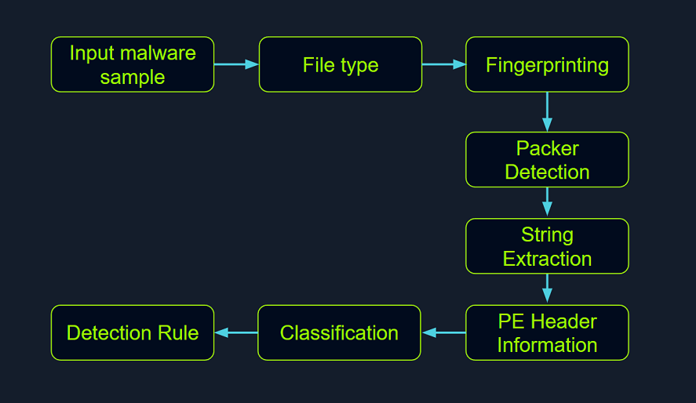

# Static Analysis on Linux
In the realm of malware analysis, static analysis to scrutinize malware without necessitating its execution. This envolves the meticulous investigation of malware's code, data and structural components, serving as a vital precursor for further, more detailed analysis

Through static analysi, extract pivotal informaiton which inlcudes:
- File types
- File hash
- String
- embedded elements
- Packer information
- Imports
- Exports
- Assembly code


## Identifying the file type
Ascertain the rudimentary information about the malware specimen to lay the groundwork for our inveestigation. Given that file extensions can be manipulated and changed, our task is devise a method to identify the actual file type we are encountering. Establishingthe file type plays an integral role in static analysis, ensuring the procedures we apply are appropriate and the results obtainerd are accurate

The command for checking the file type :
file + ....
We also do same by manually checking the header with the help of the hexdump command as follows:
hexdump -C + ...
On a Windows System, the presence of the ASCII string MZ(in hexadecimal 4D 5A) at the start of the file(known as the "magic number") denotes an executable file .MZ stands for Mark Zbikowski, a key architect of MS-DOS

## Malware Fingerprinting
In this stage, our mission to create a unique identifier for malware sample. Take a form of cryptographic hash -md5,sha1 , sha256

Fingerpriting is employed for numberous purposes, encompassing:
- identification and tracking of malware samples
- Scanning an entire system for the presence of identical malware
- Confirmation of previous encounters and analyses of the same malware
- Sharing with stakeholders as IoC (Indicators of Compromise) as part of threat intelligence reports

check by md5sum , sha256sum

## File Hash Lookup
Virus Total
Import Hashing(IMPHASH)
Fuzzy Hashing(SSDEEp) - refered as context-triggered piecewise hashing 


###Tính toán IMPHASH của tệp `potato.exe`

**Mục tiêu:**
Tính toán giá trị **IMPHASH** của tệp `potato.exe` trong thư mục `/home/htb-student/Samples/MalwareAnalysis`.

### Các bước thực hiện:

1. **Cài đặt thư viện `pefile`:**
   Cài đặt thư viện Python `pefile` để phân tích tệp PE:

   ```bash
   pip install pefile
   ```

2. **Tạo script Python để tính IMPHASH:**
   Viết script Python sau để tính IMPHASH:

   ```python
   import pefile

   # Đường dẫn đến file potato.exe
   file_path = '/home/htb-student/Samples/MalwareAnalysis/potato.exe'

   # Đọc tệp PE
   pe = pefile.PE(file_path)

   # Tính toán IMPHASH
   imphash = pe.get_imphash()

   # In ra IMPHASH
   print(f"IMPHASH: {imphash}")
   ```

3. **Chạy script Python:**
   Chạy script bằng lệnh:

   ```bash
   python3 calc_imphash.py
   ```

4. **Kết quả:**
   Kết quả sẽ hiển thị IMPHASH của tệp `potato.exe`, ví dụ:

   ```
   IMPHASH: 3399c4043c56fea40a8189de302fd889
   ```

### Kết luận:

IMPHASH là công cụ hữu ích để xác định các tệp PE tương tự, đặc biệt trong phân tích mã độc.

Powershell 
Get-FileHash "C:\Samples\MalwareAnalysis\dharma_sample.exe" -Algorithm SHA256
