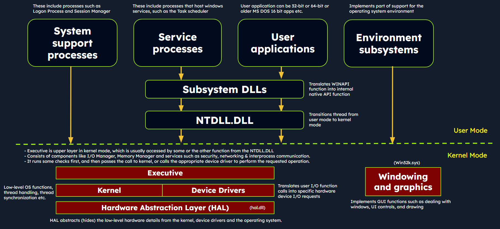
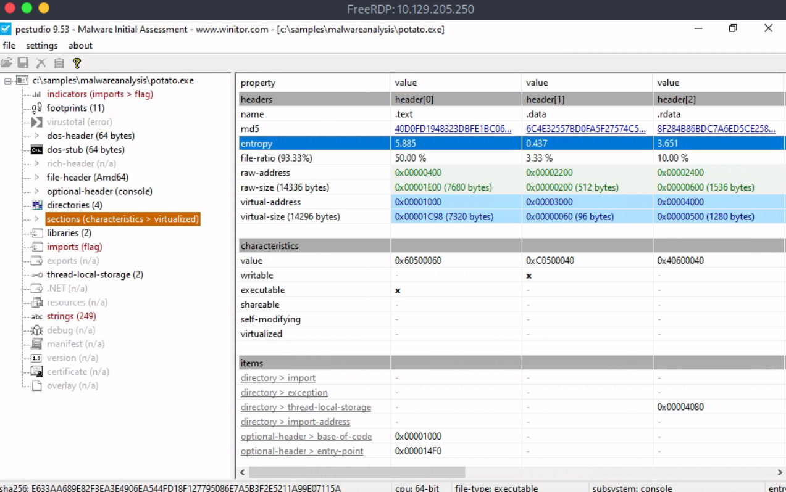
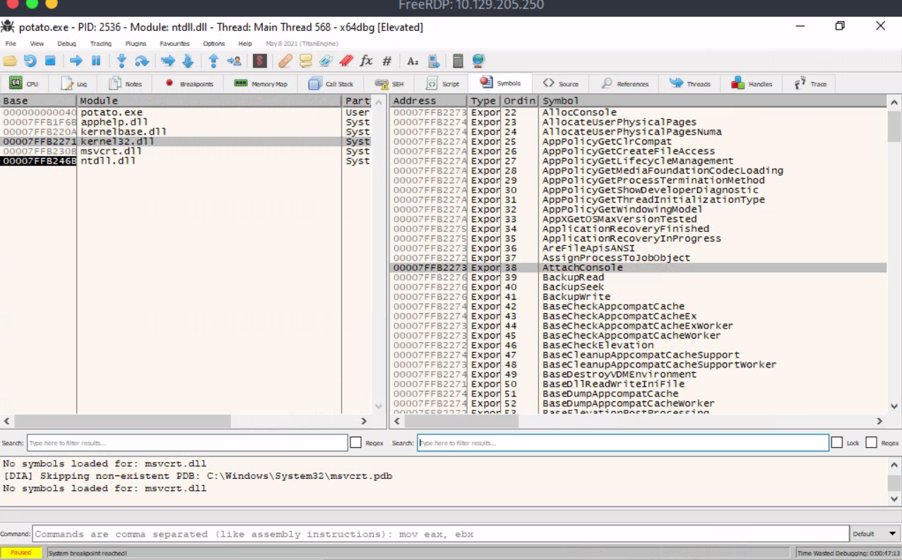

#### Windows Internals
* **User Mode (Chế Độ Người Dùng)**: Đây là chế độ mà hầu hết các ứng dụng và tiến trình người dùng hoạt động. Trong chế độ này, các tiến trình có quyền truy cập hạn chế vào tài nguyên hệ thống và phải tương tác với hệ điều hành qua các **API**.Các tiến trình này được cách ly với nhau và không thể trực tiếp truy cập phần cứng hay các chức năng hệ thống quan trọng.Tuy nhiên, trong chế độ này, mã độc vẫn có thể thao tác với các tệp, cài đặt registry, kết nội mạng và các tài nguyên có thể truy cập bởi người dùng, và nó cố gắng nâng cao quyền hạn để giành quyền kiểm soát hệ thống nhiều hơn.

* **Kernel Mode (Chế Độ Kernel)**: Ngược lại, chế độ kernel là chế độ có quyền ưu tiên cao, nơi mà nhân của hệ điều hành Windows hoạt động. Nhân có quyền truy cập không giới hạn vào tài nguyên hệ thống, phần cứng và chức năng quan trọng. No cung cấp các dịch vụ cốt lõi của hệ điều hành, quản lý tài nguyên hệ thống và thực thi các cơ chế bảo mật và ổn định. Các trình điều khiển thiết bị cũng hoạt động ở chế độ nhân. Nếu mã độc hoạt động trong chế độ nhân, nó sẽ có quyền kiểm soát cao và có thể thao tác với hành vi của hệ thống, che giấu sự tồn tại của nó, chặn các cuộc gọi hệ thống và can thiệp vào cơ chế bảo mật.

#### 2. **Kiến Trúc Windows ở High Level**
Dưới đây là version kiến trúc đơn giản của window.

* **Các Thành Phần trong User Mode**:
Các thành phần user mode là những phần của OS ko có quyền access trực tiếp vào phần cứng hay cấu trúc dữ liệu của nhân. Chúng tương tác với tài nguyên hệ thống thông qua API và các cuộc gọi hệ thống. Dưới đây là một số thành phần trong chế độ user:
  * **System Support Processes**:  Đây là những thành phần thiết yếu cung cấp các chức năng và dịch vụ quan trọng như tiến trình đăng nhập(winlogon.exe), Quản lý Phiên làm việc(smss.exe), và quản lý dịch vụ(services).
  * **Service Processes**: Các tiến trình thực thi các dịch vụ hệ thống như Windows Update Service,Task Scheduler, Print Spooler. Chúng thường chạy ở chế độ nền để phục vụ các yêu cầu hệ thống.
  * **User Applications**: Đây là process do chương trình user tạo ra, bao gồm cả ứng dụng 32 bit và 64 bit. Chúng tương tác với OS qua các API đc cung cấp bởi Windows. Các cuộc gọi API này được chuyển tiếp NTDLL.DLL, kích hoạt sự chuyển tiếp từ chế độ người dùng sang chế độ nhân, nơi các cuộc gọi hệ thống được thực thi. Kết quả sau đó sẽ được trả về cho ứng dụng chế độ người dùng, và một sự chuyển tiếp trở lại chế độ người dùng sẽ diễn ra.
  * **Environment Subsystems**: Các thành phần này cung cấp môi trường thực thi cho các loại ứng dụng đặc thù như **Win32 Subsystem**, **POSIX**, và **OS/2**.
  * **Subsystem DLLs**: Các thư viện liên kết động này chuyển các chức năng đc tài liệu hóa thành các cuộc gọi hệ thống nội bộ thích hợp, chủ yếu được triển khai trong NTDLL.DLL. Các ví dụ bao gồm kernelbase.dll, user32.dll, wininet.dll và advapi32.dll.

* **Các Thành Phần trong Kernel Mode**:
Các thành phần chế độ kernel là những phần của hdh có quyền truy cập trực tiếp vào phần cứng và cấu trúc dữ liệu của nhân. Bao gồm
  * **Executive**: Đây là lớp trên cùng trong chế độ nhân, được truy cập thông qua các hàm từ NTDLL.DLL. Nó bao gồm nhiều thành phần như I/O Manager, Object Manager, Security Reference Monitor, Process Manager… chịu trách nhiệm quản lý các khía cạnh cốt lõi của hệ điều hnafh như thao tác vào ra, quản lý object, an ninh và tiến trình. Executive sẽ ktra trc, sau đó chuyển y/c xuống Kernel hoặc gọi driver thiết bị phù hợp để thực hiện
  * **Kernel**: Thành phần này quản lý tài nguyên hệ thống, cung cấp các dịch vụ mức thấp như lập lịch luồng(thread scheduling), xử lý ngắt và ngoại lệ(interupt & exception dispatching), và đồng bộ hóa đa bộ xử lý.
  * **Device Drivers**: Trình điều khiển thiết bị giúp hệ điều hành giao tiếp với phần cứng. Chúng đóng vai trò trung gian, giúp hệ thống quản lý và kiểm soát cả tài nguyên phần cứng lẫn phần mềm.
  * **Hardware Abstraction Layer (HAL)**: Thành phần này cung cấp một lớp trung gian giữa phần cứng và hệ điều hnahf. Nhờ HAL, các lập trình viên có thể giao tiếp với hardware một cách nhất quán , ko phụ thuộc vào nền tảng.
  * **Win32k.sys**: Hệ thống con chịu trách nhiệm quản lý GUI, vẽ các thành phần hiển thị trên màn 

#### 3. **Luồng Gọi API trong Windows**

Malware thường ultitize Windows API calls để interact với system và thực thi malicious operations. Bằng cách hiểu internal details of API functions, tham số của chúng, hành vi mong động, analysts có thể identify suspicios or unauthorized API usage.

Hãy xem xét một ví dụ Windows API call flow, nơi mà user-mode application cố gắng truy cập privileges operations và system resources sử dụng ReadProcessMemory funtion.

#### 4. **Portable Executable (PE)**

* **PE Format** là định dạng tệp dùng để đóng gói các chương trình thực thi và **DLL** trong hệ điều hành Windows. Malware có thể khai thác các phần trong PE, đặc biệt là các **section** như `.text`, `.data`, `.rsrc` (tài nguyên), và `.idata` (các hàm nhập từ DLL). Việc phân tích cấu trúc PE là rất quan trọng để hiểu được cách malware hoạt động và làm thế nào chúng có thể thao túng hệ thống hoặc xâm nhập vào các tiến trình khác.

#### 5. **Quản Lý Tiến Trình**

* **PID (Process Identifier)** và **VAS (Virtual Address Space)** là các yếu tố quan trọng trong việc quản lý tiến trình. Mỗi tiến trình có không gian bộ nhớ ảo riêng, giúp bảo vệ tiến trình này khỏi việc bị ảnh hưởng bởi các tiến trình khác. Malware có thể lợi dụng các cơ chế này để thao túng bộ nhớ của tiến trình khác, ví dụ như trong các cuộc tấn công **process injection**.

#### 6. **Dynamic-Link Library (DLL)**

* **Import Functions**: Các hàm nhập khẩu từ DLL cho phép chương trình truy cập các chức năng từ thư viện bên ngoài. Malware thường lợi dụng các hàm này để thực hiện các tác vụ như thao tác với tệp tin, mạng, hoặc registry.
* **Export Functions**: Các hàm xuất khẩu từ DLL cho phép các chương trình khác sử dụng. Malware có thể lợi dụng những hàm này để giao tiếp với các chương trình khác hoặc mở rộng khả năng tấn công.

#### **Ứng Dụng trong Phân Tích Malware**

Phân tích các **Windows API**, **Portable Executable (PE)**, và **DLL** giúp các chuyên gia bảo mật nhận diện được các hoạt động đáng ngờ hoặc không hợp pháp trong hệ thống. Malware có thể sử dụng các API như `ReadProcessMemory`, `WriteProcessMemory`, hoặc các hàm từ **kernel32.dll** và **NTDLL.DLL** để thao túng bộ nhớ của các tiến trình khác, hoặc lợi dụng các thư viện **DLL** để thực hiện các tấn công tinh vi như **process injection**.

### **Kết Luận**

Hiểu rõ về **Windows Internals** là bước quan trọng để phân tích malware hiệu quả. Malware có thể khai thác cả **User Mode** và **Kernel Mode** để thực hiện hành vi độc hại. Phân tích các thành phần hệ thống như **PE file structure**, **DLL imports/exports**, và **API calls** sẽ giúp phát hiện các dấu hiệu xâm nhập của malware và các kỹ thuật mà chúng sử dụng để ẩn mình hoặc thao túng hệ thống.
# Thực hành
 kiểm tra độ entropy của phần .text trong tệp potato.exe bằng pestudio
 

 tìm và nhập tên hàm xuất khẩu từ Kernel32.dll bắt đầu bằng "Attach" trong x64dbg
 vào tab Symbol
 