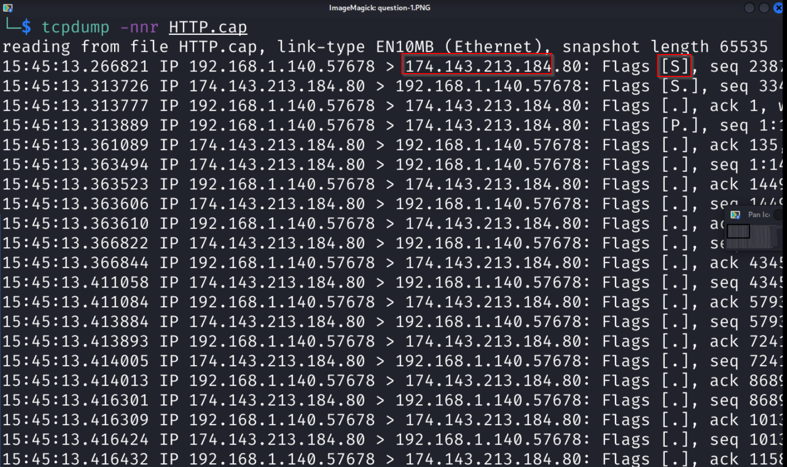
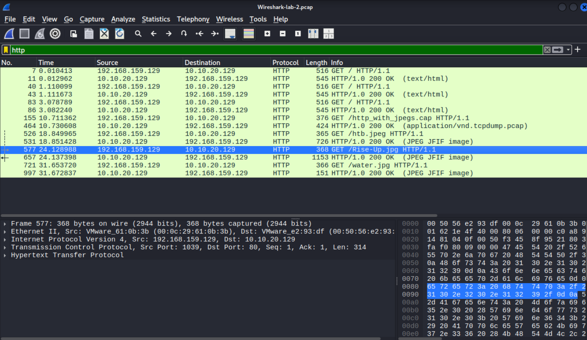
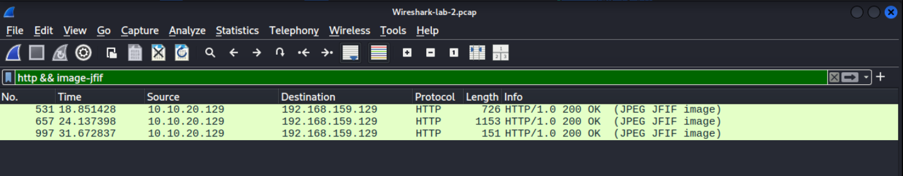

# 🧠 Tổng Quan về Network Traffic Analysis (NTA)

**Network Traffic Analysis (NTA)** là quá trình kiểm tra lưu lượng mạng nhằm:
- Hiểu rõ hoạt động mạng
- Phát hiện bất thường
- Ứng phó với mối đe dọa

Một công cụ thiết yếu để:
- Tăng khả năng hiển thị mạng
- Phát hiện sớm các mối đe dọa
- Tuân thủ quy định bảo mật

---

## 🎯 Mục Tiêu & Trường Hợp Sử Dụng

- **Phát hiện mối đe dọa**:
  - Phân tích lưu lượng thời gian thực (ransomware, khai thác, v.v.)
  - Nhận diện lưu lượng bất thường (cổng không chuẩn, máy chủ đáng ngờ)
  - Phát hiện mã độc trên đường truyền

- **Thiết lập đường cơ sở (Baseline)**:
  - Xây dựng hồ sơ lưu lượng mạng "bình thường"

- **Điều tra sự cố & Săn tìm mối đe dọa**:
  - Phân tích sự cố đã xảy ra
  - Chủ động tìm kiếm mối đe dọa tiềm ẩn

---

## 🧠 Kỹ Năng & Kiến Thức Cần Thiết

- Hiểu mô hình **TCP/IP** & **OSI**
- Kiến thức cơ bản về **Switching**, **Routing**
- Hiểu các **cổng & giao thức phổ biến**
- Phân biệt gói **TCP** vs **UDP**
- Khả năng đọc dữ liệu **Encapsulation**

---

## 🛠️ Công Cụ Phân Tích Lưu Lượng Phổ Biến

| Công Cụ      | Mô Tả |
|--------------|--------|
| **tcpdump**  | Dòng lệnh, bắt và phân tích lưu lượng mạng |
| **Tshark**   | Dòng lệnh của Wireshark |
| **Wireshark**| Giao diện đồ họa, phân tích sâu giao thức |
| **NGrep**    | Khớp mẫu regex/BPF với dữ liệu mạng |
| **Span Port**| Sao chép lưu lượng đến thiết bị phân tích |
| **Network Tap** | Thiết bị phần cứng tách lưu lượng |
| **tcpick**   | Theo dõi phiên TCP |
| **Elastic Stack** | Phân tích và trực quan hóa dữ liệu log |
| **SIEM (Splunk)** | Phân tích và cảnh báo dữ liệu tập trung |

---

## 🔍 Cú Pháp BPF (Berkeley Packet Filter)

- **Mục đích**: Lọc lưu lượng ở lớp Data-Link
- **Ứng dụng**: tcpdump, Wireshark, Tshark, NGrep
- **Ví dụ**:  
  ```bash
  host 192.168.1.1 and port 80
  ```

---

## ⚙️ Quy Trình NTA (Workflow)

1. **Tiếp nhận lưu lượng**
   - Đặt điểm giám sát (tap/span port)
   - Thu thập có lọc mục tiêu (nếu có)

2. **Giảm nhiễu bằng lọc**
   - Loại bỏ broadcast, multicast không cần thiết

3. **Phân tích & khám phá**
   - Truy vết địa chỉ, giao thức, cờ TCP
   - Câu hỏi gợi ý:
     - Có mã hóa bất thường không?
     - Có truy cập trái phép không?

4. **Phát hiện & cảnh báo**
   - Dùng IDS/IPS, heuristic, signature
   - Đánh giá: Lưu lượng lành tính hay độc hại?

5. **Khắc phục & giám sát**
   - Sau khi xử lý sự cố, tiếp tục theo dõi
   - Duy trì dashboard tập trung để giám sát liên tục

---

Dưới đây là tóm tắt những ý chính từ các đoạn văn bản bạn đã cung cấp, tập trung vào **Networking Primer - Layers 1-4**:

---

## 📝 Tóm Tắt Ý Chính: Mạng Cơ Bản - Các Lớp 1-4

Phần này cung cấp cái nhìn tổng quan về các khái niệm mạng cơ bản và cách các giao thức hoạt động trong quá trình thu thập lưu lượng.

---

### 🌐 Mô hình OSI / TCP-IP

* **OSI Model:** Mô hình lý thuyết với 7 lớp, chia nhỏ chức năng giao tiếp mạng.
    * **Lớp 1-4:** Tập trung vào vận chuyển dữ liệu giữa các máy chủ (từ phương tiện vật lý đến quản lý cuộc hội thoại).
    * **Lớp 5-7:** Xử lý diễn giải, quản lý và trình bày dữ liệu cho người dùng cuối.
* **TCP-IP Model:** Mô hình thực tế hơn với 4 lớp, được sử dụng rộng rãi.
    * **Lớp 4 (Application):** Tương ứng với lớp 5, 6, 7 của OSI.
    * **Lớp 3 (Transport):** Vận chuyển dữ liệu.
    * **Lớp 2 (Internet):** Tương ứng với lớp Network của OSI.
    * **Lớp 1 (Link):** Bao gồm lớp Data-Link và Physical của OSI.
* **PDU (Protocol Data Unit):** Gói dữ liệu chứa thông tin điều khiển và dữ liệu được đóng gói ở mỗi lớp. **Đóng gói (Encapsulation)** là quá trình mỗi lớp thêm thông tin tiêu đề riêng của mình vào PDU khi dữ liệu di chuyển xuống ngăn xếp. 

---

### 🗺️ Cơ chế Định địa chỉ

* **Địa chỉ MAC (Media Access Control):**
    * Địa chỉ 48-bit (6 octet), định dạng thập lục phân.
    * Sử dụng ở **Lớp 2** (Data-Link/Link-Layer) cho giao tiếp **trong cùng một miền quảng bá** (host-to-host).
    * Khi vượt qua giao diện Lớp 3 (bộ định tuyến), MAC address được thay thế bằng thông tin của hop tiếp theo.
* **Địa chỉ IP (Internet Protocol):** Dùng để gửi dữ liệu giữa các máy chủ **qua các ranh giới mạng**.
    * **IPv4:**
        * Địa chỉ 32-bit (4 octet), định dạng thập phân (0-255 mỗi octet).
        * Sử dụng ở **Lớp 3** (Network trong OSI) hoặc Lớp 2 (Internet trong TCP-IP).
        * Đang cạn kiệt, dẫn đến các giải pháp như VLSM, CIDR và IPv6.
    * **IPv6:**
        * Địa chỉ 128-bit (16 octet), định dạng thập lục phân.
        * Không gian địa chỉ lớn hơn nhiều, hỗ trợ Multicasting tốt hơn, bảo mật IPSec tích hợp, tiêu đề gói đơn giản hóa.
        * **Các loại địa chỉ IPv6:** Unicast (một-đến-một), Anycast (một-đến-nhiều, chỉ một trả lời), Multicast (một-đến-nhiều, tất cả nhận).
        * Tỷ lệ chấp nhận toàn cầu vẫn còn chậm (khoảng 40% theo Google tại thời điểm viết). 

---

### 🔗 TCP / UDP - Cơ chế Vận chuyển (Lớp Transport)

Lớp Transport (Lớp Vận chuyển) là trung tâm điều khiển việc phân phối dữ liệu liền mạch từ nguồn đến đích.

* **TCP (Transmission Control Protocol):**
    * **Định hướng kết nối (Connection-oriented):** Yêu cầu thiết lập kết nối (bắt tay ba bước) và kết thúc kết nối (FIN/ACK).
    * **Đáng tin cậy (Reliable):** Đảm bảo dữ liệu được gửi đầy đủ và đúng thứ tự bằng cách sử dụng số thứ tự (Sequence Number) và số xác nhận (Acknowledgment Number).
    * **Chậm hơn:** Do có nhiều overhead để đảm bảo độ tin cậy.
    * **Ví dụ:** SSH, truyền file (yêu cầu tính toàn vẹn).
    * **Bắt tay ba bước (Three-way Handshake):**
        1.  **Client -> Server: SYN** (Đồng bộ hóa số thứ tự).
        2.  **Server -> Client: SYN / ACK** (Đồng bộ hóa và xác nhận SYN của client).
        3.  **Client -> Server: ACK** (Xác nhận SYN/ACK của server, thiết lập kết nối). 
    * **Kết thúc phiên (Session Teardown):** Sử dụng cờ FIN để yêu cầu chấm dứt kết nối.

* **UDP (User Datagram Protocol):**
    * **Không kết nối (Connectionless):** "Bắn và quên", không yêu cầu thiết lập kết nối hay xác nhận.
    * **Không đáng tin cậy (Unreliable):** Không đảm bảo dữ liệu đến đích hoặc theo đúng thứ tự.
    * **Nhanh:** Ít overhead hơn, ưu tiên tốc độ.
    * **Ví dụ:** Streaming video, DNS (ưu tiên tốc độ hơn độ hoàn chỉnh).

---
**Thực hành Tcpdump**
Flags [S]: Cho biết đây là một gói SYN (Synchronization), gói đầu tiên trong quá trình bắt tay ba bước của TCP, được gửi từ client để bắt đầu kết nối.
Địa chỉ đích nằm sau ký tự ">"

**Absolute & Relative sequence number**
Số thứ tự Tuyệt đối (Absolute Sequence Numbers): Là số thứ tự thực tế, ngẫu nhiên, rất lớn, được dùng để xác định duy nhất byte dữ liệu đầu tiên. Thường thấy trong gói SYN/SYN-ACK.

Số thứ tự Tương đối (Relative Sequence Numbers): Là số thứ tự được các công cụ phân tích hiển thị để đơn giản hóa, bắt đầu từ 0 hoặc 1. Giúp dễ theo dõi luồng dữ liệu. Thường thấy trong các gói dữ liệu (P/ACK).

**Wireshark**
http filter

http && image-jfif

File -> Export Objects -> get answer image has Transformer Leader