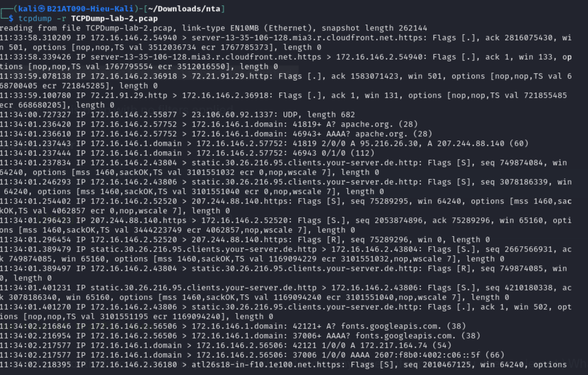
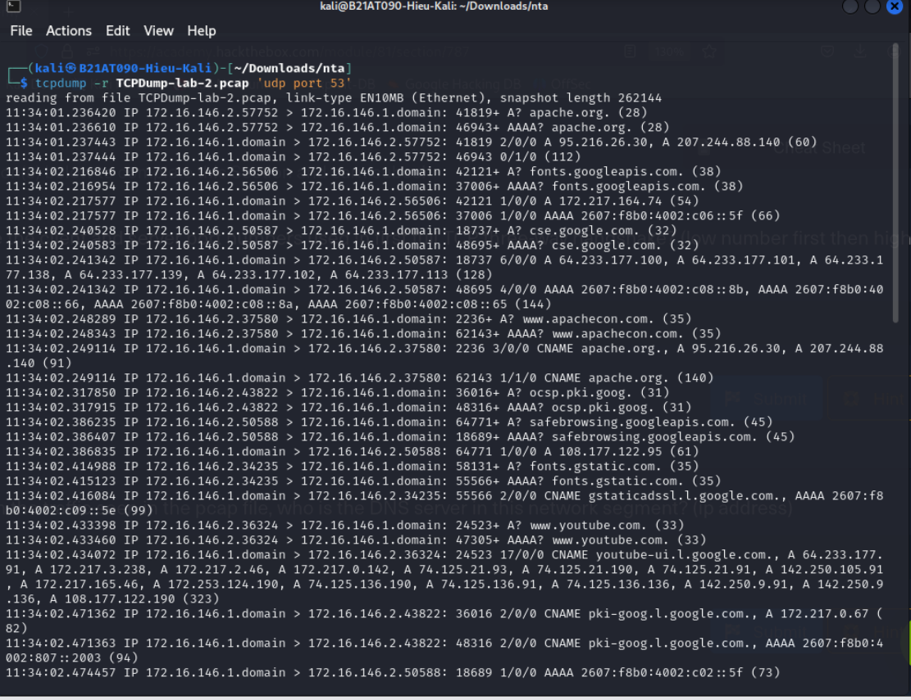
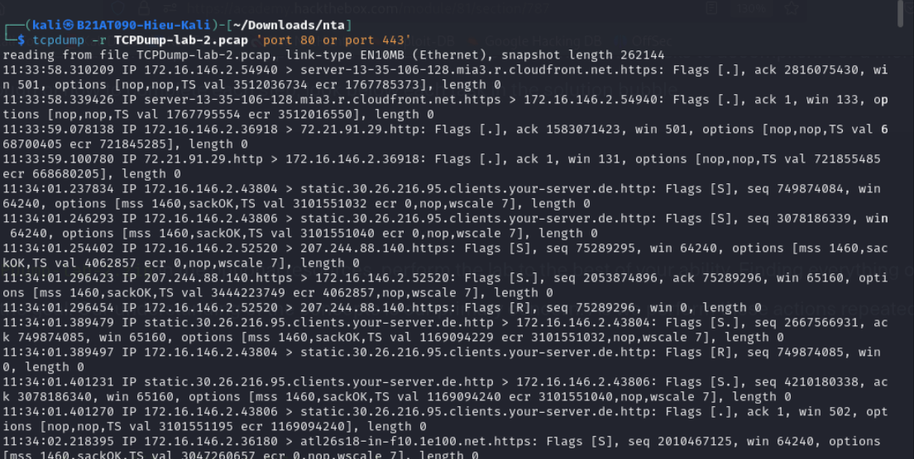

# 🛠️ Tcpdump Cheatsheet: Phân Tích & Xác Minh File PCAP

 `TCPDump-lab-2.pcap`

---

## 1. 🎯 Xác Định Giao Thức & Loại Lưu Lượng

- **Hiển thị toàn bộ lưu lượng:**
  ```bash
  tcpdump -r TCPDump-lab-2.pcap
  ```

- **Lọc DNS:**
  ```bash
  tcpdump -r TCPDump-lab-2.pcap 'udp port 53'
  tcpdump -r TCPDump-lab-2.pcap 'port 53'  # Bao gồm cả TCP DNS
  ```

ip nguồn lọc ra là 172.16.146.1
- **Lọc HTTP/HTTPS:**
```bash
tcpdump -r TCPDump-lab-2.pcap 'port 80 or port 443'
```

- **Quan sát `Flags` và `length`:** Dùng để xác định loại gói TCP và xem có chứa dữ liệu không.

---

## 2. 🤝 Phân Tích Bắt Tay Ba Bước TCP

- **Lọc bắt tay TCP (SYN, SYN/ACK):**
  ```bash
  tcpdump -r TCPDump-lab-2.pcap 'tcp[tcpflags] & (tcp-syn|tcp-ack) != 0'
  ```

- **Ý nghĩa các gói:**
  - `[S]`: SYN - Client ➜ Server
  - `[S.]`: SYN/ACK - Server ➜ Client
  - `[.]`: ACK - Client ➜ Server

- **Ví dụ bắt tay hoàn chỉnh:** `443 <--> 36180`

---

## 3. 📌 Phân Tích Chi Tiết Một Cuộc Hội Thoại

- **Timestamp bắt tay đầu tiên:**  
  `11:34:02.218395` (ví dụ)

- **Giao thức sử dụng:**  
  Quan sát cổng đích trong bắt tay TCP (VD: 443 ➜ HTTPS)

- **Tìm IP của `apache.org`:**
  ```bash
  tcpdump -r TCPDump-lab-2.pcap 'udp port 53'
  ```
  → Quan sát gói DNS **phản hồi** chứa bản ghi `A`.

---

## 4. 🔍 Lọc & Phân Tích DNS

- **Chỉ lọc DNS:**
  ```bash
  tcpdump -r TCPDump-lab-2.pcap 'port 53'
  ```

- **DNS Server:**  
  IP nguồn trong phản hồi DNS (VD: `172.16.146.1`)

- **Tên miền được truy vấn:**  
  Quan sát các gói DNS Query ➜ VD: `apache.org`

- **Loại bản ghi DNS:**
  - `A` (IPv4)
  - `AAAA` (IPv6)
  - `CNAME` (bí danh)

- **Client nào truy vấn `apache.org`:**  
  IP nguồn của gói DNS Query cho `apache.org` (VD: `172.16.146.2`)

---

## 5. 🌐 Lọc HTTP/HTTPS & Phân Tích Nội Dung

- **Lọc HTTP/HTTPS:**
  ```bash
  tcpdump -r TCPDump-lab-2.pcap 'tcp port 80 or tcp port 443'
  ```

- **Phương thức HTTP phổ biến:**  
  Quan sát các gói có `Flags [P.]`, `length > 0` → VD: `POST`

- **Phản hồi HTTP phổ biến:**  
  Mã trạng thái trong phản hồi → VD: `200 OK`

---

## 6. 🖥️ Xác Định Ứng Dụng Webserver

- **Hiển thị nội dung gói HTTP (header):**
  ```bash
  tcpdump -r TCPDump-lab-2.pcap -X 'port 80 or port 443'
  ```

  ➜ Tìm tiêu đề `Server:` trong HTTP header, ví dụ `Apache/2.4...`

---

## ✅ Mẹo

- Dùng Wireshark để phân tích sâu dễ dàng hơn.
- Tcpdump nhanh, hiệu quả, nhẹ – phù hợp khi SSH vào máy từ xa hoặc khi script hóa.

---
