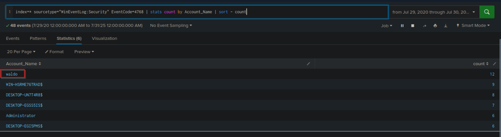
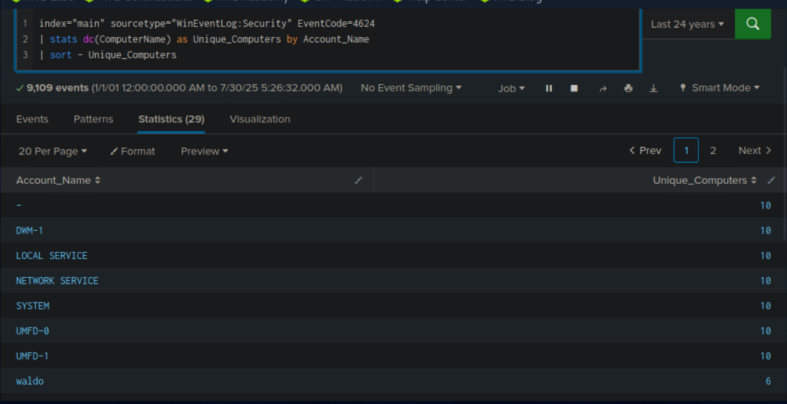
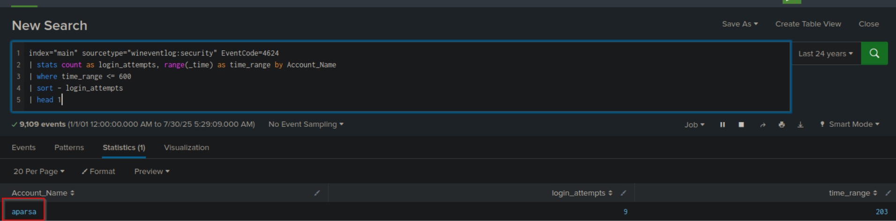

# Giới thiệu về Splunk và SPL - HackTheBox Academy
## Splunk là gì?
Splunk là phần mềm phân tích dữ liệu mạnh mẽ, có khả năng mở rộng cao, linh hoạt và có thể thu thập, lập index, phân tích và trực quan hóa lượng dữ liệu khổng lồ. Splunk có khả năng hỗ trợ rộng lớn bao gồm như bao mật mạng , pipeline dữ liệu, giám sát CNTT, khả năng quan sát cũng như quản lý CNTT và doanh nghiệp nói chung
## Kiến trúc Spunk
- **Forwarder**: là các thành phần thu thập dữ liệu từ các nguồn khác nhau và chuyển tiếp đến indexers. Có hai loại forwarders:
  - **Universal Forwarder(UF)**: Là tác nhân nhẹ, thu nhập dữ liệu và gửi đến các indexers mà không qua xử lý trước
  - **Heavy Forwarder(HF)**: Chịu trách nhiệm thu thập dữ liệu từ các nguồn xa, đặc biệt trong tác vụ có yêu cầu lớn ví dụ như tường lửa hay các điểm lọc dữ liệu. HF có thể phân tích dữ liệu trước khi gửi và có thể định địa chỉ dữ liệu theo các tiêu chí như nguồn sự kiện
  - **HTTP Event Collector(HECs)**: thu thập dữ liệu từ ứng dụng theo cách có thể mở rộng, sử dụng JSON dựa trên token hoặc phương thức API thô
  - **Search Heads**: Điều phối các công việc tìm kiếm, phân phối chúng đến các indexers và hợp nhất kết quả. Cung cấp giao diện người dùng để tương tác với Splunk.
  - **Deployment Server** : Quản lý cấu hình cho các forwarders, phân phối các ứng dụng và cập nhật
  - **Cluster Master**: Điều phối hoạt động của indexers trong mội trường phân cụm, đảm bảo sao chép dữ liệu và sự tương thích tìm kiếm
  - **License Master**: Quản lý chi tiết cấp phép của nền tảng Splunk
## Các thành phần chính của Splunk
- **Giao diện web**: GUI để người dùng tương tác, thực hiện các tasks như search, alert, report, dashboard
- **SPL**: Ngôn ngữ truy vấn của Splunk, cho phép tìm kiếm, lọc, thao tác với dữ liệu đã được lập chỉ mục
- **Apps và Add-ons**: Các ứng dụng cung cấp tính năng cụ thể trong Splunk, trong khi các Add-ons mở rộng các khả năng hoặc tích hợp với hệ thống khác
## Splunk chỉ một giải pháp SIEM
Splunk hỗ trợ phân tích dữ liệu theo thời gian thực và lịch sử, giám sát an toàn mạng, phản ứng sự cố và threat hunting
## SPL (Search Processing Language)
SQL là ngôn ngữ cơ sở để phân tích dữ liệu trong Splunk. Nó là backbone cho việc tìm kiếm, lọc, trực quan hóa dữ liệu
### 1.Basic Searching
```spl
search index = "main" "UNKNOWN"
```
### 2. Fields and Comparsion Operators
```spl
index="main" EventCode!=1
```
### 3. The fields command
```spl
index="main" sourcetype="WinEventLog:Sysmon" EventCode=1 | fields -User
```
### 4. The table command
```spl
index="main" sourcetype="WinEventLog:Sysmon" EventCode=1 | table _time, host, Image
```
_time: timestamp of the eveent
host : the name of the host where the event occured
Image: name of executable file that represents the process
### 5. The rename command
```spl
index="main" sourcetype="WinEventLog:Sysmon" EventCode=1 | rename Image as Process 
```
### 6. The dedup command
removes duplicate events
```spl
index="main" sourcetype="WinEventLog:Sysmon" EventCode=1 | dedup Image
```
### 7. The sort 
```spl
index="main" sourcetype="WinEventLog:Sysmon" EventCode=1 | sort - _time
```
### 8. The stats command
```spl
index="main" sourcetype="WinEventLog:Sysmon" EventCode=3 | stats count by _time, Image
```
statiscal operations
### 9. chart command
create a data visualization based on statiscal operations
```
index="main" sourcetype="WinEventLog:Sysmon" EventCode=3 | chart count by _time, Image
```
### 10. eval command
creates or redefined fields
```
index="main" sourcetype="WinEventLog:Sysmon" EventCode=1 | eval Process_Path=lower(Image)
```
### 11. The rex command
extracts new fields from existing ones using regular expressions
```
	index="main" EventCode=4662 | rex max_match=0 "[^%](?<guid>{.*})" | table guid
```
### 12. The lookup command
Enriches data with external sources
```
index="main" sourcetype="WinEventLog:Sysmon" EventCode=1 | rex field=Image "(?P<filename>[^\\\]+)$" | eval filename=lower(filename) | lookup malware_lookup.csv filename OUTPUTNEW is_malware | table filename, is_malware
```
### Time range
earliest and latest 
```
index="main" earliest=-7d EventCode!=1

```

### Câu 1.Tìm tài khoản có số lượng yêu cầu Kerberos authentication ticket nhiều nhất


* Trong giao diện Splunk, mở **Search & Reporting** để bắt đầu thực hiện tìm kiếm.


* Nhập truy vấn SPL sau vào thanh tìm kiếm:

```spl
index=* sourcetype="WinEventLog:Security" EventCode=4768 | stats count by Account_Name | sort - count
```

**Giải thích**:

* **index=**\*: Tìm kiếm trên tất cả các chỉ mục.
* **sourcetype="WinEventLog\:Security"**: Tìm kiếm trong các sự kiện bảo mật của Windows (đây là nơi các sự kiện Kerberos được ghi lại).
* **EventCode=4768**: Sự kiện 4768 tương ứng với yêu cầu Kerberos ticket.
* **stats count by Account\_Name**: Đếm số lượng yêu cầu của mỗi tài khoản.
* **sort - count**: Sắp xếp kết quả theo số lượng yêu cầu giảm dần.


* Kết quả sẽ hiển thị tài khoản có số lượng yêu cầu Kerberos ticket nhiều nhất ở đầu danh sách. 


---

### Câu 2. Tìm số lượng máy tính mà tài khoản SYSTEM đã truy cập qua các sự kiện 4624

**Mục tiêu**: Tìm số lượng máy tính mà tài khoản SYSTEM đã truy cập.


* Nhập truy vấn SPL sau:

```spl
index="main" sourcetype="WinEventLog:Security" EventCode=4624 
| stats dc(ComputerName) as Unique_Computers by Account_Name
| sort - Unique_Computers

```

- index="main": Xác định tìm kiếm trên chỉ mục main, nơi chứa dữ liệu mà bạn cần phân tích.

- sourcetype="WinEventLog:Security": Tìm kiếm trong các sự kiện bảo mật của Windows (Security logs) để lấy thông tin về các lần đăng nhập.

- EventCode=4624: Lọc các sự kiện đăng nhập thành công (Logon).

- stats dc(ComputerName) as Unique_Computers by Account_Name:

- dc(ComputerName): Đếm số lượng máy tính (distinct count) mà tài khoản đã truy cập.

- by Account_Name: Thực hiện đếm số lượng máy tính cho mỗi tài khoản.

- sort - Unique_Computers: Sắp xếp kết quả theo số lượng máy tính đã truy cập (từ cao đến thấp).


Kết quả sẽ hiển thị số lượng máy tính mà tài khoản SYSTEM đã truy cập.


---

### Câu 3. Tìm tài khoản có số lần đăng nhập nhiều nhất trong vòng 10 phút

**Mục tiêu**: Tìm tài khoản có số lần đăng nhập nhiều nhất trong khoảng thời gian 10 phút.


* Nhập truy vấn SPL sau:

```spl
index="main" sourcetype="wineventlog:security" EventCode=4624 
| stats count as login_attempts, range(_time) as time_range by Account_Name 
| where time_range <= 600 
| sort - login_attempts 
| head 1
```



---

