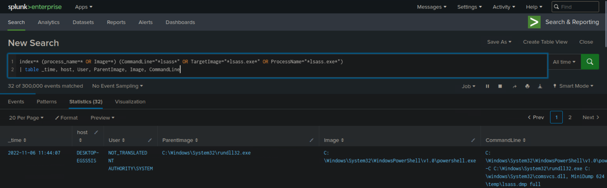
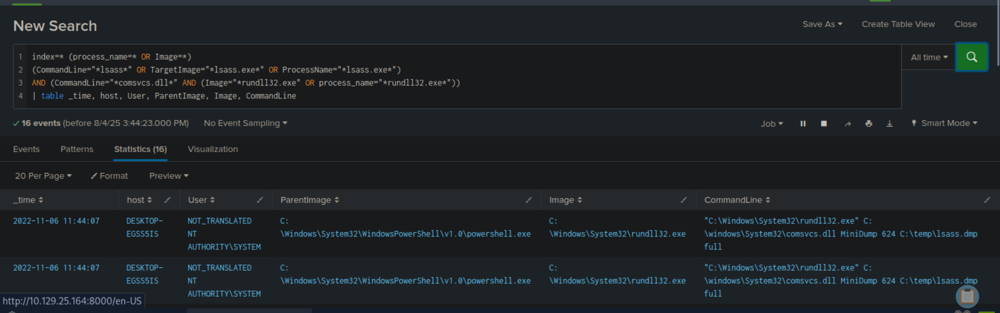

# Intrusion Detection với Splunk

## Mở đầu

Làm chủ kỹ năng tạo **truy vấn** và kích hoạt **cảnh báo** để chủ động nâng cao bảo mật cho môi trường.

## Khai thác nguồn dữ liệu

Xác định dữ liệu quan trọng và lọc nhanh chóng, hiệu quả.
Một số nguồn dữ liệu từ Splunk có thể tham khảo:

* [Botsv3](https://github.com/splunk/botsv3)
* [nginx\_json\_logs](https://raw.githubusercontent.com/elastic/examples/refs/heads/master/Common%20Data%20Formats/nginx_json_logs/nginx_json_logs)

Lưu ý: Đảm bảo chọn đúng **source type** để trích xuất dữ liệu JSON bằng cách điều chỉnh cài đặt **Indexed Extractions** thành JSON.

## Searching Hiệu quả trong Splunk
Khi mới sử dụng Splunk, bạn có thể nhận thấy một số truy vấn khá mất thời gian xử lý và return lại dữ liệu, đặc biệt là khi làm việc với các bộ dữ liệu lớn hoặc dữ liệu thực tế. Threat Hunting ở bất kỳ nền tảng SIEM nào đều phụ thuộc vào truy vấn chính xác và nhắm đến dữ liệu có liên quan.

**Tầm quan trong của dữ liệu chính xác**
dữ liệu chứa đựng **tín hiệu có giá trị** giúp phát hiện các cuộc tấn công, nhưng có thể ẩn chứa tiếng ồn thừa mà cần lọc ra. Việc làm của đội blue team là truy dấu các TTPs, đồng thời tạo ra cảnh báo và truy vấn tìm kiếm để bao phủ càng nhiều vector tấn công tiềm năng càng tốt.
## Not short-term , Be a marathon (Cái này áp dụng rất nhiều lĩnh vực nhé)
Kiên trì thôi

1. Navigate to http://[Target IP]:8000, open the "Search & Reporting" application, and find through an SPL search against all data the other process that dumped lsass. Enter its name as your answer. Answer format: _.exe

2.  Navigate to http://[Target IP]:8000, open the "Search & Reporting" application, and find through SPL searches against all data the method through which the other process dumped lsass. Enter the misused DLL's name as your answer. Answer format: _.dll

3.Navigate to http://[Target IP]:8000, open the "Search & Reporting" application, and find through an SPL search against all data any suspicious loads of clr.dll that could indicate a C# injection/execute-assembly attack. Then, again through SPL searches, find if any of the suspicious processes that were returned in the first place were used to temporarily execute code. Enter its name as your answer. Answer format: _.exe
