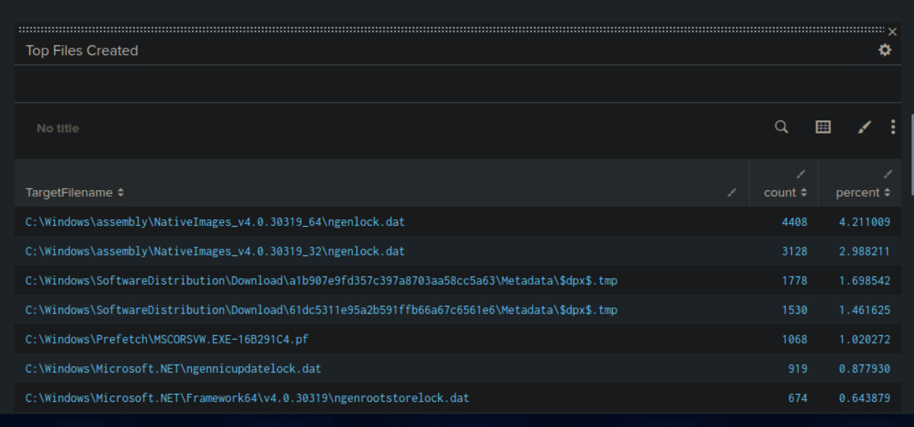

### Ứng Dụng Sysmon cho Splunk

Splunk Apps là các gói mở rộng chức năng của Splunk Enterprise hoặc Splunk Cloud, giúp quản lý dữ liệu theo các trường hợp sử dụng cụ thể như bảo mật, mạng, và hệ thống. Các ứng dụng này có thể bao gồm các công cụ như nhập liệu tùy chỉnh, biểu đồ, báo cáo, cảnh báo, v.v.

---

### Các Bước Cài Đặt Ứng Dụng Sysmon cho Splunk:

1. **Đăng ký tài khoản Splunkbase**
   Truy cập [Splunkbase](https://splunkbase.splunk.com), tạo tài khoản miễn phí và đăng nhập.

2. **Tải về Ứng Dụng Sysmon**
   Truy cập trang [Sysmon App for Splunk](https://splunkbase.splunk.com/app/1896/) để tải ứng dụng về.
3. **Cài đặt vào Search Head**
   Vào trang **Splunk**, chọn biểu tượng bánh răng (Managed Apps), tải tệp app vừa tải về lên.


4. **Chỉnh sửa Macro Tìm kiếm cho Sysmon**
   Vào **Cài đặt > Tìm kiếm nâng cao > Search Macros**. Chỉnh sửa macro 'sysmon' với cú pháp:

  
   
    
5. **Khám Phá Sysmon App**
   Sau khi cài, vào tab **File Activity**, chọn thời gian "All Time" và khám phá kết quả.
    
   
   Nếu không có kết quả trong "Top Systems", chỉnh sửa truy vấn và thay "Computer" thành "ComputerName".
   
    
---

### Questions

1. **Sửa Tìm Kiếm cho Báo Cáo "Net - net view"**

   *  tab **Reports** và mở báo cáo **"Net - net view"**.
   
   * Sửa truy vấn để hiển thị đúng tên miền:

     ```
     net view /Domain:_.local
     ```
    
    
    Answer:net view /DOMAIN:uniwaldo.local
2. **Sửa Tìm Kiếm cho Kết Nối Mạng**

   * Vào **Network Activity** > **Network Connections**.
   * Tìm và sửa truy vấn để đếm số kết nối của **SharpHound.exe**.
   
   * Đổi time range thành all time
   * Cung cấp số lượng kết nối SharpHound.exe đã tạo.
Answer: 
---

