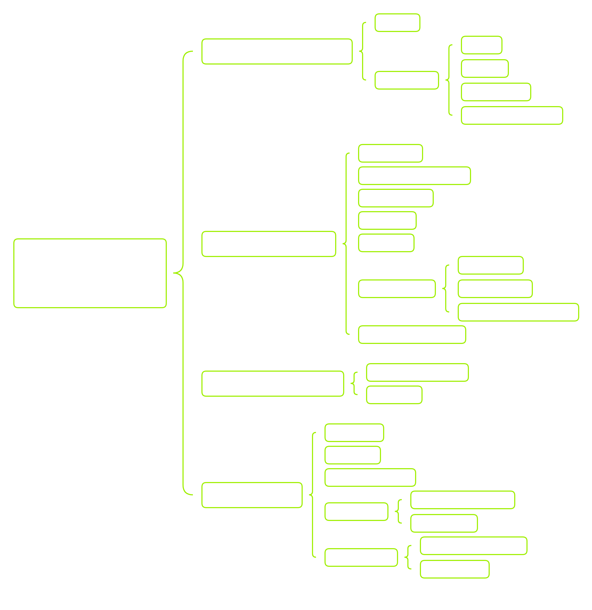

# Windows Command Line
`dir C:\Windows\System32\cmd.exe`
`ipconfig /?` // view the help 
`man` ~ "help utility"
`F7` hotkey will open an interactive list of the previous commands we have ran
**System Navigation**
Listing a Directory:
- `dir` command
- moving around `cd`
- absolute path and relative path
- exploring the file system `tree`
`tree /f` : give us a listing of all files and folders in a specificied path
`cd` // print my current working directory
**Working with directories and files**
`type` : display the contents of multiple text files
`mkdir` : make diretory
**Gathering System Information**

General System Information: Contains information about the overall target system. Target system information includes but is not limited to the hostname of the machine, OS-specific details(name,version,configuration) and installed hotfixes/patches for the system

Networking Information: Contains networking and connections information for the target system and system to which the target is connected over the network. Examples of networking information inlcude but are not limited to the following: host IP address, available netwokr interfaces, accessible subnets, DNS server, known hosts, and network resources.

Basic Domain Information: Contains Active Directory information regarding the domain to which the target system is connected.

User information: Contains information regarding local users and groups on the target system. This can typically be expanded to contain anything accessible to these accounts, such as environment variables, currently running tasks, scheduled tasks and known services.

Try and ask ourselves the following questions:
- What system information can we pull from our target host?
- What other system(s) is our target host interacting with over the network?
- What user account(s) do we have access to, and what information is accessible from the account(s)?

**Why do need this information?**
**why** behind gathering information
**goal** with **host enumeration** here is to use the information gained from the target to provide us with a starting point and guide for how we wish to attack the system. 

- What user account do we have access to?
- What groups does our user belong to?
- What current working set of privileges does our user have access to?
- What resources can our user access over the network?
- What tasks and services are running under our user account?
**How do we get this information**
`systeminfo`
`hostname`
`ver`
`ifconfig`
 - basic network information for the host machine such as Domain Name, IPv4 Address, Subnet Mask, and Default Gateway
`arp` : display the contents and entries contained with Address Resolution Protocol(ARP) cache.
`whoami`: understanding our current user
`whoami  /priv`: checking out our privileges
`whoami /groups`: investigating groups
`net user`: allow us to display a list of all users on a host, information about a specific user, and to create or delete users
`net group`: display any groups that exist on the host from which we issued the commadn, create, delete groups and add or remove users from groups. It also display domain group information if the host is joined to the domain.
`net share`: display into about shared resources on the host and to create new shared resources as well
- Do we have the proper permissions to access this share?
- Can we read, write , and execute files on the share?
- Is there any valuable data on the share?
`net view`: display to us any shared resources that host you are issuing the command against knows of

**Finding files and directories**
Searching with CMD

Using Where
C:\Users\student\Desktop>where calc.exe
C:\Users\student\Desktop>where /R C:\Users\student\ bio.txt
C:\Users\student\Desktop>where /R C:\Users\student\ *.csv

Find 
C:\Users\student\Desktop> find "password" "C:\Users\student\not-passwords.txt" 
Find Modifiers
C:\Users\student\Desktop> find /N /I /V "IP Address" example.txt  
Findstr // can be use to search for regex strings
C:\Users\student\Desktop> findstr  

Compare
C:\Users\student\Desktop> comp .\file-1.md .\file-2.md
Comparing Different Files

Sort
C:\Users\MTanaka\Desktop> sort.exe .\file-1.md /O .\sort-1.md
C:\Users\MTanaka\Desktop> type .\sort-1.md

unique
PS C:\Users\MTanaka\Desktop> sort.exe .\sort-1.md /unique

Question: find waldo.txt
Get-ChildItem -Path C:\ -Recurse -Filter 'waldo.txt' -ErrorAction SilentlyContinue

# Skill Assessment
1
ssh -> see a prompt text contain flag
2
