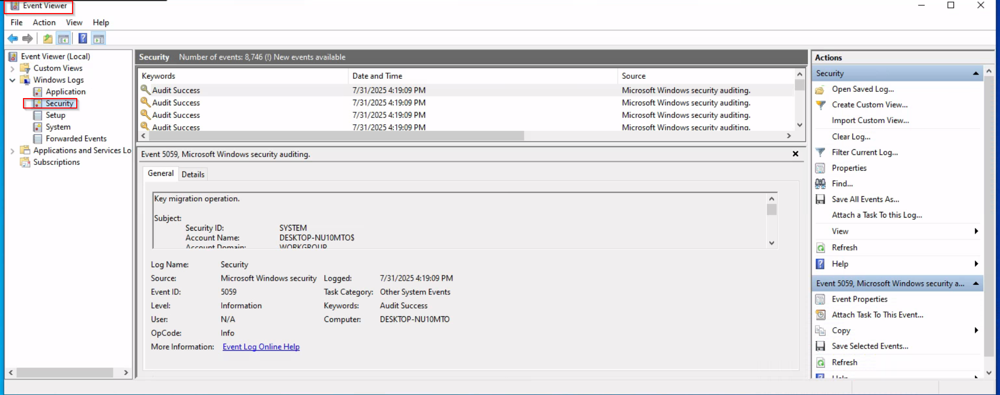
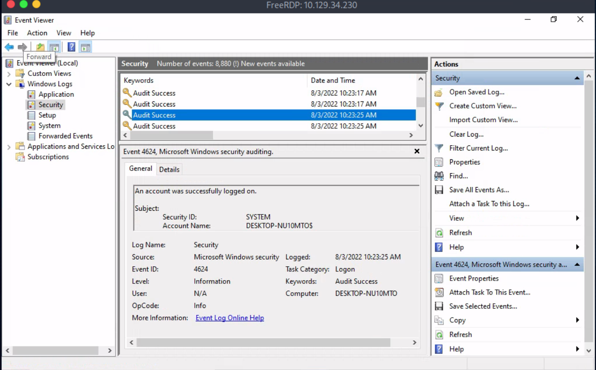
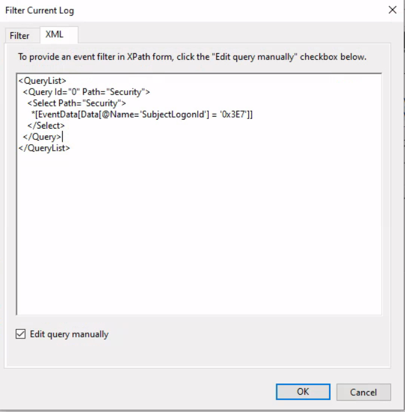
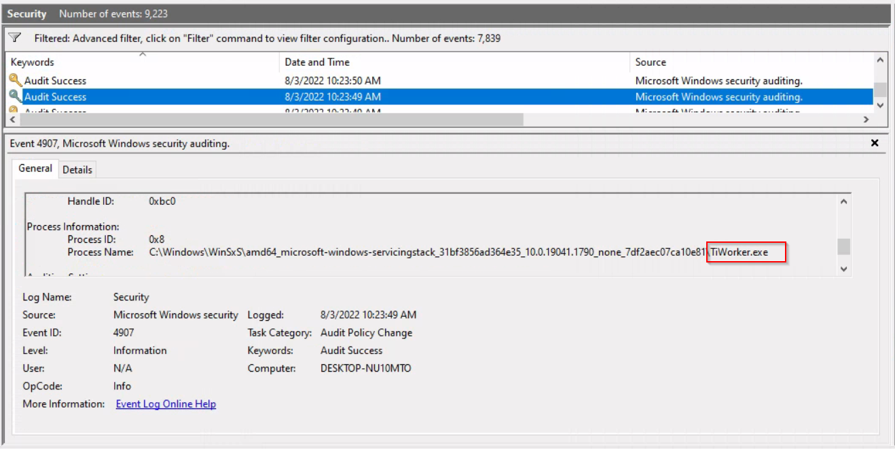

# Windows Event Logs And Analysis
## 1.Windows Event Logs Overview
- Windows Event Logs are an essential part of the system, logging events from various components such as system operations,applications, services, and more
- Type of Logs: Application, System, Security,Setup,Forwarded Events
## 2.Event log components
- Log Name
- Source : Software that logged the event
- Event ID: Unique identifier for the event
- Task Category
- Level: Serverity
- Keywords: Additional categoziration, e.g: "Audit success"
- User
- Opcode: Spcecific operation associated with the event
- Logged: Date and time the event was logged
- Computer: Name of the computer where the event occured
- XML data: Detailed event data in XML format
## 3. Event viewer and usage
Event Viewer allows easy access to logs, both live and saved(.evtx files)
Logs can be accessed through **Event Viewer**(Run>"eventvwr.msc") or APIs

### Analyze the event with ID 4624, that took place on 8/3/2022 at 10:23:25
Event viewer -> window logs - > Security



Click Find Button to find faster

Create a custom XML query based on the logon ID above image


Answer: TiWorker.exe
### Build an XML query to determine if the previously mentioned executable modified the auditing settings of C:\Windows\Microsoft.NET\Framework64\v4.0.30319\WPF\wpfgfx_v0400.dll. Enter the time of the identified event in the format HH:MM:SS as your answer.

```powershell
Get-SecurityEvent 4907 "8/3/2022 10:23:24" "8/3/2022 10:24:00" | Where-Object { $_.Message -match 'Object Name:\s+C:\\Windows\\Microsoft.NET\\Framework64\\v4.0.30319\\WPF\\wpfgfx_v0400.dll' } | Select-Object -Property TimeCreated
```
