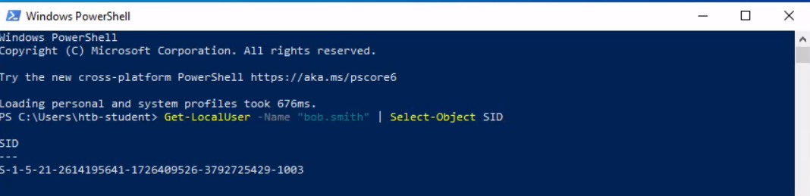
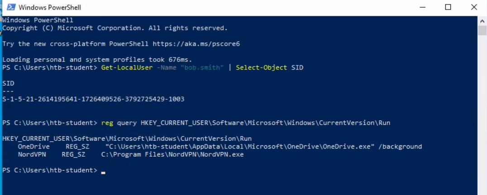
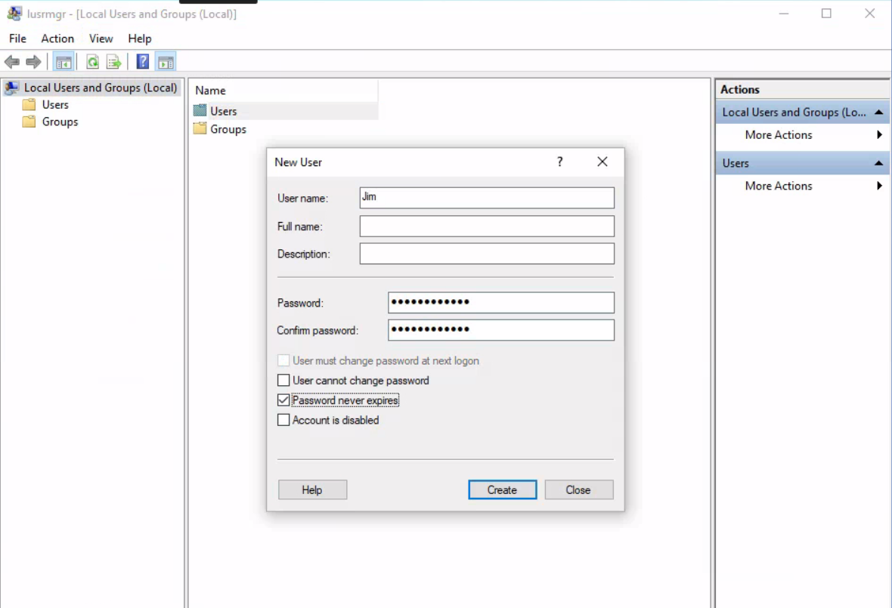
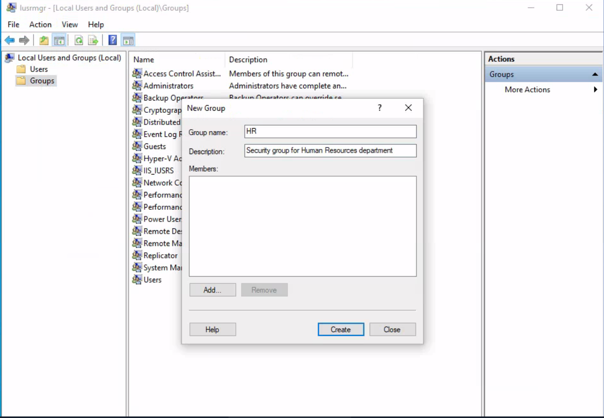
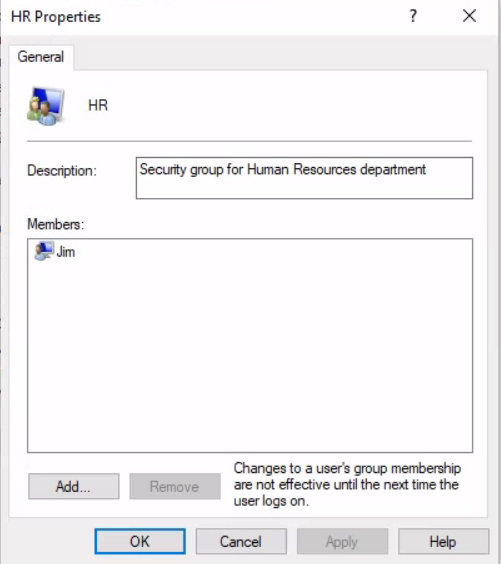
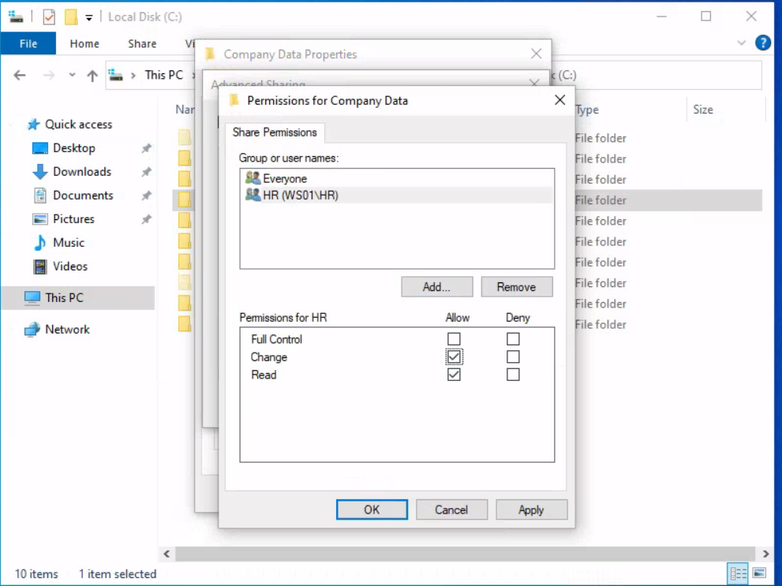
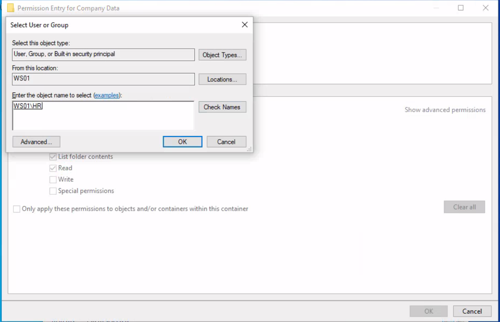

# Windows Security
1.Find the SID of the bob.smith user
Get-LocalUser -Name "bob.smith" | Select-Object SID

2.What 3rd party security application is disabled at startup for the current user? (The answer is case sensitive).
reg query HKEY_CURRENT_USER\Software\Microsoft\Windows\CurrentVersion\Run
📂 OneDrive
🛡️ NordVPN


Chắc chắn rồi\! Dưới đây là hướng dẫn chi tiết và một bài viết (write-up) mẫu cho bài đánh giá kỹ năng này, được trình bày từng bước một cách rõ ràng để bạn có thể thực hiện và báo cáo.

-----

### **Hướng dẫn Thực hành Bảo mật Phân quyền Thư mục trên Windows**

-----

### **Bước 1: Tạo thư mục chia sẻ `Company Data`**

**Mục tiêu:** Tạo thư    mục gốc sẽ được sử dụng để chia sẻ dữ liệu chung của công ty.

**Công cụ sử dụng:** File Explorer.

**Các bước thực hiện:**

1.  Mở File Explorer.
2.  Di chuyển đến ổ đĩa `C:`.
3.  Nhấp chuột phải vào một khoảng trống, chọn **New** \> **Folder**.
4.  Đặt tên cho thư mục mới là **Company Data** và nhấn Enter.


-----

### **Bước 2: Tạo thư mục con `HR`**

**Mục tiêu:** Tạo một thư mục con bên trong thư mục chia sẻ để lưu trữ dữ liệu nhạy cảm của phòng Nhân sự (HR).

**Công cụ sử dụng:** File Explorer.

**Các bước thực hiện:**

1.  Mở thư mục `C:\Company Data` đã tạo ở Bước 1.
2.  Nhấp chuột phải vào một khoảng trống, chọn **New** \> **Folder**.
3.  Đặt tên cho thư mục mới là **HR** và nhấn Enter.


-----

### **Bước 3: Tạo người dùng `Jim`**

**Mục tiêu:** Tạo một tài khoản người dùng mới để minh họa việc gán quyền cho một cá nhân cụ thể thông qua nhóm.

**Công cụ sử dụng:** Computer Management (`lusrmgr.msc`).

**Các bước thực hiện:**

1.  Nhấn **Windows + R**, gõ `lusrmgr.msc` và nhấn Enter để mở Local Users and Groups.
2.  Trong cửa sổ bên trái, nhấp vào thư mục **Users**.
3.  Nhấp chuột phải vào vùng trống ở giữa, chọn **New User...**.
4.  Trong hộp thoại New User:
      * **User name:** `Jim`
      * **Password / Confirm password:** Đặt một mật khẩu an toàn (ví dụ: `P@ssw0rd123!`)
      * **Bỏ chọn (Uncheck)** ô **User must change password at next logon**.
      * Chọn ô **Password never expires** (tùy chọn cho môi trường lab).
5.  Nhấp **Create**, sau đó nhấp **Close**.

- Tạo người dùng `Jim` để mô phỏng một nhân viên phòng Nhân sự

-----

### **Bước 4: Tạo nhóm bảo mật `HR`**

**Mục tiêu:** Tạo một nhóm bảo mật để quản lý quyền truy cập cho tất cả các thành viên của phòng Nhân sự một cách tập trung.

**Công cụ sử dụng:** Computer Management (`lusrmgr.msc`).

**Các bước thực hiện:**

1.  Trong cửa sổ Local Users and Groups, nhấp vào thư mục **Groups**.
2.  Nhấp chuột phải vào vùng trống ở giữa, chọn **New Group...**.
3.  Trong hộp thoại New Group:
      * **Group name:** `HR`
      * **Description:** `Security group for Human Resources department`
4.  Nhấp **Create**, sau đó nhấp **Close**.

 Quản lý quyền theo nhóm là một trong best practices. Thay vì gán quyền cho từng người dùng, ta sẽ gán quyền cho nhóm. Khi một nhân viên mới vào hay nghỉ việc, ta chỉ cần thêm hoặc xóa họ khỏi nhóm mà không cần phải thay đổi quyền trên từng thư mục.
-----

### **Bước 5: Thêm `Jim` vào nhóm bảo mật `HR`**

**Mục tiêu:** Liên kết tài khoản người dùng `Jim` với vai trò và quyền hạn của phòng Nhân sự.

**Công cụ sử dụng:** Computer Management (`lusrmgr.msc`).

**Các bước thực hiện:**

1.  Trong thư mục **Groups**, nhấp đúp vào nhóm **HR** vừa tạo.
2.  Trong cửa sổ Properties, nhấp vào nút **Add...**.
4.  Nhấp vào nút **Check Names**. Tên `Jim` sẽ được gạch chân để xác nhận.
5.  Nhấp **OK**, sau đó nhấp **OK** một lần nữa để đóng cửa sổ Properties.

Bằng cách thêm Jim vào nhóm HR, Jim sẽ được thừa hưởng tất cả các quyền được gán cho nhóm này.

-----

### **Bước 6: Phân quyền cho thư mục `Company Data`**

**Mục tiêu:** Thiết lập quyền chia sẻ (Share Permissions) và quyền NTFS cho thư mục gốc, chỉ cho phép nhóm HR truy cập.

**Công cụ sử dụng:** File Explorer (Properties).

**Các bước thực hiện:**

1.  Quay lại File Explorer, nhấp chuột phải vào thư mục `C:\Company Data` và chọn **Properties**.
2.  **Thiết lập Share Permissions:**
      * Chuyển đến tab **Sharing** và nhấp vào **Advanced Sharing...**.
      * Tích vào ô **Share this folder**.
      * Nhấp vào nút **Permissions**.
      * Chọn nhóm **Everyone** và nhấp **Remove**.
      * Nhấp **Add...**, gõ `HR`, nhấp **Check Names** rồi **OK**.
      * Chọn nhóm **HR** vừa thêm, trong khung Permissions bên dưới, tích vào ô **Allow** cho quyền **Change** và **Read**.
      * Nhấp **OK** hai lần.
      
3.  **Thiết lập NTFS Permissions:**
      * Trong cửa sổ Properties của `Company Data`, chuyển đến tab **Security**.
      * Nhấp vào nút **Advanced**.
      * Ở góc dưới bên trái, nhấp vào **Disable inheritance**, sau đó chọn **"Convert inherited permissions into explicit permissions on this object."**.
      * Trong danh sách "Permission entries", tìm và chọn nhóm **Users** (ví dụ: `DESKTOP-NAME\Users`) và nhấp **Remove**.
      * Nhấp **Add...**, sau đó nhấp vào **"Select a principal"**. Gõ `HR`, nhấp **Check Names** rồi **OK**.
      
      * Trong cửa sổ Basic permissions, tích chọn các quyền sau: **Modify**, **Read & Execute**, **List folder contents**, **Read**, **Write**.
      * Nhấp **OK**, **Apply**, và **OK**.

**Giải thích:**

  * **Share vs. NTFS:** Share Permissions là "người gác cổng" đầu tiên khi truy cập qua mạng. NTFS Permissions là "người gác cổng" thứ hai, chi tiết hơn và áp dụng cho cả truy cập qua mạng lẫn truy cập trực tiếp trên máy. Quyền hiệu lực sẽ là quyền **hạn chế nhất** giữa hai loại này.
  * **Disable Inheritance:** Việc vô hiệu hóa kế thừa là cực kỳ quan trọng. Nó ngăn các quyền từ thư mục cha (ổ C:) ảnh hưởng đến thư mục của chúng ta, tạo ra một môi trường an toàn và độc lập.

-----

### **Bước 7: Phân quyền cho thư mục con `HR`**

**Mục tiêu:** Áp dụng bộ quyền NTFS tương tự và riêng biệt cho thư mục con `HR` để đảm bảo an toàn tuyệt đối.

**Công cụ sử dụng:** File Explorer (Properties).

**Các bước thực hiện:**

1.  Nhấp chuột phải vào thư mục `C:\Company Data\HR` và chọn **Properties**.
2.  Chuyển đến tab **Security** và nhấp vào **Advanced**.
3.  Nhấp **Disable inheritance** và chọn **"Convert inherited permissions..."**.
4.  Chọn và **Remove** các nhóm không cần thiết (như nhóm `Users`). Lưu ý: Nhóm HR đã có sẵn do được kế thừa từ bước chuyển đổi.
5.  Nhấp đúp vào nhóm **HR** để kiểm tra lại quyền. Đảm bảo các quyền **Modify**, **Read & Execute**, **List folder contents**, **Read**, **Write** đã được chọn. Nếu chưa, hãy thiết lập lại cho đúng.
6.  Nhấp **OK** để đóng tất cả các cửa sổ.

**Giải thích:** Lặp lại việc vô hiệu hóa kế thừa và gán quyền tường minh cho thư mục con đảm bảo rằng ngay cả khi quyền của thư mục cha thay đổi, thư mục nhạy cảm này vẫn được bảo vệ bởi bộ quy tắc riêng của nó.

-----

### **Bước 8: Sử dụng PowerShell để xem chi tiết dịch vụ**

**Mục tiêu:** Minh họa cách sử dụng PowerShell để kiểm tra trạng thái và thông tin của một dịch vụ hệ thống, một kỹ năng cần thiết để kiểm tra các thay đổi bất thường.

**Công cụ sử dụng:** PowerShell.

**Các bước thực hiện:**

1.  Mở PowerShell với quyền quản trị (Run as administrator).
2.  Để xem chi tiết về một dịch vụ (ví dụ: dịch vụ Print Spooler có tên là `Spooler`), gõ lệnh sau và nhấn Enter:
    ```powershell
    Get-Service -Name Spooler | Format-List *
    ```
3.  Quan sát kết quả hiển thị tất cả các thuộc tính của dịch vụ như `Name`, `DisplayName`, `Status`, `StartupType`, `DependentServices`...

Trả lời câu hỏi
+   What is the name of the group that is present in the Company Data Share Permissions ACL by default?
Everyone
+ What is the name of the tab that allows you to configure NTFS permissions?
Security
 + What is the name of the service associated with Windows Update?
 wuauserv
 + List the SID associated with the user account Jim you created.
 wmic useraccount where name='Jim' get sid (cmd)
 +  List the SID associated with the HR security group you created.
 wmic group where name='HR' get sid

 # WMI
  1.Use WMI to find the serial number of the system.
 Get-WmiObject -Class Win32_OperatingSystem | select SerialNumber