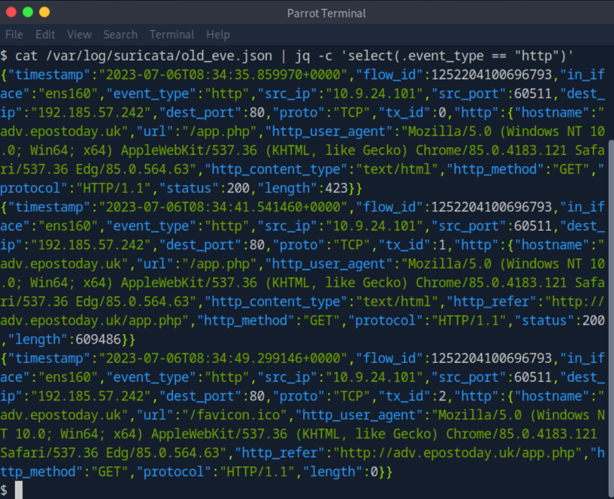

**Suricata Fundamentals**

Được xem như một công cụ mạnh mẽ cho Hệ thống Phát hiện Xâm nhập (IDS), Hệ thống Ngăn chặn Xâm nhập (IPS), và Giám sát An ninh Mạng (NSM), Suricata là nền tảng quan trọng trong bảo mật mạng. Công cụ mã nguồn mở này, được quản lý và phát triển bởi Open Information Security Foundation (OISF), là minh chứng cho sức mạnh của một sáng kiến phi lợi nhuận do cộng đồng lãnh đạo.

Mục tiêu của Suricata là **phân tích tỉ mỉ từng chi tiết nhỏ nhất** trong lưu lượng mạng, tìm kiếm các dấu hiệu có thể là hành vi độc hại. Sức mạnh của nó nằm ở khả năng **đánh giá toàn diện tình trạng mạng** và **đi sâu vào chi tiết của từng giao dịch lớp ứng dụng**. Chìa khóa để Suricata hoạt động thành công là bộ quy tắc được thiết kế tinh vi. Những hướng dẫn này định hướng quá trình phân tích của Suricata, giúp nhận diện các mối đe dọa tiềm ẩn và các khu vực cần chú ý. Được trang bị khả năng **hoạt động với tốc độ cao** trên cả phần cứng sẵn có và phần cứng thiết kế riêng biệt, hiệu quả của Suricata là vô song.

---

**Suricata Operation Modes**

Suricata hoạt động trong bốn chế độ riêng biệt:

1. **Chế độ IDS (Hệ thống Phát hiện Xâm nhập)** đặt Suricata ở vai trò một **quan sát viên thụ động**. Trong chế độ này, Suricata **kiểm tra tỉ mỉ** lưu lượng mạng, đánh dấu các cuộc tấn công tiềm tàng nhưng không can thiệp. Bằng cách cung cấp cái nhìn sâu sắc về hoạt động của mạng và tăng tốc thời gian phản hồi, chế độ này nâng cao khả năng quan sát mạng mà không trực tiếp bảo vệ.

2. **Chế độ IPS (Hệ thống Ngăn chặn Xâm nhập)**, Suricata áp dụng **tư thế chủ động**. Tất cả lưu lượng mạng phải qua các kiểm tra nghiêm ngặt của Suricata và chỉ được phép truy cập vào mạng nội bộ sau khi Suricata phê duyệt. Chế độ này tăng cường bảo mật bằng cách ngăn chặn các cuộc tấn công trước khi chúng xâm nhập vào mạng nội bộ. Việc triển khai Suricata trong chế độ IPS yêu cầu hiểu rõ về cấu trúc mạng để tránh vô tình chặn các lưu lượng hợp pháp. Thêm vào đó, mỗi lần kích hoạt quy tắc cần phải được thử nghiệm và xác nhận kỹ lưỡng. Mặc dù chế độ này nâng cao bảo mật, nhưng quá trình kiểm tra có thể gây độ trễ.

3. **Chế độ IDPS (Hệ thống Phát hiện và Ngăn chặn Xâm nhập)** kết hợp những ưu điểm của cả IDS và IPS. Trong khi Suricata tiếp tục giám sát lưu lượng thụ động, nó có khả năng gửi gói tin RST để phản hồi lại các hành vi bất thường. Chế độ này đạt được sự cân bằng giữa bảo vệ chủ động và duy trì độ trễ thấp, rất quan trọng cho hoạt động mạng không bị gián đoạn.

4. Trong chế độ **NSM (Giám sát An ninh Mạng)**, Suricata trở thành một cơ chế **ghi log chuyên dụng**, bỏ qua khả năng phân tích lưu lượng chủ động hoặc thụ động hay ngăn chặn. Nó **ghi lại tỉ mỉ** mọi thông tin mạng mà nó gặp phải, cung cấp một kho dữ liệu quý giá cho các cuộc điều tra sự cố an ninh sau này, mặc dù lượng dữ liệu tạo ra rất lớn.

---

**Suricata Inputs**

Về phần đầu vào của Suricata, có hai loại chính:

* **Đầu vào ngoại tuyến**: Liên quan đến việc đọc các tệp PCAP để xử lý các gói tin đã được bắt trước đó trong định dạng tệp LibPCAP. Điều này không chỉ có lợi cho việc kiểm tra dữ liệu sau sự cố mà còn hữu ích khi thử nghiệm các bộ quy tắc và cấu hình khác nhau.

* **Đầu vào trực tiếp (Live Input)**: Đầu vào trực tiếp có thể được thực hiện qua LibPCAP, nơi các gói tin được đọc trực tiếp từ các giao diện mạng. Tuy nhiên, LibPCAP có một số hạn chế về hiệu suất và không hỗ trợ khả năng cân bằng tải. Để hoạt động trực tiếp, có thể sử dụng các tùy chọn NFQ và AF\_PACKET. NFQ, một chế độ IPS trực tiếp dành riêng cho Linux, hợp tác với IPTables để chuyển các gói tin từ không gian kernel vào Suricata để phân tích chi tiết. AF\_PACKET cung cấp cải tiến hiệu suất so với LibPCAP và hỗ trợ đa luồng. Tuy nhiên, nó không tương thích với các bản phân phối Linux cũ và không thể sử dụng khi máy chủ cũng phải định tuyến gói tin.

---

**Suricata Outputs**

Suricata tạo ra nhiều loại đầu ra khác nhau, bao gồm các bản ghi, cảnh báo, và dữ liệu mạng liên quan như yêu cầu DNS và luồng mạng. Một trong những đầu ra quan trọng nhất là **EVE**, một bản ghi theo định dạng JSON ghi lại nhiều loại sự kiện khác nhau, bao gồm cảnh báo, HTTP, DNS, TLS metadata, drop, SMTP metadata, luồng, netflow và nhiều hơn nữa. Các công cụ như Logstash có thể dễ dàng tiêu thụ đầu ra này để phục vụ việc phân tích dữ liệu.

Chúng ta cũng có thể gặp đầu ra **Unified2** của Suricata, thực tế là một định dạng cảnh báo nhị phân của Snort, cho phép tích hợp với các phần mềm khác sử dụng Unified2. Mọi đầu ra Unified2 có thể được đọc bằng công cụ u2spewfoo của Snort, một phương pháp đơn giản và hiệu quả để hiểu rõ về dữ liệu cảnh báo.

---

### Cấu hình Suricata và Quy tắc Tùy chỉnh

Sau khi truy cập vào phiên bản Suricata đã triển khai qua SSH, ta có thể kiểm tra tổng quan về tất cả các tệp quy tắc bằng lệnh đơn giản.

```bash
hieunm@htb[/htb]$ ls -lah /etc/suricata/rules/
```

Quy tắc có thể được kiểm tra dưới dạng danh sách dễ dàng và được phân tích để hiểu rõ về chức năng của chúng.

---

**Tương tác trực tiếp với Suricata Inputs và Outputs**

Để kiểm tra Suricata trong chế độ ngoại tuyến (Offline Input), ta có thể sử dụng tệp PCAP (ví dụ: suspicious.pcap) bằng lệnh sau:

```bash
hieunm@htb[/htb]$ suricata -r /home/htb-student/pcaps/suspicious.pcap
```

Tương tự, để sử dụng đầu vào trực tiếp (Live Input), ta có thể thử Suricata trong chế độ LibPCAP hoặc AF\_PACKET.

---

**Chế độ Cập nhật Quy tắc và Tải Lại Quy tắc Trực Tiếp**

Chế độ tải lại quy tắc trực tiếp trong Suricata cho phép ta cập nhật bộ quy tắc mà không làm gián đoạn quá trình kiểm tra lưu lượng mạng. Điều này rất quan trọng để duy trì giám sát liên tục và giảm thiểu khả năng bỏ sót bất kỳ hoạt động độc hại nào.

```bash
hieunm@htb[/htb]$ sudo suricata -T -c /etc/suricata/suricata.yaml
```

Với lệnh trên, ta có thể kiểm tra cấu hình của Suricata và đảm bảo rằng mọi tệp cấu hình được tham chiếu đều có thể truy cập và hợp lệ.

---

**Tóm tắt về các tính năng quan trọng của Suricata**

* Phân tích sâu gói tin và ghi log gói tin
* Phát hiện bất thường và Giám sát An ninh Mạng
* Phát hiện và Ngăn chặn Xâm nhập, với chế độ kết hợp
* Kịch bản Lua
* Xác định vị trí địa lý IP (GeoIP)
* Hỗ trợ IPv4 và IPv6 đầy đủ
* Lý lịch IP
* Trích xuất tệp
* Kiểm tra giao thức nâng cao
* Đa người dùng
* Phát hiện lưu lượng "phi chuẩn/bất thường"

---

**Thực hành**

1.lọc chỉ các sự kiện HTTP từ tệp /var/log/suricata/old_eve.json sử dụng công cụ dòng lệnh jq và tìm flow_id
Use jq to Filter HTTP Events
```bash
cat /var/log/suricata/old_eve.json | jq -c 'select(.event_type == "http")'
```

Extract the flow_id Field
```bash
cat /var/log/suricata/old_eve.json | jq -c 'select(.event_type == "http") | .flow_id'
```

2.Enable the http-log output in suricata.yaml and run Suricata against /home/htb-student/pcaps/suspicious.pcap. Enter the requested PHP page as your answer. Answer format: _.php

sửa file suricata.yaml tìm http.log và đặt đúng file path đổi no -> yes


Chạy suricata với file pcap  và đọc HTTP Log output thấy app.
sudo suricata -r /home/htb-student/pcaps/suspicious.pcap
sudo cat /var/log/suricata/http.log


---

### **Phát Triển Quy Tắc Suricata Phần 1:**

**Mục đích của một quy tắc trong Suricata** là hướng dẫn công cụ giám sát các dấu hiệu đặc biệt trong lưu lượng mạng. Khi các dấu hiệu này xuất hiện, Suricata sẽ thông báo cho chúng ta.

Các quy tắc Suricata không chỉ nhằm phát hiện các hoạt động xấu hoặc lưu lượng có thể gây hại. Trong nhiều trường hợp, các quy tắc có thể được thiết kế để cung cấp cho các đội phòng thủ mạng (blue team) các thông tin quan trọng hoặc dữ liệu ngữ cảnh về các hoạt động mạng đang diễn ra.

**Đặc tính của các quy tắc này** phụ thuộc vào độ chính xác hoặc tổng quát của chúng. Việc tìm ra sự cân bằng là rất quan trọng, ví dụ như để nhận diện các biến thể của một chủng malware nhất định mà vẫn tránh được các báo động giả.

Quá trình phát triển các quy tắc này thường sử dụng thông tin từ cộng đồng an ninh thông tin và từ các nguồn dữ liệu tình báo về mối đe dọa. Tuy nhiên, cần lưu ý rằng mỗi quy tắc khi được triển khai đều tiêu tốn một phần tài nguyên của CPU và bộ nhớ của máy chủ. Vì vậy, Suricata cung cấp các hướng dẫn cụ thể để viết các quy tắc hiệu quả.

---

### **Cấu Trúc Quy Tắc Suricata**

**Ví dụ quy tắc Suricata:**

```plaintext
action protocol from_ip port -> to_ip port (msg:"Hành vi độc hại đã biết, có thể là nhiễm malware X"; content:"some thing"; content:"some other thing"; sid:10000001; rev:1;)
```

#### **Phần tiêu đề của quy tắc:**

* **action**: Chỉ dẫn Suricata các bước cần thực hiện nếu nội dung khớp, chẳng hạn như tạo cảnh báo (alert), ghi log mà không tạo cảnh báo (log), bỏ qua gói tin (pass), chặn gói tin trong chế độ IPS (drop), hoặc gửi gói TCP RST (reject).
* **protocol**: Có thể là tcp, udp, icmp, ip, http, tls, smb, dns, v.v.
* **from\_ip port -> to\_ip port**: Xác định các địa chỉ IP và cổng mà quy tắc sẽ áp dụng. Quy tắc sẽ được kích hoạt khi lưu lượng HTTP đến từ bất kỳ cổng nào (any) trên một máy chủ trong mạng nội bộ (\$HOME\_NET) đến cổng bất kỳ (any) của một máy chủ ngoài mạng (\$EXTERNAL\_NET).

---

#### **Phần nội dung quy tắc:**

* **msg:** Thông điệp hiển thị khi quy tắc được kích hoạt. Thông điệp này nên chứa các chi tiết về phần mềm độc hại, gia đình malware, và hành động của nó.
* **content:** Các giá trị đặc biệt giúp xác định lưu lượng mạng hoặc các hoạt động cụ thể. Suricata sẽ so khớp các giá trị này với các gói tin để phát hiện.

Ví dụ:

```plaintext
alert http any any -> any any (msg:"HTTP request with User-Agent Mozilla"; content:"User-Agent: Mozilla"; nocase; sid:8001;)
```

---

#### **Các tùy chọn quy tắc:**

* **nocase**: Đảm bảo rằng quy tắc không bị bỏ qua bởi các thay đổi về chữ hoa chữ thường.
* **offset**: Thông báo cho Suricata vị trí bắt đầu trong gói tin để tìm kiếm.
* **depth**: Độ dài cần kiểm tra trong gói tin.
* **distance**: Đặt khoảng cách giữa các khớp tiếp theo của một nội dung nhất định.
* **within**: Chỉ định rằng quy tắc phải khớp trong một phạm vi byte cụ thể sau một khớp trước đó.

---

### **Sử Dụng Biểu Thức Chính Quy PCRE (Perl Compatible Regular Expression)**

PCRE có thể là một công cụ mạnh mẽ khi viết quy tắc. Để sử dụng PCRE trong Suricata, ta dùng lệnh `pcre`, theo sau là một biểu thức chính quy (regular expression), được bao bọc trong dấu gạch chéo `/.../`.

**Ví dụ:**

```plaintext
alert http any any -> $HOME_NET any (msg: "ATTACK [PTsecurity] Apache Continuum <= v1.4.2 CMD Injection"; content: "POST"; http_method; content: "/continuum/saveInstallation.action"; offset: 0; depth: 34; http_uri; content: "installation.varValue="; nocase; http_client_body; pcre: !"/^\$?[\sa-z\\_0-9.-]*(\&|$)/iRP"; flow: to_server, established; sid: 10000048; rev: 1;)
```

Quy tắc này phát hiện lỗ hổng tiêm lệnh (command injection) trong ứng dụng Apache Continuum, tìm kiếm các mẫu URL và dữ liệu đặc trưng của malware.

---

### **Các Phương Pháp Viết Quy Tắc IDS/IPS**

1. **Phát hiện theo chữ ký (signature-based detection)**: Đây là phương pháp truyền thống, phát hiện các mối đe dọa đã biết bằng cách tìm kiếm các mẫu đặc trưng trong lưu lượng mạng.

2. **Phát hiện theo hành vi (anomaly-based detection)**: Xác định các hành vi khác thường trong lưu lượng mạng có thể chỉ ra mối đe dọa hoặc tấn công mới, chưa có chữ ký.

3. **Phân tích trạng thái giao thức (stateful protocol analysis)**: Theo dõi và so sánh các trạng thái của các kết nối mạng để tìm kiếm các hành vi bất thường trong giao thức.

---

### **Ví dụ về Quy Tắc Suricata Phát Hiện PowerShell Empire**

```plaintext
alert http $HOME_NET any -> $EXTERNAL_NET any (msg:"ET MALWARE Possible PowerShell Empire Activity Outbound"; flow:established,to_server; content:"GET"; http_method; content:"/"; http_uri; depth:1; pcre:"/^(?:login\/process|admin\/get|news)\.php$/RU"; content:"session="; http_cookie; pcre:"/^(?:[A-Z0-9+/]{4})*(?:[A-Z0-9+/]{2}==|[A-Z0-9+/]{3}=|[A-Z0-9+/]{4})$/CRi"; content:"Mozilla|2f|5.0|20 28|Windows|20|NT|20|6.1"; http_user_agent; http_start; content:".php|20|HTTP|2f|1.1|0d 0a|Cookie|3a 20|session="; fast_pattern; http_header_names; content:!"Referer"; content:!"Cache"; content:!"Accept"; sid:2027512; rev:1;)
```

Quy tắc này phát hiện hoạt động của PowerShell Empire, một framework phổ biến cho điều khiển và tấn công sau xâm nhập. Quy tắc theo dõi các yêu cầu HTTP có các dấu hiệu đặc trưng như tên tệp `.php`, chuỗi base64 trong cookie, và đặc trưng User-Agent.

---

### **Thực hành:**
---
Open the rules and adjust the offset. Hint: go lower.
sudo nano /home/htb-student/local.rules
Reset Suricata so the rules will apply.
sudo systemctl restart suricata
Run Suricata on the .pcap file
sudo suricata -r /home/htb-student/pcaps/eternalblue.pcap -k none -l .
Check the fast.log file to see if the alarm raised or not
sudo cat /var/log/suricata/fast.log
Keep playing around until alarm is not raised anymore and the minimum is found.
Answer is: 4

ja3 -a --json /home/htb-student/pcaps/trickbot.pcap