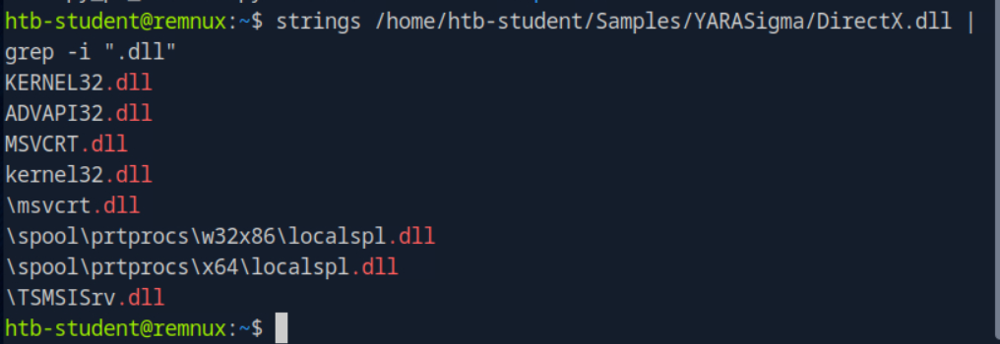

### Phát triển Quy tắc YARA

**Mục tiêu**: Trong phần này, chúng ta sẽ khám phá cách phát triển quy tắc YARA, bao gồm cách tạo quy tắc thủ công và tự động.

#### Phân tích chuỗi và tạo quy tắc YARA

1. **Phân tích chuỗi (strings) của tệp**:

   * **Sử dụng lệnh `strings`**: Đầu tiên, ta thực hiện phân tích chuỗi của mẫu phần mềm độc hại (ví dụ `svchost.exe`). Các chuỗi phát hiện được sẽ giúp xác định các đặc điểm của tệp, chẳng hạn như "UPX0", "UPX1", "UPX2", cho thấy rằng tệp có thể bị nén bằng công cụ UPX.
   * **Công cụ YARA**: Dựa trên chuỗi phát hiện, ta có thể tạo ra một quy tắc YARA để phát hiện các tệp nén bằng UPX.

   **Quy tắc YARA mẫu (UPX):**

   ```yara
   rule UPX_packed_executable
   {
       meta:
           description = "Detects UPX-packed executables"

       strings: 
           $string_1 = "UPX0"
           $string_2 = "UPX1"
           $string_3 = "UPX2"

       condition:
           all of them
   }
   ```

   * **Giải thích quy tắc**:

     * **Tên quy tắc**: `UPX_packed_executable`
     * **Phần `strings`**: Tìm các chuỗi "UPX0", "UPX1", "UPX2" trong tệp.
     * **Điều kiện**: Quy tắc yêu cầu tất cả các chuỗi trên phải xuất hiện trong tệp để kích hoạt cảnh báo.

2. **Sử dụng công cụ yarGen**:

   * `yarGen` là một công cụ tự động giúp tạo quy tắc YARA từ chuỗi phát hiện trong các mẫu phần mềm độc hại.
   * **Cách sử dụng**:

     * Tải `yarGen`, cài đặt các phụ thuộc và cập nhật cơ sở dữ liệu chuỗi tốt (goodware strings).
     * Tạo quy tắc YARA tự động bằng cách sử dụng các mẫu phần mềm độc hại từ thư mục tạm.

   **Ví dụ kết quả của `yarGen`:**

   * Quy tắc YARA tạo ra bao gồm các chuỗi đặc trưng của phần mềm độc hại, và các điều kiện để phát hiện phần mềm độc hại đó dựa trên thông tin như kích thước tệp, hash, và chuỗi đặc trưng.

3. **Phát triển quy tắc YARA thủ công**:

   * **Ví dụ ZoxPNG RAT của APT17**: Dựa trên phân tích chuỗi, hash, và kích thước tệp, ta có thể phát triển quy tắc YARA để phát hiện sự hiện diện của ZoxPNG RAT trong các tệp bị nhiễm.

   **Quy tắc YARA mẫu (APT17 - ZoxPNG):**

   ```yara
   rule APT17_Malware_Oct17_Gen {
       meta:
           description = "Detects APT17 malware"
           author = "Florian Roth"
           date = "2017-10-03"
       strings:
           $x1 = "Mozilla/4.0" 
           $x2 = "http://%s/imgres?q=A380"
           $s1 = "hWritePipe2 Error:%d"
           $s2 = "Not Support This Function!"
       condition:
           uint16(0) == 0x5a4d and filesize < 200KB and 6 of them
   }
   ```

   **Giải thích quy tắc**:

   * **Điều kiện**: Kiểm tra MZ (thông qua `uint16(0) == 0x5a4d`), kích thước tệp nhỏ hơn 200KB và cần có ít nhất 6 chuỗi đặc trưng của APT17.

4. **Ví dụ với Neuron của Turla**:

   * **Công cụ `monodis`**: Dùng để phân tích các mẫu .NET và tìm các lớp (class) và hàm (function) đặc trưng.
   * **YARA quy tắc**: Dựa trên phân tích các lớp và hàm trong mã nguồn .NET, ta tạo ra quy tắc YARA phát hiện các mẫu liên quan đến Turla.

   **Quy tắc YARA mẫu (Neuron - Turla):**

   ```yara
   rule neuron_functions_classes_and_vars {
       meta:
           description = "Rule for detection of Neuron based on .NET functions"
           author = "NCSC UK"
       strings:
           $class1 = "StorageUtils"
           $class2 = "WebServer"
           $func1 = "AddConfigAsString"
           $func5 = "ExecCMD"
       condition:
           uint16(0) == 0x5A4D and $dotnetMagic and 6 of them
   }
   ```

   **Giải thích**:

   * **Chạy lệnh `monodis`**: Phân tích tệp `.exe` và tìm các lớp, hàm, chuỗi đặc trưng.
   * **Điều kiện**: Kiểm tra xem tệp có phải là PE, có hàm `ExecCMD`, và có ít nhất 6 chuỗi đặc trưng không.

5. **Ví dụ với Stonedrill (Shamoon 2.0)**:

   * **Kiểm tra entropy của phần tài nguyên**: Sử dụng `entropy_pe_section.py` để kiểm tra phần tài nguyên có mức entropy cao, có thể chỉ ra rằng dữ liệu đã bị mã hóa hoặc nén.
   * **Quy tắc YARA mẫu (Stonedrill)**:

   ```yara
   rule susp_file_enumerator_with_encrypted_resource_101 {
       meta:
           description = "Detects Stonedrill based on encrypted resource 101"
       strings:
           $mz = "This program cannot be run in DOS mode."
       condition:
           uint16(0) == 0x5A4D and filesize < 700000 and pe.number_of_resources > 1 and math.entropy(pe.resources[0].offset, pe.resources[0].length) > 7.8
   }
   ```

   **Giải thích**:

   * **Entropy**: Kiểm tra phần tài nguyên có mức entropy cao, chứng tỏ có thể đã mã hóa.
   * **Điều kiện**: Kiểm tra tệp PE, tài nguyên với ID 101 và độ dài trên 20000 byte.

### Tài nguyên phát triển quy tắc YARA

* **Tài liệu chính thức của YARA**: Cung cấp hướng dẫn chi tiết về cách sử dụng YARA và viết quy tắc hiệu quả.
* **Blog của Kaspersky**: Giới thiệu cách sử dụng `yarGen` và cách phát triển quy tắc YARA thủ công.

### Tóm tắt:

* YARA là công cụ mạnh mẽ trong việc phát hiện phần mềm độc hại thông qua quy tắc dựa trên các chuỗi, đặc điểm tệp và các thông tin khác.
* Các công cụ tự động như `yarGen` giúp tăng tốc quá trình tạo quy tắc, nhưng cần phải kết hợp với phân tích thủ công để tạo ra các quy tắc hiệu quả hơn.

Câu hỏi thực hành:

