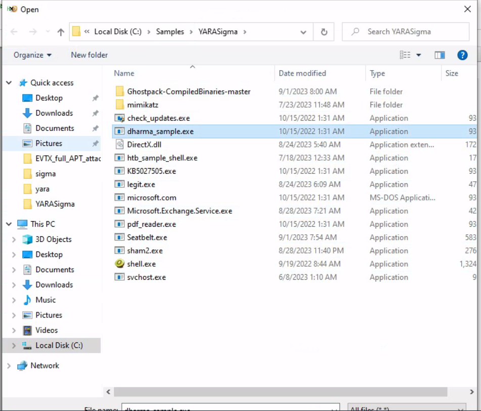
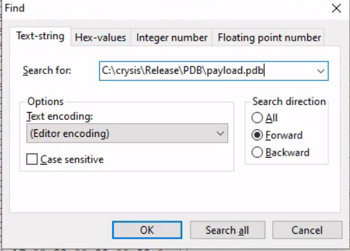
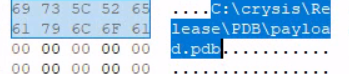

# Hunting for Malicious Executables on Disk with YARA
1.Mở tệp trong Hex Editor open file dharma_sample.exe và tìm chuỗi C:\crysis\Release\PDB\payload.pdb.



2/Identifit the repeted sssssbsss
đây là một pattern cần focus để tạo yara rule
Record lại offset/position của string surrounding data for rule creation
3.Tạo yara rule
```yara
rule ransomware_dharma {
    meta:
        author = "Madhukar Raina"
        version = "1.0"
        description = "Simple rule to detect strings from Dharma ransomware"
        reference = "https://www.virustotal.com/gui/file/bff6a1000a86f8edf3673d576786ec75b80bed0c458a8ca0bd52d12b74099071/behavior"

    strings:
        $string_pdb = {  433A5C6372797369735C52656C656173655C5044425C7061796C6F61642E706462 }
        $string_ssss = { 73 73 73 73 73 62 73 73 73 }

    condition:
        all of them
}
```
4. save yara
5. scan files with yara
powershell
yara64.exe -s C:\Rules\yara\dharma_ransomware.yar C:\Samples\YARASigma\ -r 2>null
6. Observe result
ransomware_dharma C:\Samples\YARASigma\dharma_sample.exe
